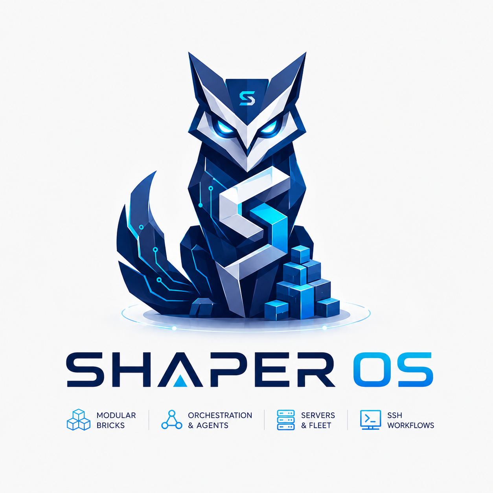
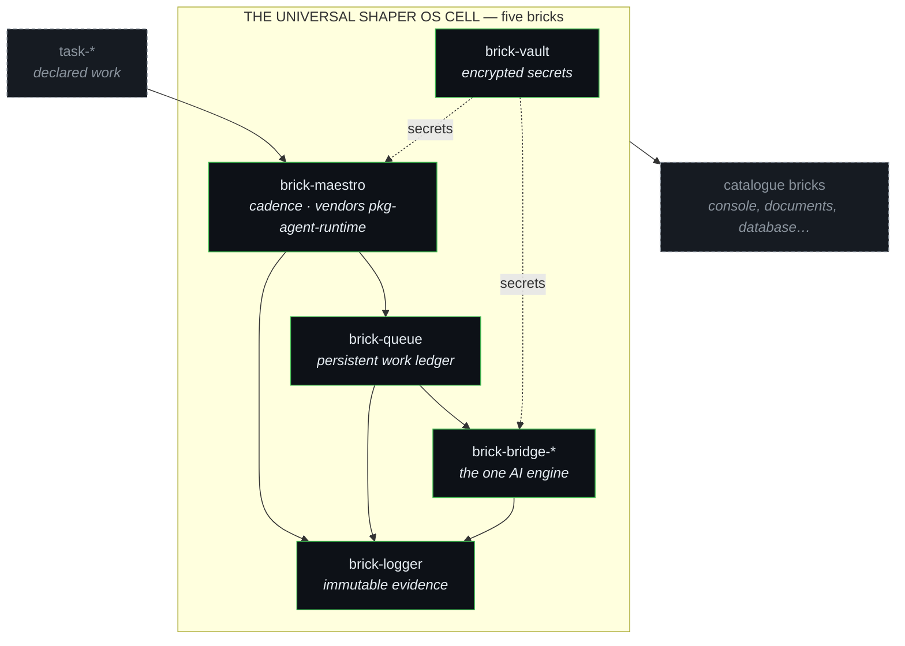
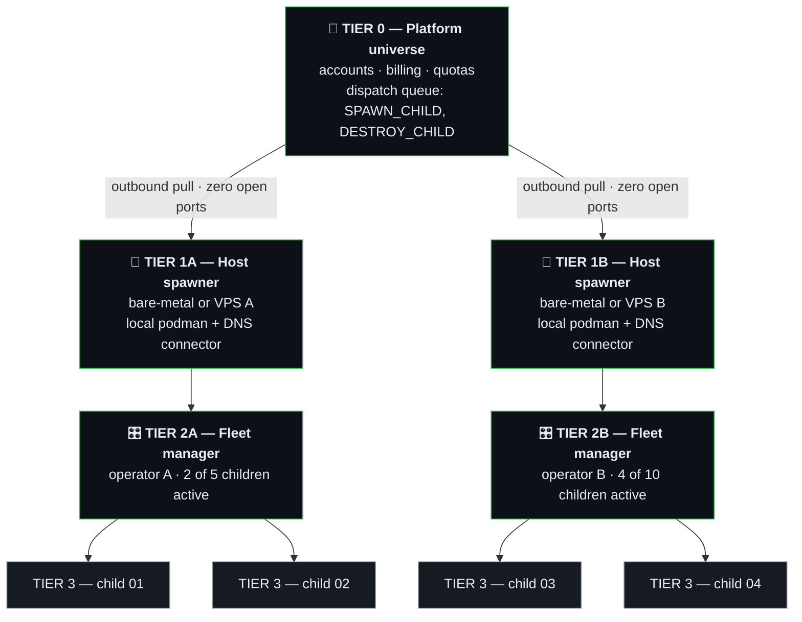

<p align="center">
  
</p>

<p align="center"><em>Shape systems. Orchestrate intelligence.</em></p>

# SHAPER OS V1.13

> **The Sovereign Operating System of Standardized Bricks & Intentions — Where Humans Formulate Vision and AI Agents Build & Operate**

---

**In one paragraph.** SHAPER OS lets you run your own business tools — a shop, a
CRM, a document hub, an inventory — on your own server, without monthly per-user
fees and without lock-in. You describe what you want in plain language. An AI
agent builds it, runs it, watches it, and repairs it, inside strict rules that
stop it from improvising where it matters. You stay the owner: of the machine,
of the data, and of every decision the agent is not allowed to take alone.

---

## 📖 Start with the reading that fits you

This repository is read by two kinds of reader, and they do not need the same
text. Humans need a ramp: one idea at a time, in order. AI agents need
compression: the whole frame at once, dense, so they can derive the rest. **Same
truth, different encodings.** Pick your row.

### If you are a human

| Level | You are | Read |
| :---: | :--- | :--- |
| **1** | A business owner. You want to know what this does for you. | [Level 1](#level-1--everyone-the-business-owner) below, then [`THE-NON-TECHNICAL-OWNER-PROMISE.md`](./docs/human/THE-NON-TECHNICAL-OWNER-PROMISE.md) |
| **2** | A technical user who will operate the system. | [Level 2](#level-2--the-technical-user-the-operator) below, then [`START-HERE.md`](./docs/human/START-HERE.md) and [`PROOF.md`](./docs/human/PROOF.md) |
| **3** | A developer or DevOps engineer. | [Level 3](#level-3--developer--devops-the-engineer) below, then [`docs/architecture/BRICKS.md`](./docs/architecture/BRICKS.md) and [`software/RULES.md`](./software/RULES.md) |
| **4** | An architect judging the design. | [Level 4](#level-4--architect-the-systems-designer) below, then [`docs/agent/PRINCIPLES.md`](./docs/agent/PRINCIPLES.md) and [`FRACTAL-ARCHITECTURE-AND-SECURITY.md`](./docs/architecture/FRACTAL-ARCHITECTURE-AND-SECURITY.md) |
| **5** | Looking at where this goes. | [Level 5](#level-5--the-fractal-vision-autonomous-multi-tier-systems) below, then [`doctrine/`](./doctrine/) |

**Piloting an AI agent?** You do not need to read what the agent reads. Point it
at [`AGENTS.md`](./AGENTS.md) and stay at your own level — your job is the
intent and the arbitration, not the syntax.

### If you are an AI agent

Go to **[`AGENTS.md`](./AGENTS.md)**. It routes you by capability:

| Your class | Your path |
| :--- | :--- |
| **High abstraction** — you hold a system in one context and derive from principles | [`docs/agent/PRINCIPLES.md`](./docs/agent/PRINCIPLES.md) — ten principles that generate the 49 rules — then [`docs/agent/PHASES.md`](./docs/agent/PHASES.md) |
| **Fast or light** — high throughput, short context, or work that must not be improvised | [`docs/agent/RUNBOOK-EXPLICIT.md`](./docs/agent/RUNBOOK-EXPLICIT.md) — literal steps, explicit stops, no derivation required |
| **Any class, first** | [`docs/agent/BOOT-CONTRACT.md`](./docs/agent/BOOT-CONTRACT.md) — what you may do and when you must stop |

The binding text for every agent, whatever its class, is
[`software/RULES.md`](./software/RULES.md), read in full.

> Reading only your row is enough to start correctly. Reading everything is still
> worth it — it is what turns an agent that executes into one that can be trusted
> with the next decision, and a user into an owner.

---

## 🗺️ Where everything is

Five files at the root, three named directories. Nothing was deleted when this
was reorganised — every document that existed still exists, at a place its
purpose explains.

```
├── README.md          ← you are here — the human door
├── AGENTS.md          ← the agent door
├── LAW.md             ← what is never skipped, in one page
├── INTENT.md          ← what this kit is for, and its invariants
├── NOTICE.md          ← authorship, AI-assisted writing, licence
│
├── docs/human/        ← install, prove, operate, vocabulary
├── docs/agent/        ← the four documents an AI agent reads
├── docs/architecture/ ← bricks, cognition requirements, fractal security
│
├── doctrine/          ← the master corpus (single canonical copy)
├── examples/          ← templates to copy into your universe
└── software/          ← the running system — packages, bricks, and RULES.md
```

If you only ever open two files: this one, and
[`docs/human/START-HERE.md`](./docs/human/START-HERE.md).

---

## 🎯 Why the repository is shaped like this

Model capability moves. The agent reading this today is not the agent that will
read it in six months, and that one will be stronger. Every serious system built
on AI has to answer one question: **when the models improve, what improves with
them — and what must not move at all?**

SHAPER OS answers it explicitly:

> **The code is the variable. Everything else is the constant.**

A better model must produce **better code** — not a different architecture. So
everything that is not code is written down and made explicit: intentions
([`INTENT.md`](./INTENT.md)), law ([`software/RULES.md`](./software/RULES.md)),
proof obligations ([`PROOF.md`](./docs/human/PROOF.md)), lifecycle
([`LIFECYCLE.md`](./docs/human/LIFECYCLE.md)), perimeters, and the cognitive
requirements of each piece of work
([`COGNITION.md`](./docs/architecture/COGNITION.md)). The improvement then lands
where we want it — implementation quality — and cannot leak into where we do not:
architectural drift.

This is what makes the freedom real. **Carte blanche on the implementation, zero
blanche on the frame.** The agent may write the code however it judges best; it
may not decide that a proof is optional, that a secret can live in a shell
script, or that a test universe is worth keeping.

The same reasoning applies to engines. A brick never says "use model X" — that
sentence expires. It declares the **reasoning depth** and the **throughput** its
work requires, and what it does when neither is available. When the ranking of
models changes, nothing in the architecture has to.

---

## 💡 The Core Paradigm: Human Intentions & Native AI-Agent Environment

> *"In SHAPER OS, the Human is the architect of intentions: every elementary brick and universe is born from an explicit human intent (`INTENT.md`).  
> The AI Agent is the master builder and operator: because every brick is modular, specialized, and strictly bounded by the [Rules](./software/RULES.md), the [Laws](./LAW.md), and the [Manifesto](./software/MANIFESTO.md), AI agents are **exceptionally at ease with these clear concepts** and navigate them with total fluency."*

In legacy software, humans spend 90% of their time acting as biological routers between disconnected SaaS tabs, databases, API keys, and terminal windows.

**SHAPER OS establishes a harmonious synergy:**
1. **The Human** formulates business intentions, operational rules, and inviolable invariants in plain Markdown.
2. **The AI Agent** organizes, specializes, and connects elementary bricks into live, self-healing universes in strict accordance with the SHAPER standards.
3. **The System** remains 100% sovereign, auditable, predictable, and modular.

---

## 🌊 Beyond Raw "Vibe Coding": Structured Intent & Sovereign Guardrails

For creators and developers familiar with the concept of **"Vibe Coding"** (prompting an AI in natural language to build software), SHAPER OS represents the next evolutionary leap:

* **In Raw Vibe Coding:** The human prompts an AI model without strict architecture. The AI generates loose code that quickly degrades into unmaintainable spaghetti or breaks production silently.
* **In SHAPER OS Sovereign Vibe Coding:**
  1. **Zero Lines of Code Required from Humans:** The human provides **pure directives and intentions** (`INTENT.md`), stating what must be achieved and what must *never* happen (unless specifying a precise technical concept).
  2. **Carte Blanche for the AI Agent:** The agent is given total operational autonomy to write the implementation, orchestrate containers, and wire the services to fulfill the human's demand.
  3. **Inviolable Sovereign Guardrails:** The agent operates under the strict governance of:
     - The **canon of 49 rules** ([`software/RULES.md`](./software/RULES.md)) — e.g. Rule 23 External Healing, Rule 27 Convergence Guard, Rule 36 Fractal SSH Authority — condensed to one page as [`LAW.md`](./LAW.md).
     - The **Package & Isolation Rules** ([`software/RULES.md`](./software/RULES.md)).
     - The **Core Manifesto** ([`software/MANIFESTO.md`](./software/MANIFESTO.md)).
     - Mandatory automated test validation before any deployment or promotion.

> *"You give the AI agent pure intent and carte blanche to execute — while the SHAPER OS laws guarantee that the architecture remains robust, sovereign, sandboxed, and production-grade."*

---

## 🧭 SHAPER OS — 5 Levels of Understanding

### Level 1 — Everyone (The Business Owner)
SHAPER OS allows business tools to run autonomously without lock-in or recurring per-user subscriptions.

It gives dedicated AI agents a structured environment to observe what is happening, execute work, update catalogs, process data, detect anomalies, and resolve issues autonomously. Humans retain full control whenever an action exceeds granted authority.

---

### Level 2 — The Technical User (The Operator)
SHAPER OS transforms an infrastructure into a collection of autonomous, self-similar spaces called **"universes"**.

Each universe possesses its own services, agent bridges, rules, dependencies, and business context. It executes background workloads asynchronously, tracks its own health, produces immutable structured logs, and alerts humans only when strategic decisions are required.

---

### Level 3 — Developer / DevOps (The Engineer)
SHAPER OS is a **declarative, cellular orchestration layer** for agentic systems.

An architecture is described by its topology, dependencies, capabilities, and lifecycle rules in a single lightweight `manifest.json`. SHAPER materializes this intention into executable, sandboxed services (Podman/OCI, rootless where the host allows it — see the note on root in the security section), orchestrates processing queues, enforces quality gates, and automates zero-touch validation.

---

### Level 4 — Architect (The Systems Designer)
SHAPER OS introduces a discrete unit of execution, security, and responsibility called a **"universe"**.

A universe has an explicit perimeter, local context, dedicated resources, encrypted secrets, and operational responsibility. An agent observes and repairs its own perimeter (Rule 23 Vitals). When an incident exceeds its boundary, it is escalated cleanly to the **parent universe**. The parent can instantiate an ephemeral sandbox, test a fix, verify the outcome, and promote the validated solution.

---

### Level 5 — The Fractal Vision (Autonomous Multi-Tier Systems)
SHAPER OS is a **fractal, recursive architecture**.

Every universe can spawn and supervise child universes using the exact same invariant cellular rules. Systems are built recursively:

$$\text{Elementary Brick} \longrightarrow \text{Universe (Cell)} \longrightarrow \text{Parent Universe} \longrightarrow \text{Host Spawner} \longrightarrow \text{SaaS Fleet}$$

governed by the continuous sovereign cycle:

$$\text{Intention} \longrightarrow \text{Materialization} \longrightarrow \text{Execution} \longrightarrow \text{Observation} \longrightarrow \text{Proof} \longrightarrow \text{Repair} \longrightarrow \text{Validation} \longrightarrow \text{Promotion}$$

---

## 🧱 The Elementary Cell: Base Bricks of SHAPER OS

Every SHAPER OS universe is constructed from an **invariant set of elementary bricks**. When an AI agent lands in *any* universe, it immediately understands where secrets reside, where memory is written, how jobs are queued, and how health is proven.

> **Three questions, three answers — do not confuse them.** What must **run** for
> a universe to exist is the **runnable core**: five bricks — vault, logger,
> agent bridge, queue, maestro — exactly what `manifest.tier-a.json` declares and
> starts, in that boot order. The diagram below shows the wider **cell** an agent
> can expect to find, including services consumed in-process such as auth and
> supervisor. And the **P1 foundation perimeter** is a third set again, defined
> by responsibility rather than by boot. All three are reconciled, with what
> breaks when each brick is absent, in
> [`docs/architecture/BRICKS.md`](./docs/architecture/BRICKS.md).



> **Five, not seven.** `@shaper/pkg-auth` and `@shaper/pkg-supervisor` are
> packages, not bricks: they run inside the services that import them and no
> `podman build` produces them. `pkg-agent-runtime` likewise lives inside
> `brick-maestro`'s image. See [`docs/architecture/NAMING.md`](./docs/architecture/NAMING.md).

### 1. 🔐 `@shaper/pkg-vault` — The Cryptographic Safe
* **Role:** Secure storage and isolation of secrets, API keys, database credentials, and license tokens.
* **Why the Agent loves it:** The agent never hallucinates raw passwords in chat prompts. Secrets are referenced by secure pointers (`secret_ref`) and decrypted only at execution time in memory.

### 2. 🛡️ `@shaper/pkg-auth` — Sovereign Identity & Access
* **Role:** Local authentication, role-based access control (`admin`, `operator`, `agent`), and cryptographic session verification.
* **Why the Agent loves it:** Zero dependency on external identity providers (Auth0/Firebase). Identity is self-contained and sovereign.

### 3. 📜 `@shaper/pkg-logger` — Immutable Memory & Audit Trail
* **Role:** High-speed, structured JSONL event logging (`log/events.jsonl`).
* **Why the Agent loves it:** Complete deterministic memory. The agent can replay previous events, audit exactly who did what at any timestamp, and learn from execution history.

### 4. 📬 `@shaper/pkg-queue` — Multi-Lane Task Circulation
* **Role:** Asynchronous job queuing with lane prioritization, concurrency control, persistent storage, and quality gates.
* **Why the Agent loves it:** Prevents system choking. Heavy tasks (data imports, video processing, bulk provisioning) are cleanly scheduled and drained in order without crashing the machine.

### 5. 🎼 `@shaper/pkg-maestro` — The Autonomous Clock & Conductor
* **Role:** Executes recurring beats (clock ticks), dispatches scheduled jobs, and coordinates multi-step agent actions.
* **Why the Agent loves it:** Gives the agent a reliable heartbeat to periodically check incoming emails, inspect stock levels, or trigger automated maintenance.

### 6. 📡 `@shaper/pkg-supervisor` — Health Sentinel (Rule 23 & 27)
* **Role:** Ingests raw telemetry signals (Vitals) from child bricks and computes hierarchical health grades (`nominal`, `degraded`, `failing`).
* **Why the Agent loves it:** Strict separation of powers: child bricks emit raw measurements without grading themselves; the supervisor makes objective diagnostic evaluations.

---

## 🧬 Fractal Cellular Specialization

In SHAPER OS, you **never reinvent the foundation**. You take the base cell and attach the specialized tools required for that universe's explicit scope:

| Universe Type | Universal Base Cell | Specialized Bricks & Tools Added |
| :--- | :--- | :--- |
| **Host Spawner Engine** | Vault + Logger + Queue + Maestro | Podman OCI Controller + Cloudflare DNS Manager + Host Resource Allocator |
| **Fleet Manager (Parent)** | Vault + Logger + Queue + Supervisor | Manager Gateway UI + Child Fleet Registry (`children.json`) + Child Config API |
| **Child Instance** | Vault + Logger + Vitals Probes | The bricks that one line of business needs, from the catalogue |
| **Sovereign GED / Document AI** | Vault + Logger + Queue + Maestro | `@shaper/pkg-ged-engine` + `@shaper/pkg-rag` + Qdrant Vector Store + PDF Extractor |

---

## 🛍️ Concrete Case: Multi-Tier & Multi-Host Fractal E-Commerce Cloud

SHAPER OS scales seamlessly across **multiple physical Bare-Metal servers or VPS nodes**.  
Each server operates **its own autonomous Host Spawner Engine** communicating via outbound PULL links with the Central SaaS platform:



> Every name at Tier 3 is supplied by the operator. This repository ships none.

### 🌐 Key Multi-Host Properties:
1. **1 Host Spawner Per Physical Node / VPS:** Each Bare-Metal machine (OVH, Scaleway, Hetzner, On-Premise) runs its own lightweight Host Spawner cell that manages only its local Podman containers and storage volumes.
2. **Infinite Horizontal Scaling:** Adding capacity simply means launching a new Host Spawner on a new server; it instantly registers to Tier 0 and begins accepting container provisioning orders.
3. **Heterogeneous Infrastructure:** Host A can be a powerful Bare-Metal server with NVMe SSDs for production stores, while Host B can be a cost-effective VPS for staging or test environments.

---

## 🔒 Security: The Sovereign "PULL Worker" Architecture

SHAPER OS strictly rejects exposing SSH root or open administrative ports to the public Internet.

```
     ❌ INSECURE LEGACY MODEL :
        SaaS Web UI ════════════ SSH Root (Port 22 Open) ════════════> Host Server
        (Vulnerability: Any web exploit gives attackers total root access to the physical host)

     ✅ SHAPER OS SOVEREIGN PULL MODEL :
        SaaS Web UI <═══════════ OUTBOUND HTTPS (SSE/Polling) ════════ Host Server (100% CLOSED)
        (The host initiates all traffic outbound. Zero inbound attack surface.)
```

1. **Zero Open Inbound Ports:** The host VPS operates behind firewalls with no public administrative ports.
2. **Container isolation, and an honest note about root:** each brick runs in its own container, so a zero-day in a web plugin stays inside that container rather than reaching the host. The **rootless** posture is the target and is what a workstation install does; the documented LXC path on a VPS is not there yet — Rule 11 mandates a privileged LXD profile for nested Podman, and the deployment guide runs Podman as root inside that container. A beta tester found the two statements side by side and could not tell which was true. Both are: the isolation is real, the `Zero Root` claim was not, and it is withdrawn here rather than softened.
3. **Multi-Tenancy Isolation:** child universe `01` has no physical or network access to child universe `02`'s database or volumes.

---

## 📜 Markdown Files Are Executable Code for AI Agents

In legacy programming, code is written in Python, Rust, or JavaScript, while Markdown is merely passive documentation that humans rarely read.

**In SHAPER OS, Markdown is the primary executable source code for AI Agents:**

| Markdown File | Targeted Agent | What It Instructs |
| :--- | :--- | :--- |
| **`INTENT.md`** | Deploy / IDE Agent | The absolute objective, architectural boundaries, and 4 to 6 non-negotiable invariants. |
| **`AGENTS.md`** | Any Agent, First | The entry door: which reading matches your capability class. |
| **`LAW.md`** | All Agents | What is never skipped, in one page. The full canon is `software/RULES.md` (49 rules). |
| **`docs/agent/BOOT-CONTRACT.md`** | Any Agent, First | Granted authority, hard stops, and the obligation to report every correction back into the repository. |
| **`docs/agent/PRINCIPLES.md`** | High-Abstraction Models | The ten principles the 49 rules derive from. |
| **`docs/agent/RUNBOOK-EXPLICIT.md`** | Fast / Light Models | Literal ordered steps with explicit stop conditions. |
| **`docs/architecture/COGNITION.md`** | Dispatching Agent | The reasoning depth and throughput each piece of work requires. |
| **`AGENT-DEPLOY.md`** | Provisioning Agent | Exact operational permissions on this host (commands allowed autonomously vs human approval required). |
| **`context/ctx-universe.md`** | Runtime Agent | Business rules, tone of voice, domain vocabulary, and decision workflows. |
| **`CONTEXT.md`** | Session Prime Agent | Local universe state, user preferences, and workspace conventions. |

> *"When a human writes code, they write syntax. When a human programs a SHAPER OS universe, they write intentions in Markdown. The AI agent parses the Markdown as its flight plan and materializes the infrastructure deterministically."*

---

## 👤 For Humans: What You Can Shape With SHAPER OS

While AI agents execute the low-level orchestration, **humans define the business vision**. Here is what a business owner, freelancer, or organization can build in a few hours on this sovereign foundation:

| Your Business Need | What You Shape on Top | What the SHAPER OS Base Handles |
| :--- | :--- | :--- |
| **Light ERP / Inventory** | Orders, stock thresholds, supplier CSV sync, invoicing | Secrets, background queue, audit trail, scheduled sync beats |
| **CRM & Client Follow-up** | Client records, pipeline stages, automatic inbound triage | Declared task cadence, AI bridge, job queue, operator alerts |
| **Autonomous E-Commerce** | Storefront and catalogue of your choice, payment provider | Multi-tier container fleet, zero-touch provisioning, health probes |
| **Association / NGO Hub** | Member directories, automated dues reminders, events | Persistent database, scheduled email beats, privacy compliance |
| **Field Service & Trades** | Quotes, site photos, intervention reports, voice notes | Voice STT/TTS console, mobile-friendly interface, local storage |
| **Custom Vertical Tool** | Any unique business logic that no generic SaaS supports | Immutable cellular architecture — your rules remain first-class |

---

## 🤝 The Non-Technical Owner Promise

You do **not** need to become a DevOps engineer or write thousands of lines of boilerplate code:
1. **You write what you want in plain text (Markdown):** Your business rules, your catalog, your exceptions.
2. **Your AI Agent reads your intent:** It builds the containers, generates the tests, and starts the services.
3. **You operate your tool via Web, Chat, or Voice:** The system runs 24/7 on your own server or VPS, with zero per-seat licensing fees.

---

---

## 🧠 Every Piece of Work Declares the Intelligence It Needs

Hardcoding "use model X" is a decision that expires. SHAPER OS declares the
**requirement** instead, on three axes plus a fallback policy:

| Axis | Question it answers | Scale |
| :--- | :--- | :--- |
| **Capacity class** | What kind of work is this? | `heavy-engineering` · `rapid-iteration-ui` · `infra-ops` · `fast-eval` (Rule 21) |
| **Depth** | How much reasoning does it need? | `D0` none → `D1` literal → `D2` procedural → `D3` derivational → `D4` architectural (human co-signature) |
| **Throughput** | How fast, in order of magnitude? | `T0` ≳500 tok/s voice ack · `T1` ≳50 tok/s conversation · `T2` ≳10 tok/s background · `T3` batch |
| **Degradation** | What happens when neither is available? | `refuse` · `queue` · `allowed-with-note` — never silently degraded |

Two consequences worth stating plainly:

1. **Most infrastructure needs no model at all.** Vault, logger, queue and
   maestro are `D0` — deterministic. The intelligence requirement belongs to the
   **job**, not to the container that carries it.
2. **Published benchmarks are advisory; measured availability from the target
   host is mandatory.** This was learned the hard way: during the v1.7
   clean-sheet test the publicly fastest free model timed out twice from inside
   the container, and a slower one on paper did the actual work.

There is deliberately **no automatic router yet**. The declaration comes first —
it is what a router would have to read, and it is already useful without one.
Full scales and declaration format: [`docs/architecture/COGNITION.md`](./docs/architecture/COGNITION.md).

---

## 🚀 Quick Start

### 1. Clone the repository
```bash
git clone https://github.com/xavdp-pro/SHAPER-OS-V1.13.git
cd SHAPER-OS-V1.13
```

### 2. Bootstrap the Local Foundation (Tier-a)
```bash
cp .env.example software/.env
cd software
npm run vault:bootstrap
npm test
bash scripts/build-all-bricks.sh
```

### 3. Deploy the Base Cell
```bash
bash software/universes/univ-base/deploy/podman-up.sh
```

`univ-base` is the canonical universe of this repository: vault, logger, queue,
maestro, agent-runtime and one bridge — the six bricks every other universe
starts from. It runs on `127.0.0.1` and needs no domain, no account and no
catalogue brick.

### 4. Prove It Is Alive
```bash
bash software/universes/univ-base/deploy/proof.sh
```

Every brick answers `/api/vitals`, the maestro holds the declared task, and the
logger holds the evidence that it did. That output is the proof — not this page.

> This first install is **DEV** — whatever you call it. TEST rebuilds from
> nothing and is destroyed; PROD is created once and updated by git tag.
> [`LIFECYCLE.md`](./docs/human/LIFECYCLE.md).

---

## 📚 Documentation Map

**For agents** — routed by capability from [`AGENTS.md`](./AGENTS.md):

| Document | Purpose |
| :--- | :--- |
| [`AGENTS.md`](./AGENTS.md) | The agent door. Routes by model class. |
| [`docs/agent/BOOT-CONTRACT.md`](./docs/agent/BOOT-CONTRACT.md) | Twelve statements: what you may do, when you must stop. |
| [`docs/agent/PRINCIPLES.md`](./docs/agent/PRINCIPLES.md) | Ten principles that generate the 49 rules. Dense, for high-abstraction models. |
| [`docs/agent/PHASES.md`](./docs/agent/PHASES.md) | The seven phases, and which rules bind in each. |
| [`docs/agent/RUNBOOK-EXPLICIT.md`](./docs/agent/RUNBOOK-EXPLICIT.md) | Literal steps for fast and light models. |
| [`docs/architecture/COGNITION.md`](./docs/architecture/COGNITION.md) | Declaring required depth, throughput, and degradation. |
| [`docs/architecture/BRICKS.md`](./docs/architecture/BRICKS.md) | The four brick classes and what breaks without each. |

**For humans:**

| Document | Purpose |
| :--- | :--- |
| [`START-HERE.md`](./docs/human/START-HERE.md) | Step-by-step first install (DEV). |
| [`PROOF.md`](./docs/human/PROOF.md) | The operator loop that proves it actually works. |
| [`LIFECYCLE.md`](./docs/human/LIFECYCLE.md) | DEV → TEST (destroyed) → PROD, and the three recovery clocks. |
| [`CONCEPTS.md`](./docs/human/CONCEPTS.md) · [`GLOSSARY.md`](./docs/human/GLOSSARY.md) | Fractal model, perimeters, naming, vocabulary. |
| [`THE-NON-TECHNICAL-OWNER-PROMISE.md`](./docs/human/THE-NON-TECHNICAL-OWNER-PROMISE.md) | What is promised to a non-technical owner. |
| [`KEYS-AND-ACCOUNTS.md`](./docs/human/KEYS-AND-ACCOUNTS.md) | Which API keys, which vendor consoles, tier-a vs tier-b. |

**Authority — binding on everyone:**

| Document | Force |
| :--- | :--- |
| [`software/RULES.md`](./software/RULES.md) | The canon. 49 rules, read in full, never summarised. |
| [`LAW.md`](./LAW.md) | What is never skipped, in one page. |
| [`FRACTAL-ARCHITECTURE-AND-SECURITY.md`](./docs/architecture/FRACTAL-ARCHITECTURE-AND-SECURITY.md) | Fractal recursivity, PULL workers, security model. |
| [`doctrine/`](./doctrine/) | The master corpus. `software/docs/` references it; it does not duplicate it. |

---

**Author:** Xavier DE POORTER / XDP LLC · **Missions:** Short & long term architecture & implementation — [xavier@xavdp.pro](mailto:xavier@xavdp.pro) · [LinkedIn](https://www.linkedin.com/in/xavier-de-poorter)  
**Live Showcase:** [https://shaper.xavdp.pro](https://shaper.xavdp.pro) · [https://xavdp.pro](https://xavdp.pro)  
**License:** [CC BY-SA 4.0](./LICENSE) · **Doctrine:** [`software/MANIFESTO.md`](./software/MANIFESTO.md)
