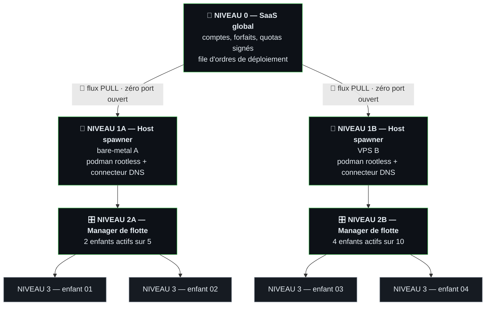
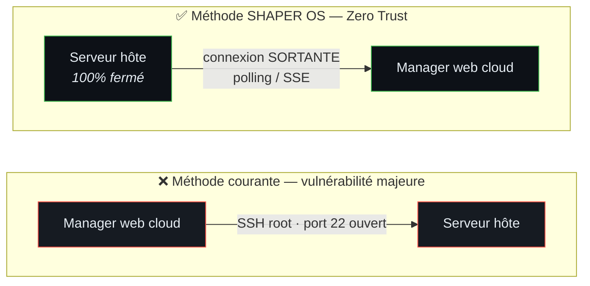
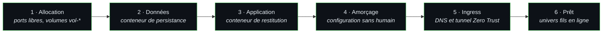

# 🌌 SHAPER OS — Architecture Fractale & Modèle de Sécurité Souverain

> **Statut de Référence :** Document d’Architecture & de Sécurité Normative  
> **Conformité :** Règles 23 (Vitals/Sondes), 27 (Alerting), 36 (Autorité & Isolation)

---

## 1. Vision & Principe Fondamental de la Fractalité

Dans **SHAPER OS**, chaque niveau de l'organisation est un univers autonome et auto-similaire.  
Un univers à un niveau donné ne connaît que ses enfants directs et son parent immédiat. Il n'a aucun pouvoir arbitraire sur le système d'exploitation global.

> Chaque nom au niveau 3 est fourni par l'opérateur. Ce dépôt n'en livre aucun.

---

## 2. Le Modèle de Sécurité Souverain : Le Modèle « PULL Worker »

La sécurité de SHAPER OS repose sur un refus catégorique des accès root et des ports ouverts.

Dans le premier cas, un web compromis donne le contrôle total du serveur. Dans
le second, l'hôte interroge la file de tâches et n'expose aucun port entrant.

### Pourquoi ce modèle est inviolable :
1. **Zéro port d'écoute ouvert sur Internet :** Le serveur VPS / Hôte ne possède aucun port SSH ou API d'administration exposé au public.
2. **Initiative toujours locale :** C'est le moteur de l'Hôte qui va chercher ses ordres auprès du SaaS (requête sortante HTTPS).
3. **Impossibilité d'injection de code système :** Le serveur hôte n'accepte que des ordres de mission stricts et typés (`SPAWN_STORE`, `STOP_STORE`, `BACKUP_STORE`).

---

## 3. L'Univers SHAPER OS de l'Hôte (Host Spawner Engine)

Pour exécuter les ordres de création de conteneurs, le serveur Hôte possède **son propre Univers SHAPER OS** composé des briques natives :

| Brique SHAPER | Rôle dans l'Hôte Spawner |
| :--- | :--- |
| **`@shaper/pkg-queue`** | Ordonnance les créations et destructions de boutiques dans une file priorisée avec gestion de charge. |
| **`@shaper/pkg-logger`** | Enregistre chaque événement d'infrastructure dans un journal immuable JSONL (`log/events.jsonl`). |
| **`@shaper/pkg-maestro`** | Chef d'orchestre local qui dépile la Queue, exécute les scripts Podman et vérifie la conformité. |
| **`@shaper/pkg-vault`** | Chiffre et isole les clés API Cloudflare, les mots de passe MariaDB et les certificats de licence. |
| **`@shaper/pkg-supervisor`** | Surveille l'utilisation RAM, CPU et disque de l'ensemble de la flotte de conteneurs. |

---

## 4. Le Principe du Moindre Privilège & Podman Rootless

1. **Podman Rootless (Zéro Root) :**
   * Tous les conteneurs, quels qu'ils soient, s'exécutent sous un utilisateur non privilégié dédié.
   * Même en cas de faille zero-day critique dans l'application hébergée, l'attaquant reste confiné dans le conteneur sans aucun droit sur le système hôte.
2. **Isolation Réseau Multi-Tenancy :**
   * Chaque univers fils possède son propre sous-réseau conteneurisé.
   * L'univers fils `01` ne peut ni lire, ni écrire dans la base de données de l'univers fils `02`.

---

## 5. Le Cycle de Vie Automatisé (Zero-Touch Provisioning)

Lorsqu'un ordre `SPAWN_CHILD` est validé par la Queue de l'Hôte :

1. **Amorçage automatique :** l'application du fils est installée et configurée sans intervention humaine.
2. **Spécialisation :** la brique métier du catalogue est activée et paramétrée depuis le manifeste du fils.
3. **Câblage edge :** l'API du fournisseur DNS associe le nom public au tunnel Zero Trust sans redémarrage de service.

---

## 6. Gestion des Quotas & Modèle Économique (5, 10, 20 Boutiques)

* Le SaaS Grand-Père injecte dans le Vault du Manager Père un jeton de quota cryptographique (`max_stores: 5`).
* Le Manager Père refuse toute création supplémentaire si `nombre_boutiques >= max_stores`.
* Lors d'une mise à niveau de forfait, le SaaS émet un jeton mis à jour qui débloque instantanément les nouveaux emplacements dans l'interface commerçant.

---

*Document de référence SHAPER OS V1.8 — Architecture Fractale & Sécurité Souveraine.*
