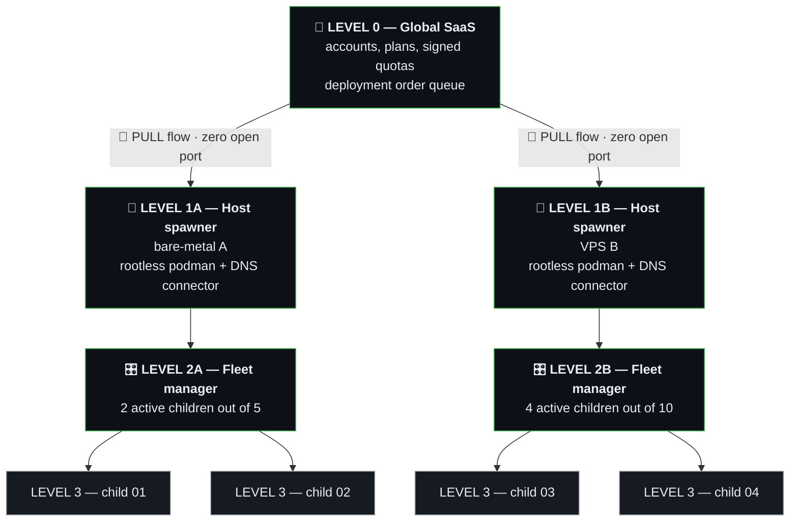
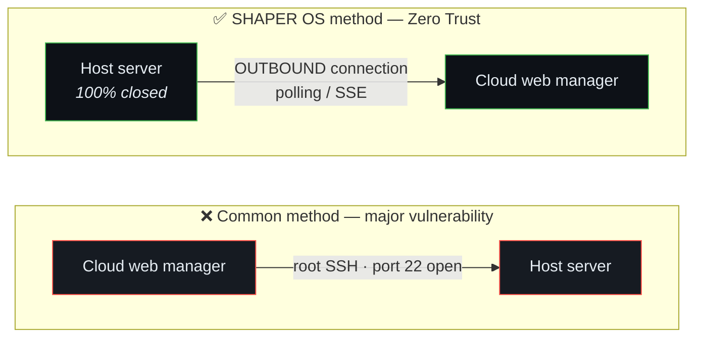
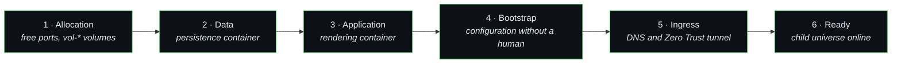

# 🌌 SHAPER OS — Fractal Architecture & Sovereign Security Model

> **Reference status:** Normative Architecture & Security Document  
> **Compliance:** Rules 23 (Vitals/Probes), 27 (Alerting), 36 (Authority & Isolation)

---

## 1. Vision & Fundamental Principle of Fractality

In **SHAPER OS**, every level of the organisation is an autonomous, self-similar universe.  
A universe at a given level knows only its direct children and its immediate parent. It has no arbitrary power over the global operating system.

> Every name at level 3 is supplied by the operator. This repository ships none.

---

## 2. The Sovereign Security Model: The "PULL Worker" Model

SHAPER OS security rests on a categorical refusal of root access and open ports.

In the first case, a compromised web tier gives total control of the server. In
the second, the host polls the task queue and exposes no inbound port.

### Why this model is inviolable:
1. **Zero listening port open to the Internet:** The VPS / host server has no SSH port or administration API exposed to the public.
2. **Initiative always local:** It is the host's engine that fetches its orders from the SaaS (outbound HTTPS request).
3. **No system code injection possible:** The host server accepts only strict, typed mission orders (`SPAWN_STORE`, `STOP_STORE`, `BACKUP_STORE`).

---

## 3. The Host's SHAPER OS Universe (Host Spawner Engine)

To execute container creation orders, the host server has **its own SHAPER OS universe** made of the native bricks:

| SHAPER brick | Role in the Host Spawner |
| :--- | :--- |
| **`@shaper/pkg-queue`** | Schedules store creations and destructions in a prioritised queue with load management. |
| **`@shaper/pkg-logger`** | Records every infrastructure event in an immutable JSONL journal (`log/events.jsonl`). |
| **`@shaper/pkg-maestro`** | Local conductor that dequeues the Queue, runs the Podman scripts and checks compliance. |
| **`@shaper/pkg-vault`** | Encrypts and isolates the Cloudflare API keys, the MariaDB passwords and the licence certificates. |
| **`@shaper/pkg-supervisor`** | Watches the RAM, CPU and disk usage of the whole container fleet. |

---

## 4. The Principle of Least Privilege & Rootless Podman

1. **Rootless Podman (Zero Root):**
   * All containers, whatever they are, run under a dedicated unprivileged user.
   * Even with a critical zero-day flaw in the hosted application, the attacker stays confined to the container with no rights on the host system.
2. **Multi-Tenancy Network Isolation:**
   * Every child universe has its own containerised subnet.
   * Child universe `01` can neither read nor write the database of child universe `02`.

---

## 5. The Automated Lifecycle (Zero-Touch Provisioning)

When a `SPAWN_CHILD` order is validated by the host's Queue:

1. **Automatic bootstrap:** the child's application is installed and configured without human intervention.
2. **Specialisation:** the catalogue's business brick is enabled and parameterised from the child's manifest.
3. **Edge wiring:** the DNS provider's API binds the public name to the Zero Trust tunnel without a service restart.

---

## 6. Quota Management & Economic Model (5, 10, 20 Stores)

* The Grandfather SaaS injects into the Father Manager's Vault a cryptographic quota token (`max_stores: 5`).
* The Father Manager refuses any further creation if `store_count >= max_stores`.
* On a plan upgrade, the SaaS issues an updated token that instantly unlocks the new slots in the merchant interface.

---

*SHAPER OS V1.8 reference document — Fractal Architecture & Sovereign Security.*
