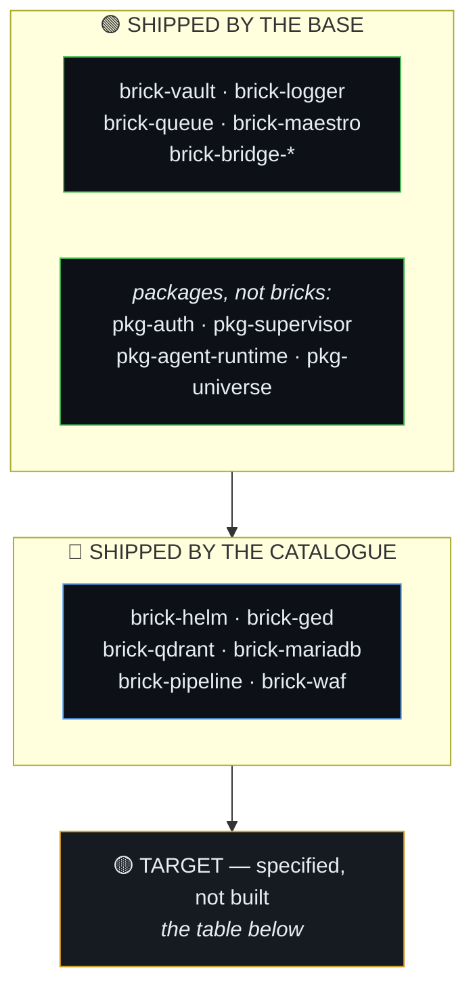

# Missing & Target Bricks Roadmap — The Extended Capability Catalog

> **Why this document exists.** SHAPER OS v1.8 ships with a robust, proven
> **runnable core** (vault, logger, agent-bridge, queue, maestro) and specialized
> live extensions (ged, qdrant, rag, supervisor, mariadb, helm). However, full
> real-world business autonomy requires a defined roadmap of **extended specialized
> bricks**, notably for **telephony, communications, webmail, and external ingress
> channels**.
> 
> This document specifies the missing bricks: their role, ports, perimeters,
> cognition requirements, and exact interfaces so that human architects understand
> what is coming and AI agents can materialize them deterministically without
> inventing contradictory designs.

---

## 🗺️ Extended Bricks Overview

> **The boundary matters more than the list.** Until V1.12 this diagram put
> `brick-helm`, `brick-ged`, `brick-qdrant` and `brick-mariadb` under "live in
> core / repo". They are catalogue products: the base neither ships nor tests
> them, and cannot stay right about them. See
> [`ARTIFACT-BOUNDARY.md`](./ARTIFACT-BOUNDARY.md).

### Target bricks — communications, telephony, webmail and ingress channels

| # | Brick | Port | What it would do |
| ---: | :--- | :--- | :--- |
| 1 | `brick-waf` | 8680 | Adaptive sovereign firewall and positive SSR cache |
| 2 | `brick-telephony-pbx` | 5060 | Sovereign IPBX, SIP trunk and interactive voice (IVR) |
| 3 | `brick-softphone` | 8660 | WebRTC responsive softphone, desktop and mobile PWA |
| 4 | `brick-webmail` | 8652 | Sovereign responsive webmail with AI-assisted composition |
| 5 | `brick-mail-intake` | 8655 | Continuous IMAP IDLE listener and attachment queue ingress |
| 6 | `brick-messaging` | 8665 | WhatsApp Pro / Telegram / Signal client ingress |
| 7 | `brick-voice` | 8670 | Local Whisper STT and low-latency voice synthesis |
| 8 | `brick-billing` | 8690 | Payment webhooks, quotas and sovereign auto-invoicing |
| 9 | `brick-caldav` | 8675 | Two-way CalDAV/ICS calendar sync and online slot booking |
| 10 | `brick-pdf` | 8685 | Deterministic multi-page PDF splitting and eIDAS signature |
| 11 | `brick-pipeline` | 8695 | Eight-stage multi-witness document understanding and arbiter |
| 12 | `brick-forms` | 8692 | Sovereign public form builder and secure attachment ingress |
| 13 | `brick-sms` | 8662 | SMS gateway, OTP and 2FA dispatch |
| 14 | `brick-iot-mqtt` | 1883 / 8682 | IoT telemetry ingress and MQTT event dispatch |
| 15 | `brick-bank-bridge` | 8694 | EBICS and open banking statement ingress (CAMT.053 / CFONB) |
| 16 | `brick-sftp` | 2222 | Isolated B2B SFTP drop and EDI exchange ingress |
| 17 | `brick-social-feed` | 8668 | Customer reviews and social feedback ingress |

---

## 📞 1. `brick-telephony-pbx` — Sovereign IPBX & SIP Switchboard

* **Perimeter:** P2 (Operator Telephony) / P3 (Customer Reception & Call Center).
* **Ports:** `:5060` (SIP UDP/TCP), `:8088` (WebRTC WSS Signaling), `:10000-20000` (RTP Media).
* **Role:** Full enterprise telephony standard:
  - Connects to sovereign SIP trunks (OVH Telecom, Free Telecom, Twilio, Sipgate).
  - **Interactive Voice Response (IVR / SVI):** Automated vocal menu (*"Press 1 for Sales, 2 for Support"*).
  - Call routing, queues, music on hold, call transfers, and voicemail recording.
  - Automatically pushes call audio recordings to `brick-ged` and triggers speech-to-text transcription jobs in `brick-queue`.
* **Cognition:** `D0` (SIP switching & call state machine) + `D1` (IVR routing logic).
* **Status:** `TARGET`.

---

## 📱 2. `brick-softphone` — WebRTC Responsive Softphone (Desktop & Mobile)

* **Perimeter:** P2 (Operator Cockpit / Agent UI).
* **Port:** `:8660` (or embedded inside Helm cockpit).
* **Role:** Lightweight, zero-install WebRTC softphone client running on Desktop and Mobile browsers (PWA):
  - Inbound and outbound phone calls with crystal-clear Opus audio.
  - Dialpad, call history, address book lookup, and DTMF tones.
  - Live in-call transcription display and audio note tagging.
  - Works anywhere behind Cloudflare Zero Trust without requiring VPNs or complex SIP client installations on employee devices.
* **Cognition:** `D0` (WebRTC client UI) + `T0` (real-time audio stream).
* **Status:** `TARGET`.

---

## 📬 3. `brick-webmail` — Sovereign Responsive Webmail UI

* **Perimeter:** P2 (Operator Cockpit) / P3 (Corporate Mail Portal).
* **Port:** `:8652`.
* **Role:** Sovereign, ultra-responsive webmail interface:
  - Multi-account IMAP / SMTP support with zero reliance on Google Workspace or Outlook 365.
  - Deep integration with `brick-ged` for attaching files or saving inbound documents with one click.
  - **AI-Assisted Composition & Reply:** Summarizes long email threads, drafts professional contextual replies, and auto-categorizes messages.
  - Complete mobile responsiveness and offline draft caching.
* **Cognition:** `D0` (email UI & IMAP renderer) + `D2` (AI drafting & summarization).
* **Status:** `TARGET` (Pre-existing code base ready for containerization).

---

## 🛡️ 4. `brick-waf` — Adaptive Sovereign Firewall & Positive Cache

* **Perimeter:** P1 / P2 Boundary (Ingress Security & Route Filtering).
* **Port:** `:8680` (or reverse-proxy socket).
* **Role:** Neutralizes malicious or parasitic traffic in $< 0.2$ ms without ever waking application runtimes (Node.js/PHP).
* **The 2-Phase Adaptive Lifecycle:**
  1. **Phase 1 (Generic Pre-boot Base):** Hardened filters (anti-SQLi, anti-XSS, anti-path traversal `../`, IP sliding-window rate limiter, Cloudflare zero-trust ingress).
  2. **Phase 2 (Live Application Profiling):** Once the target application runs, whatever it is, the Parent Agent compiles an **exact positive allow-list of routes and HTTP verbs** (`GET /api/search`, `POST /api/upload`). Any request outside this shape is dropped at Layer 3 with a `403 Forbidden` in $0.1$ ms.
  3. **SSR Positive Cache:** Serves immutable product sheets, brochures, and public catalog pages in $0.3$ ms.
* **Cognition:** `D0` (deterministic packet filtering) + `D2` (post-boot route compilation).
* **Status:** `TARGET` (Specified in `doctrine/SOVEREIGN-WEB-CHAIN-WAF-AND-CACHE.md` and Rule 28).

---

## 💳 5. `brick-billing` — Sovereign Payment Gateway & Subscriptions

* **Perimeter:** P2 (Platform Billing) / P3 (Client E-Commerce & Services).
* **Port:** `:8690`.
* **Role:** Receives payment provider webhooks (Stripe, PayPal, Mollie) with cryptographic HMAC signature verification, manages recurring subscription states, tracks usage quotas, and triggers automated invoice PDF generation stored into `brick-ged`.
* **Cognition:** `D0` (webhook verification & balance arithmetic).
* **Status:** `TARGET`.

---

## 🎙️ 6. `brick-voice` — Local Whisper STT & Low-Latency Voice Synthesis

* **Perimeter:** P2 (Operator Cockpit Voice) / P3 (Field Worker Audio Notes).
* **Port:** `:8670`.
* **Role:** Speech-to-Text (STT) transcription via Whisper / Faster-Whisper + Text-to-Speech (TTS) via Piper / XTTS. Provides low-latency streaming acknowledgment for voice-first interactions ($< 500$ ms).
* **Cognition:** `D1` (audio transcription) + `T0` (voice streaming throughput $\ge 500$ tok/s).
* **Status:** `TARGET`.

---

## 💬 7. `brick-messaging` — Instant Messaging Bridge (WhatsApp / Telegram / Signal)

* **Perimeter:** P3 (Business Communication Ingress).
* **Port:** `:8665`.
* **Role:** Bidirectional connector for WhatsApp Business Cloud API, Telegram Bot API, and Signal-CLI. Receives client text messages, photos, audio notes, and PDF attachments, converting them into queued jobs in `brick-queue`. Dispatches outbound notifications, payment links, and quote approvals.
* **Cognition:** `D1` (message normalization) + `T1` (conversational response).
* **Status:** `TARGET`.

---

## 📅 8. `brick-caldav` — 2-Way Calendar Engine & Online Appointment Booking

* **Perimeter:** P3 (Business Scheduling).
* **Port:** `:8675`.
* **Role:** Lightweight CalDAV / ICS server and synchronization bridge. Interacts with Apple iCloud, Google Calendar, and Nextcloud. Calculates real-time booking availability slots and handles instant slot reservation without third-party subscriptions.
* **Cognition:** `D0` (slot availability arithmetic).
* **Status:** `TARGET`.

---

## 📑 9. `brick-pdf` — Deterministic PDF Toolkit & Digital Signature

* **Perimeter:** P1 / P3 (Document Operations).
* **Port:** `:8685` (or CLI container).
* **Role:** Binary PDF manipulation: multi-page splitting by barcode/employee ID (e.g. payroll batch), PDF merging, official company watermarking, and cryptographic X.509 eIDAS digital signatures.
* **Cognition:** `D0` (deterministic binary manipulation).
* **Status:** `TARGET`.

---

## 📥 10. `brick-mail-intake` — Dedicated IMAP IDLE Daemon

* **Perimeter:** P2 (Operator Inbox) / P3 (Invoice & Support Inbound).
* **Port:** `:8655`.
* **Role:** Standalone container maintaining continuous `IMAP IDLE` connections to business mailboxes (e.g. `invoices@company.com`, `support@company.com`). Extracts MIME parts, saves attachments to CAS storage in `brick-ged`, and injects tasks into `brick-queue`.
* **Cognition:** `D1` (MIME parsing & header normalization).
* **Status:** `PARTIAL` (`@shaper/pkg-mail-agent` exists in-process; needs standalone daemon packaging).

---

## 🔬 11. `brick-pipeline` — 8-Stage Multi-Witness Document Pipeline

* **Perimeter:** P3 (Deep Document Understanding).
* **Port:** `:8695`.
* **Role:** 8-stage document intelligence pipeline: Ingestion $\rightarrow$ Triage $\rightarrow$ Dual OCR + Vision $\rightarrow$ Mechanical Arbitration $\rightarrow$ Fact Extraction $\rightarrow$ Normalization $\rightarrow$ 384d Vectorization $\rightarrow$ CAS Storage.
* **Cognition:** `D1` (OCR) + `D2` (Fact extraction) + `D3` (Arbitration of conflicting witnesses).
* **Status:** `TARGET` (Specified in `doctrine/DOCUMENT-PIPELINE.md`).

---

## 📋 12. `brick-forms` — Public Form Builder & Secure File Ingress

* **Perimeter:** P3 (Client Ingress & Surveys).
* **Port:** `:8692`.
* **Role:** Sovereign form builder replacing Typeform / Google Forms:
  - Generates embedded public forms (quote requests, patient questionnaires, KYC data collection).
  - Secure chunked multi-gigabyte file uploads with antivirus and MIME-type validation.
  - Feeds submissions directly into `brick-queue` and `brick-ged`.
* **Cognition:** `D0` (form rendering & schema validation).
* **Status:** `TARGET`.

---

## 📟 13. `brick-sms` — Sovereign SMS & 2FA Gateway

* **Perimeter:** P2 / P3 (Urgent Notifications & Verification).
* **Port:** `:8662`.
* **Role:** SMS dispatch and reception via local 4G/5G USB dongle modem or standard telecom SIP/SMPP APIs. Used for booking reminders, shipping alerts, security OTPs, and operator escalation alerts.
* **Cognition:** `D0` (telecom frame dispatch).
* **Status:** `TARGET`.

---

## 📡 14. `brick-iot-mqtt` — IoT & Telemetry Ingress Broker

* **Perimeter:** P3 (Industrial & Physical Hardware Ingress).
* **Ports:** `:1883` (MQTT TCP), `:8682` (MQTT WebSockets / Webhooks).
* **Role:** Lightweight MQTT broker ingesting telemetry from physical hardware (cold room temperature sensors, fleet GPS trackers, electricity meters, connected scales). Triggers automated alerts and maintenance jobs in `brick-queue`.
* **Cognition:** `D0` (stream ingestion & threshold triggers).
* **Status:** `TARGET`.

---

## 🏦 15. `brick-bank-bridge` — EBICS & Open Banking Ingress

* **Perimeter:** P3 (Financial Operations).
* **Port:** `:8694`.
* **Role:** Ingests daily bank transaction statements via EBICS TS / Open Banking DSP2 standards (formats CAMT.053, CFONB, MT940). Feeds raw ledger lines into `accounting-vault` for automatic reconciliation.
* **Cognition:** `D0` (cryptographic bank transport & XML parsing).
* **Status:** `TARGET`.

---

## 🗄️ 16. `brick-sftp` — Isolated B2B SFTP Drop Ingress

* **Perimeter:** P1 / P3 (B2B EDI File Exchanges).
* **Port:** `:2222`.
* **Role:** Chrooted, unprivileged SFTP file drop server for supplier inventory catalogs, large CAD files, and EDI invoices. Watched directories automatically trigger ingestion jobs into `brick-ged` and `brick-queue`.
* **Cognition:** `D0` (secure file transport).
* **Status:** `TARGET`.

---

## 🌟 17. `brick-social-feed` — Reviews & Social Ingress

* **Perimeter:** P3 (Reputation & Customer Feedback).
* **Port:** `:8668`.
* **Role:** Ingests customer ratings and reviews from Google My Business, Trustpilot, and social comments. Triggers sentiment analysis and drafts AI-assisted customer responses.
* **Cognition:** `D1` (review ingestion) + `D2` (sentiment classification & response drafting).
* **Status:** `TARGET`.

---

## 📊 Summary Matrix: All Extended & Target Bricks

| Brick | Default Port | Perimeter | Primary Engine / Tech | Cognition Class |
| :--- | :---: | :---: | :--- | :--- |
| **`brick-telephony-pbx`** | `5060/8088` | P2/P3 | Asterisk / FreeSWITCH SIP | `D0` / `D1` (`infra-ops`) |
| **`brick-softphone`** | `8660` | P2/P3 | WebRTC PWA + Opus Audio | `D0` / `T0` (`rapid-iteration-ui`) |
| **`brick-webmail`** | `8652` | P2/P3 | Node.js + IMAP/SMTP Client | `D0` / `D2` (`rapid-iteration-ui`) |
| **`brick-waf`** | `8680` | P1/P2 | Node.js + Nginx Socket | `D0` / `D2` (`infra-ops`) |
| **`brick-billing`** | `8690` | P2/P3 | Node.js + Stripe SDK | `D0` (`infra-ops`) |
| **`brick-voice`** | `8670` | P2/P3 | Faster-Whisper + Piper | `D1` / `T0` (`fast-eval`) |
| **`brick-messaging`** | `8665` | P3 | WhatsApp Cloud / Telegram API | `D1` / `T1` (`rapid-iteration-ui`) |
| **`brick-caldav`** | `8675` | P3 | CalDAV Server / ICAL.js | `D0` (`infra-ops`) |
| **`brick-pdf`** | `8685` | P1/P3 | PDFtk / MuPDF / QPDF | `D0` (`heavy-engineering`) |
| **`brick-mail-intake`**| `8655` | P2/P3 | Node.js IMAP-Flow | `D1` (`infra-ops`) |
| **`brick-pipeline`** | `8695` | P3 | Dual-OCR + Vision + Arbiter | `D3` (`heavy-engineering`) |
| **`brick-forms`** | `8692` | P3 | Node.js Form Engine | `D0` (`rapid-iteration-ui`) |
| **`brick-sms`** | `8662` | P2/P3 | Gammu / 4G Dongle / SIP SMS | `D0` (`infra-ops`) |
| **`brick-iot-mqtt`** | `1883/8682` | P3 | Mosquitto MQTT / Aedes | `D0` (`infra-ops`) |
| **`brick-bank-bridge`**| `8694` | P3 | EBICS Client / CAMT Parser | `D0` (`heavy-engineering`) |
| **`brick-sftp`** | `2222` | P1/P3 | OpenSSH Chroot Drop | `D0` (`infra-ops`) |
| **`brick-social-feed`**| `8668` | P3 | REST Webhook Ingress | `D1` (`rapid-iteration-ui`) |

---

## 🛠️ Implementation Contract for AI Agents

When an AI agent is instructed to build one of these target bricks:
1. **Never fork core libraries:** Consume `@shaper/pkg-vault`, `@shaper/pkg-logger`, and `@shaper/pkg-queue` as standard dependencies.
2. **One Container, One Intent:** Package the brick as an autonomous OCI container under `software/bricks/<brick-name>/`.
3. **Declare Cognition:** Write required reasoning depth, throughput, and degradation policy in the brick's `INTENT.md` (see [`COGNITION.md`](./COGNITION.md)).
4. **Ship Non-Regression Tests:** Every brick must ship with 100% passing unit and contract tests before being referenced in any manifest.
