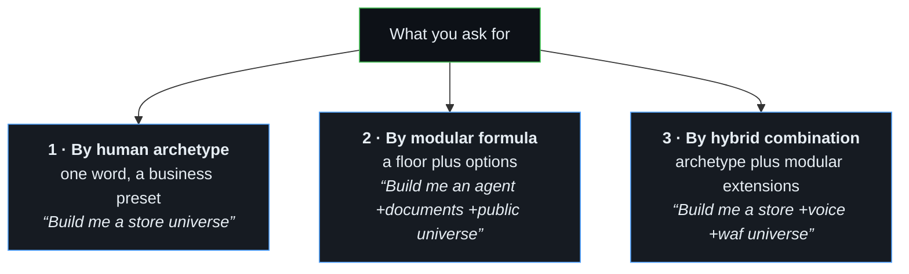
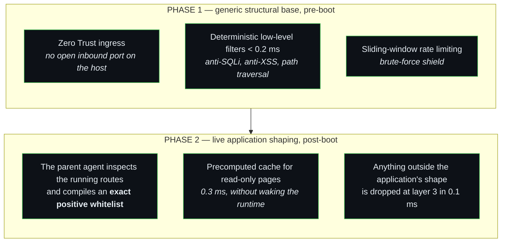

# Universe Profiles & Human Archetypes — Naming What to Build

> **Why this page exists.** Two agents were asked, in the same words, to build
> "the base universe". One built five containers, the other six. Neither was
> wrong: the phrase had no definition. This page gives the starting points names —
> whether you speak in **business archetypes** (human mode) or in **modular Lego
> formulas** (agent mode) — so that a single phrase in a prompt settles what gets
> built, and everything after that phrase is yours to shape.

A profile is a **floor, not a cage.** It says where to start. What you add on top
is the work.

---

## 🧭 The 3 Ways to Prompt a Universe

You can prompt a universe in whichever way feels natural to you:



---

## 🏛️ 1. Human Archetypes (Business Presets)

Direct business names you can use in your prompts. The agent resolves the
archetype into its canonical formula and its bricks.

> **Two tables, and the line between them is not decoration.** The first lists
> what can be built **today**, from bricks that exist. The second lists where the
> product is going: every archetype there names at least one brick that is a
> specification and not yet code. Ask for one of those and an agent will raise the
> floor correctly, then stop at the first missing brick — having spent your time.
>
> A test refuses any archetype in the first table that names a brick which does
> not exist, so this boundary cannot rot quietly.

### With this repository alone

| Human Archetype (EN / FR) | Manifest Alias | Canonical Formula | Bricks Deployed | What It Does for the Business |
| :--- | :--- | :--- | :--- | :--- |
| **Fleet Manager (Parent)**<br>*(Gestionnaire de Flotte)* | `fleet-manager` | `agent +parent +public` | `vault`, `logger`, `bridge`, `queue`, `maestro`, `supervisor`, `manager-gateway`, `tunnel` | Supervisor cockpit repairing ($K+1$) and provisioning child universes |
| **Watchdog & Scraping**<br>*(Agent de Veille & Tâches)* | `watchdog` | `agent +clock` | `vault`, `logger`, `bridge`, `queue`, `maestro` | Autonomous cron tasks, supplier API sync, competitor scraping & alerts |
| **Public Brochure**<br>*(Site Vitrine Souverain)* | `brochure` | `passive +public` | `logger`, `nginx/static`, `tunnel` | Ultra-fast, lightweight public presence with zero attack surface |

---

### With the brick catalogue

Buildable today too, but they need bricks from **`SHAPER-OS-BRICKS`** — packaged
products referenced by image and tag. Clone or pull that catalogue first; nothing
here is copied from it.

| Human Archetype (EN / FR) | Manifest Alias | Canonical Formula | Bricks Deployed | What It Does for the Business |
| :--- | :--- | :--- | :--- | :--- |
| **E-Commerce Store**<br>*(Boutique E-Commerce)* | `store` | `passive +data +public` | `brick-logger`, plus the storefront and database bricks of the catalogue | Online transactional store with database, health probes & payments |
| **Document & AI Hub**<br>*(GED & IA Documentaire)* | `document-hub` | `agent +documents +public` | `vault`, `logger`, `bridge`, `queue`, `maestro`, `ged`, `qdrant`, `rag`, `tunnel` | Sovereign document management, OCR, 384d vector search & multimodal AI |

---

### On the roadmap — not buildable yet

Each of these raises a real floor, then stops: the option it needs is a
specification. They are listed so the vocabulary is stable before the bricks
exist, never so that one can be requested by mistake.

| Human Archetype (EN / FR) | Manifest Alias | Canonical Formula | Bricks Deployed | What It Does for the Business | Still missing |
| :--- | :--- | :--- | :--- | :--- | :--- |
| **Corporate Switchboard & Office**<br>*(Standard & Téléphonie)* | `telephony-hub` | `agent +telephony +softphone +webmail` | `vault`, `logger`, `bridge`, `queue`, `maestro`, `telephony-pbx`, `softphone`, `webmail` | Sovereign IPBX phone standard, responsive softphone & webmail | brick-telephony-pbx, brick-softphone, brick-webmail |
| **Field Service & Quotes**<br>*(Devis & Rapports de Chantier)* | `field-service` | `agent +documents +voice` | `vault`, `logger`, `bridge`, `queue`, `maestro`, `ged`, `rag`, `voice` | Turns voice notes & job site photos into structured quotes & PDF reports | brick-voice |
| **Accounting & Reconciliation**<br>*(Rapprochement & Compta)* | `accounting-vault` | `agent +documents +data +banking` | `vault`, `logger`, `bridge`, `queue`, `maestro`, `ged`, `rag`, `mariadb`, `bank-bridge` | Ingests supplier invoices & bank statements, reconciles lines & exports journals | brick-bank-bridge |
| **Omnichannel Helpdesk**<br>*(Support Client Omnicanal)* | `helpdesk` | `agent +intake +messaging +documents` | `vault`, `logger`, `bridge`, `queue`, `maestro`, `mail-agent`, `messaging`, `ged`, `rag` | Automatic email/WhatsApp triage, vector knowledge lookup & ticket escalation | brick-messaging |
| **Booking Engine**<br>*(Prise de Rendez-Vous)* | `booking-engine` | `passive +data +calendar +public` | `logger`, `mariadb`, `calendar-sync`, `tunnel` | Online appointment booking with CalDAV/ICS sync and SMS/email alerts | brick-caldav |
| **Online Academy / LMS**<br>*(Plateforme Formations)* | `academy` | `passive +data +billing +public` | `logger`, `mariadb`, `billing`, `auth`, `tunnel` | Member portal for video courses and PDF deliverables (0% platform fee) | brick-billing |

---

## 🧱 2. The Two Canonical Floors

### `passive` — it runs, and it can be proven

```
logger                                    :8620
```

Plus whatever service it watches (a website, a store, a database). The `logger`
is the one brick that never leaves, because the currency of SHAPER OS is proof —
a universe that cannot show what happened is outside the doctrine.

**Nothing reasons here.** No agent, no queue, no clock.

### `agent` — it reasons, works in the background, and starts on its own

```
vault    :8610      the secrets
logger   :8620      the memory and the proof
bridge   :4440      the AI agent
queue    :8640      asynchronous work, and the answer persisted
maestro  :8630      autonomous heartbeat / scheduled beats
```

Boot order: `vault ∥ logger → bridge → queue → maestro`.

**This is the default.** When nobody names a profile, this is what gets built.
It is what `manifest.tier-a.json` has always declared; `tier-a` stays as an alias.

---

## 🧩 3. Modular Options & Extensions

Options attach to either floor or any archetype.

### In this repository

This repository ships **the base and nothing else**. These options need no other
source:

| Option | Human alias | Adds | What it buys |
| :--- | :--- | :--- | :--- |
| **`+clock`** | `+cadence` | `brick-maestro` | For a `passive` universe — `agent` already has it |
| **`+parent`** | `+flotte` | `@shaper/pkg-supervisor`, children registry, SSH authority | It operates **other** universes |
| **`+public`** | `+internet` | `cloudflared` (upstream image) | Reachable from outside, with no inbound port open |

### From the brick catalogue

Available today, but they live in **`SHAPER-OS-BRICKS`** — packaged products with
their own upstreams and their own release pace. Referenced by image and tag, never
copied here:

| Option | Adds | What it buys |
| :--- | :--- | :--- |
| **`+documents`** | `brick-ged`, `brick-qdrant`, `@shaper/pkg-rag` | It knows things beyond the current task |
| **`+data`** | `brick-mariadb` | Relational state that outlives the run |
| **`+web`** | `brick-helm` | A human who is not at a terminal can drive it |
| **`+intake`** | `@shaper/pkg-mail-agent` | Work arrives on its own |

### On the roadmap

Every option below names a brick that is a **specification, not code**. They are
catalogued so the vocabulary settles before the bricks exist — and so that asking
for one is a deliberate act rather than a surprise at deploy time.

| Option (Lego) | Human Alias | Adds | What It Buys |
| :--- | :--- | :--- | :--- |
| **`+telephony`** | `+standard` | `brick-telephony-pbx` *(TARGET)* | Sovereign IPBX phone standard, SIP trunks, IVR menus & call recording |
| **`+softphone`** | `+phone` | `brick-softphone` *(TARGET)* | Responsive WebRTC softphone on Desktop & Mobile PWA |
| **`+webmail`** | `+courriel` | `brick-webmail` *(TARGET)* | Sovereign multi-account webmail with AI-assisted drafting |
| **`+waf`** | `+security` | `@shaper/waf-engine` *(TARGET)* | **Adaptive Sovereign Firewall & positive cache (shaped live)** |
| **`+billing`** | `+payment` | `brick-billing` *(TARGET)* | Stripe webhooks, subscriptions, customer billing & auto-invoicing |
| **`+voice`** | `+audio` | `brick-voice` *(TARGET)* | Whisper voice transcription (STT) & vocal response synthesis (TTS) |
| **`+messaging`** | `+whatsapp` | `brick-messaging` *(TARGET)* | WhatsApp Pro / Telegram / Signal client photo & chat intake |
| **`+calendar`** | `+agenda` | `brick-caldav` *(TARGET)* | CalDAV / ICS booking availability & 2-way agenda sync |
| **`+forms`** | `+formulaire`| `brick-forms` *(TARGET)* | Sovereign form builder & secure large attachment uploads |
| **`+sms`** | `+texto` | `brick-sms` *(TARGET)* | SMS gateway, OTP 2FA codes & urgent client alerts |
| **`+banking`** | `+banque` | `brick-bank-bridge` *(TARGET)* | EBICS & Open Banking daily bank statement ingestion (CAMT.053) |
| **`+iot`** | `+capteurs` | `brick-iot-mqtt` *(TARGET)* | MQTT broker for connected hardware & sensor telemetry |
| **`+sftp`** | `+edi` | `brick-sftp` *(TARGET)* | Isolated chroot SFTP server for B2B supplier file drops |
| **`+social`** | `+avis` | `brick-social-feed` *(TARGET)* | Customer reviews ingestion (Google/Trustpilot) & sentiment analysis |
| **`+pdf-toolkit`** | `+pdf` | `brick-pdf` *(TARGET)* | Multi-page PDF splitting, barcode tagging, and digital signature |
| **`+documents`** | `+dms` | `ged`, `qdrant`, `@shaper/pkg-rag` | Full document ingestion, OCR, and 384d semantic vector search |
| **`+data`** | `+db` | `mariadb` | Relational database state that outlives the execution run |
| **`+web`** | `+cockpit` | `helm`, `auth` | Operator `/console` cockpit and authenticated browser interface |
| **`+public`** | `+online` | `tunnel` (Cloudflare Zero Trust) | Public HTTPS routing with **zero open inbound ports** |
| **`+intake`** | `+mail` | `@shaper/pkg-mail-agent` | Automatic inbound IMAP mail listening & background job intake |
| **`+parent`** | `+supervisor` | `@shaper/pkg-supervisor`, SSH authority | Supervisor role: grades child vitals (R23) and performs repairs |
| **`+clock`** | `+cron` | `maestro` | Heartbeat scheduler (for `passive` floor only; `agent` already has it) |

---

## 🛡️ Special Focus: The Adaptive Sovereign WAF (`+waf`)

> **Doctrine Reminder (Rule 28 & Sovereign Web Chain)**:  
> *A WAF cannot be an arbitrary static black-box. It must be structurally prepared with a generic base, and then **shaped in live execution according to the specific application it protects**.*



Adding **`+waf`** to any universe activates this adaptive guardian.

---

## 💬 4. Real-World Prompt Examples Across Lifecycles

Here is how humans and AI agents formulate instructions in plain English across the 3 lifecycle stages (`DEV`, `TEST`, `PROD`).

> **Examples 1 to 3 can be built today. Examples 4 to 6 describe the roadmap** —
> they name options that are still specifications, and an agent asked for one will
> raise the floor and then stop at the missing brick.

### Example 1 — Sovereign document hub (DEV) · *buildable*
> *"Build me a **`document-hub`** universe called `univ-devis-dev`, DEV lifecycle. It ingests incoming quote requests, indexes them, and produces a written summary every morning."*

### Example 2 — Watchdog on supplier prices (DEV) · *buildable*
> *"Build me a **`watchdog`** universe called `univ-veille-dev`, DEV lifecycle. Every hour it checks three supplier APIs and writes an alert into the journal when a price moves by more than 5%."*

### Example 3 — Fleet parent supervising two shops (TEST) · *buildable*
> *"Build me a **`fleet-manager`** universe called `univ-flotte-test`, TEST lifecycle. It provisions two child shops, proves it can repair one of them, then destroys itself."*

### Example 4 — Corporate Telephony & Webmail Standard (DEV) · *roadmap*
> *"Build me a **`telephony-hub +waf`** universe called `univ-office-dev`, DEV lifecycle. Connects to our OVH SIP trunk with an interactive voice menu (IVR), softphone WebRTC on desktop/mobile, and webmail with AI draft replies."*

### Example 2 — E-Commerce Store with Adaptive WAF (DEV)
> *"Build me a **`store +waf`** universe called `univ-shoes-dev`, DEV lifecycle. It runs a storefront with an adaptive firewall and a precomputed cache for catalogue pages."*

### Example 3 — Field Service Quotes with Voice & WhatsApp (DEV)
> *"Build me a **`field-service +messaging +billing`** universe called `univ-renov-dev`, DEV lifecycle. Artisans send photos and audio notes via WhatsApp; the agent produces signed quotes and collects Stripe deposit payments."*

### Example 4 — Accounting Hub with Auto-Mail & EBICS Banking Ingress (TEST)
> *"Build me an **`accounting-vault +intake +banking +waf`** universe called `univ-accounting-test`, TEST lifecycle. Invoices arriving by email and CAMT.053 bank statements are automatically ingested, reconciled, and filed into the GED. Rebuild from scratch, validate tests, then destroy."*

### Example 5 — Booking Engine for Healthcare with WhatsApp Reminders (DEV)
> *"Build me a **`booking-engine +messaging +sms`** universe called `univ-clinic-dev`, DEV lifecycle. Patients book slots online, syncing with Apple/Google Calendar and receiving appointment reminders on WhatsApp and SMS."*

### Example 6 — Private Video Academy (PROD)
> *"Deploy the validated tag `v1.2.0` on the **`academy +billing +waf`** universe called `univ-courses-prod`, PROD lifecycle, under domain `academy.company.com`. Private member portal selling video masterclasses with Stripe subscriptions and zero third-party platform fees."*

---

## 📋 5. Declared and Machine-Checked

The profile is declared in the universe manifest:

```json
{
  "universe": "univ-office-dev",
  "environment": "dev",
  "profile": "telephony-hub +waf"
}
```

The test suite (`software/packages/pkg-queue/test/universe-profile.test.js`) automatically resolves human archetypes and verifies that all required base bricks are present before any deployment is permitted.

---

## 🚫 What No Profile Contains

Its own repair authority. A universe emits its raw vitals; a level above ($K+1$)
grades them and repairs it (Rule 23), or a human operator does (Rule 24).
`+parent` makes a universe the supervisor of **others** — never the one who
modifies itself in flight.
