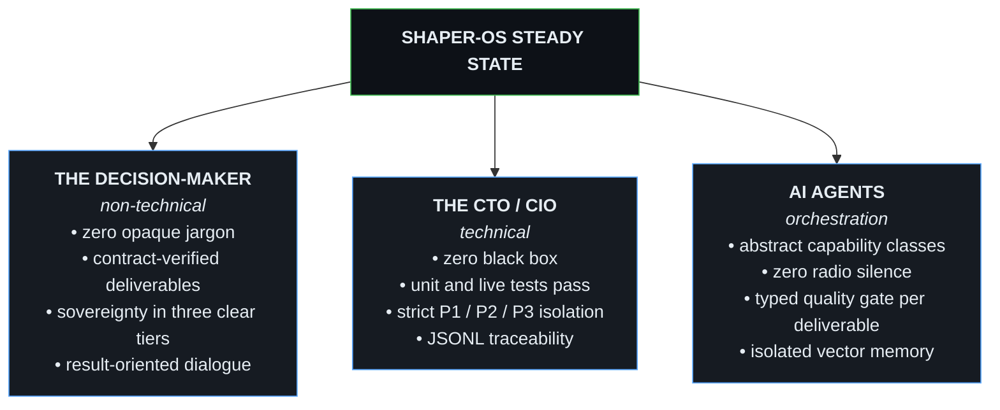

# SHAPER-OS — Convergence Proposal Towards the Target Steady State
## Framing Document, Invariance Rules, Intents, and Manifest Extensions

This document synthesizes the strategic and technical answers to the questions raised during the **August 2026** framing. It formally defines the **target steady state** and establishes the invariance rules (Rules 19 to 29), the deliverable verification typology, and the reconciliation loop.

---

## 0. THE QUESTIONS ASKED BY THE USER (XAVIER)

1. **Question 1:** *“What do you understand from this?”* (Commercial framing & Simple/Technical toggle).
2. **Question 2:** *“What is already true in this, and what do we need to improve to match it?”* (Audit of existing V1.6/V1.7 vs Promise).
3. **Question 3:** *“What rules, what intents, what should be added to the manifest, what should be added elsewhere to ensure 100% convergence toward the target steady state? Define what the target steady state is.”*

---

## 1. FORMAL DEFINITION OF THE “TARGET STEADY STATE”

The steady state of SHAPER-OS is the situation where **the system simultaneously and frictionlessly satisfies the requirements of its three stakeholders**:



### Sovereignty in 3 Explicit Tiers (Total Technical Honesty):
1. **Tier 1 — Owned Data (100% Sovereign)**: Local MariaDB databases, `sav/` volumes, AES-256-GCM Vault. No client data ever leaves the perimeter.
2. **Tier 2 — Owned Foundation & Orchestration (100% Sovereign)**: Rootless Podman, Maestro Scheduler, Queue, JSONL Logger, boot and self-healing scripts.
3. **Tier 3 — Modular Intelligence Engines (Interchangeable)**: By choice, local sovereign models (Ollama, local OpenCode Zen) or ultra-fast external APIs (Groq, Deepgram), swappable in 1 configuration line within `manifest.json`.

---

## 2. INVARIANCE RULES OF THE DOCTRINE (Rules 19 to 29)

### Rule 19 — Two-Faced Semantic Register (The Toggle Law)
> **Statement:** Every output generated by the agent or displayed by the interface has two levels of abstraction:
> 1. **Simple Mode (Decision-Maker)**: Natural language focused on action and result. Absolute ban on internal jargon (`P1`, `P2`, `P3`, `Maestro`, `KovZu`, `Podman`, `Redis`, `Tokens`, `Endpoints`). Authorized words: *Sovereignty, Autonomy, Custom-built, Deliverable, Secured, Validated*.
> 2. **Technical Mode (CTO)**: Full traceability, job identifiers, HTTP statuses, queue metrics, JSONL streams, and execution trees.

### Rule 20 — Typed Closed Control Gate (Typed Quality Gate)
> **Statement:** No deliverable can transition to `COMPLETED` status in `@shaper/pkg-queue` without validation by a **typed verification contract**:
> * **Type 1: Code & Scripts** $\rightarrow$ Unit test suite (`node --test`), linter, ephemeral sandbox.
> * **Type 2: Documents & Reports (PDF, DOCX, XLSX)** $\rightarrow$ JSON/XML schema validation, presence of mandatory metadata, arithmetic verification of totals (e.g., Total Incl. Tax = Total Excl. Tax + VAT).
> * **Type 3: Data & Imports (CSV, JSON)** $\rightarrow$ Strict column typing, primary key uniqueness, traceable source.
> * **Type 4: System Actions & Dispatches (Emails, APIs)** $\rightarrow$ Payload validation, preliminary dry-run simulation when available.

### Rule 21 — Delegation via Abstract Capability Classes
> **Statement:** The law declares **capability classes**, never proprietary commercial brand names:
> * Maestro never executes transformation work himself; he arbitrates and dispatches.
> * **`heavy-engineering`**: Architectural tasks, multi-file refactoring, complex code generation.
> * **`rapid-iteration-ui`**: UI component polishing and fine adjustments in interactive mode.
> * **`infra-ops`**: Vulnerability scans, system administration, container orchestration.
> * **`fast-eval`**: Ultra-fast acknowledgments, streaming text classification.
> * *The mapping between a class and a real engine (Claude Code, Antigravity, OpenCode, local script) is defined in `manifest.json` and can change without touching the doctrine.*

### Rule 22 — Self-Feeding & Multi-Tenant Isolation of RAG Memory
> **Statement:** Every document validated in `/data/ged` is chunked and vector-indexed locally (`all-MiniLM-L6-v2` via ONNX) in **its own isolated Qdrant collection**.
> **Absolute Isolation Rule:** A universe can only query its own vector space. The supervisory Parent Universe only reads activity metrics and textual summaries; it NEVER accesses the raw vector spaces of its child universes (zero inter-tenant leaks).

### Rule 23 — Superior-Level Healing Law (External Healing Law)
> **Statement:** An agent NEVER modifies its own active infrastructure files, its bridge server, or its in-flight runtime. Any structural intervention on a Level $K$ Agent is operated from the outside by the Level $K+1$ Supervisor Agent (or a human).

### Rule 24 — Root Guardian Law
> **Statement:** For the Root of the fractal tree (Level $N$, without a parent), monitoring and modification are performed by an **Out-of-Band Guardian Agent (Sentinel Sidecar)** or by a **Human equipped with an IDE (Cursor / Antigravity / Claude Code)** via an isolated emergency channel.

### Rule 25 — Canary Rollout & Top-Down Rollback (Anti-Propagation)
> **Statement:** When a Parent Universe distributes a configuration update or brick to its fleet of children:
> 1. **Canary (1/N)**: Application to 1 single pilot child universe.
> 2. **Observation Period & Typed Gate**: Monitoring metrics and health for $T$ minutes (default 5 min), **and** production of at least one real deliverable of the universe's nominal type that passed its typed verification contract (Rule 20). A `200 OK` on `/api/health` is a liveness signal, never a validity signal.
> 3. **Progressive Rollout**: If green $\rightarrow$ deployment to 10%, then 100% of the fleet.
> 4. **Automatic Rollback**: At the first anomaly detected on the canary, immediate cancellation without touching other children.

### Rule 26 — Complete Database Isolation (MariaDB per Universe)
> **Statement:** To uphold the promise of zero domino effect, each Universe possesses its own isolated MariaDB instance/database. The central Super-SaaS database contains only the node inventory registry and global billing.

### Rule 27 — Reconciliation Convergence Guard (Anti-Runaway)
> **Statement:** A reconciliation loop that cannot give up becomes the outage itself. The engine strictly bounds its corrective action:
> 1. **Exponential backoff** on the same drift signature (30s → 1m → 2m → 4m), never at a fixed cadence.
> 2. **Bounded attempts**: `maxHealingAttempts` (default 5), then cessation of attempts.
> 3. **Terminal `DEGRADED` state**: resting state that never auto-clears; only an action from a human or the Root Guardian restores it to `RECONCILING`.
> 4. **Fleet circuit-breaker**: if more than 20% of a fleet transitions to `DEGRADED` within the same window, all reconciliation and rollouts are suspended on that fleet and escalated.
>
> *Without these bounds, a single invalid manifest across a fleet of 50 children produces 50 simultaneous restart loops: the mechanism intended to heal becomes the major outage.*

### Rule 28 — Sovereign WAF Validation by Attack Corpus (No Unproven Guardian)
> **Statement:** The WAF/router whitelist is synthesized by the parent agent: it is therefore an artifact like any other, subject to Rule 20.
> 1. **Mandatory attack corpus versioned** in the repository: at minimum SQLi, XSS, path traversal (`../`), verb violation on a `GET` route, rate-limit saturation. No ruleset goes to production without passing it completely.
> 2. **Mandatory legitimate corpus**: the same ruleset must pass a versioned corpus of legitimate business requests. A WAF that blocks real clients is an outage, not a protection.
> 3. **Zero silent drift**: any regeneration of the whitelist replays both corpora and deploys under canary protocol (Rule 25).
> 4. **Perimeter discipline**: the uncontested role of the sovereign layer is **routing** (universe → container) and **serving precomputed cache**. Generic attack signature filtering should delegate to a maintained engine (OWASP CRS via Coraza / ModSecurity) rather than being reimplemented by hand.

### Rule 29 — Constructive Integrity (Every Fixed Bug Becomes a Test)
> **Statement:** Every resolved defect — in code, in a manifest, in a WAF rule, in an agent prompt — mandatorily gives rise to a regression test committed alongside the fix.
> * **No fix without proof**: a patch whose accompanying test would still pass on the uncorrected code demonstrates nothing and is rejected.
> * **Antifragility contract**: this is what makes the fractal tree antifragile rather than merely resilient — every incident permanently raises the quality baseline of all universes instantiated thereafter.

---

## 3. THE RECONCILIATION ENGINE: THE EXECUTABLE “SOVEREIGN TERRAFORM”

To transition from static declarative configuration to a dynamic autonomous system, SHAPER-OS relies on the **Continuous Reconciliation Loop**:

```mermaid
flowchart TD
    Desired[Desired State: manifest.json] --> DiffEngine[Maestro Reconciliation / Diff Engine]
    Observed[Observed State: observedState.json / Health / MariaDB] --> DiffEngine
    DiffEngine --> DriftCheck{Drift Detected?<br/>(Container down, token expired, obsolete version)}
    DriftCheck -->|YES| PlanAction[Generate Correction Plan]
    PlanAction --> ApplyAction[Cold Execution by Superior Agent]
    ApplyAction --> ObserveAgain[Update observedState.json]
    DriftCheck -->|NO| Standby[Periodic Watch - Maestro Beat]
    Standby --> Observed
```

---

## 4. UNIVERSAL CONFIGURATION SCHEMA (`manifest.json`)

```json
{
  "universe": "univ-boutique-chaussures",
  "specialize": {
    "delegationMatrix": {
      "heavyEngineering": { "engine": "claude-code", "runtime": "cli" },
      "rapidIterationUi": { "engine": "interactive-human", "runtime": "ide" },
      "infraOps": { "engine": "opencode-bridge", "endpoint": "http://127.0.0.1:4440" },
      "fastEval": { "engine": "local-onnx", "model": "fast-classifier-v1" }
    },
    "reconciliation": {
      "intervalSec": 30,
      "stateFile": "./sav/state/observed-state.json",
      "autoHealing": true
    },
    "qualityGate": {
      "contractTypes": ["code", "document", "data", "action"],
      "sandboxTimeoutMs": 30000
    },
    "rolloutPolicy": {
      "strategy": "canary",
      "canaryUnits": 1,
      "bakeTimeMinutes": 5,
      "autoRollback": true
    }
  }
}
```
