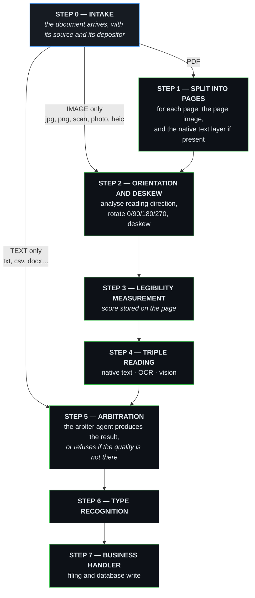
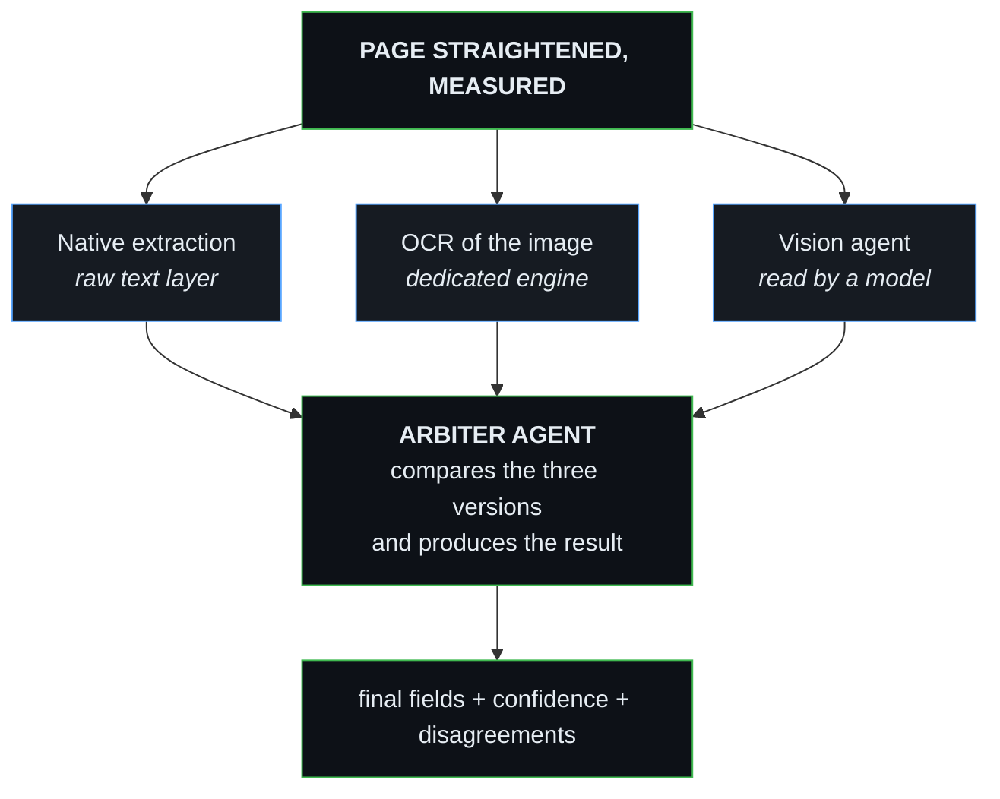
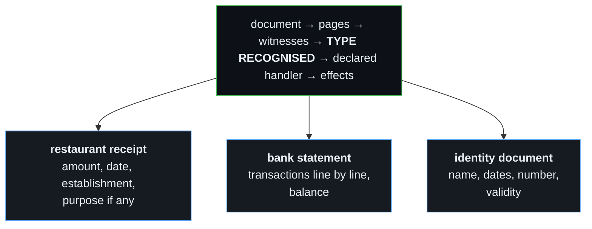

# SHAPER-OS — The Document Pipeline
## Understanding a document whatever its condition, source and orientation

> **Motto**: *"A page is not a file. A scan is not text. And a badly photocopied document is not safe data — that has to be stated, not guessed."*

---

## 1. WHAT THE FIELD TAUGHT US

This document does not start from a theory but from three real projects, and their failures:

* **Extracting bank transactions from PDFs.** Text analysis alone missed lines; vision analysis alone missed lines too. The deadlock broke by running **both on the same page**, then reconciling.
* **Belgian passports and identity cards.** Vision alone never reached 100%. It was the combination of **OCR + vision** that finally got there.
* **Uneven photocopies.** Some scans are clean, others illegible — and nothing in the result said so. A wrong value looked exactly like a right one.
* **Orientation.** Documents arrived upside down or askew. A page read upside down does not give a poor result: it gives a false one.

The invariants below are those scars, written down.

---

## 2. THE PAGE IS THE UNIT OF WORK

A PDF is **potentially multi-page**, and pages do not resemble one another:

| Kind of page | What handles it |
| :--- | :--- |
| **Pure text** | native extraction (the PDF's text layer) |
| **Pure image** (scan, photo) | deskew → OCR → vision |
| **Both** | native extraction **and** OCR/vision, then reconciliation |

Processing a document "as a whole" amounts to applying the first page's method to all the others. That is the original mistake.

---

## 3. THE CANONICAL ORDER OF PROCESSING

This order is not advisory: **each stage depends on the one before it**. Straightening after reading is pointless; running the triple reading before straightening degrades all three witnesses at once.



A lone image enters at **step 2**, as a one-page document. A text file enters at
**step 5**, with a single witness instead of three — and the arbiter is told so,
rather than left to infer it from silence.

### The stages in detail

| Step | What happens | Why exactly here |
| :---: | :--- | :--- |
| **0** | Document intake, with its source and its depositor | Identity must be captured at the door; it will be needed for filing (§9) |
| **1** | **PDF only**: split into pages. For each page we produce **the page image** *and* **the native text layer when available** | Both are produced systematically, not as an either/or: the text layer may exist on one page and not on the next |
| **2** | **Analyse the image's reading direction**, then rotate and deskew | Must precede any reading. A skewed page degrades OCR; an upside-down page gives a false result, not a mediocre one |
| **3** | Measure the legibility of the straightened page | After straightening, otherwise you measure the quality of a badly oriented image |
| **4** | **Triple reading**: native text layer, OCR of the image, vision agent | All three start from the **same, already straight page**, otherwise they are not describing the same object |
| **5** | **Arbitration**: the agent compares the three and produces the result, or refuses | Cannot exist before all three readings |
| **6** | Document type recognition | Rests on the arbitrated result, not on any single witness |
| **7** | Business handler: filing in the GED, writing to the database | The type determines which handler, and the depositor from step 0 determines where |

### The three entry points

This is the part not to miss:

* **PDF** → enters at **step 1**. It is the only type that goes through the page split.
* **A lone image** (photo of an invoice, scan of an ID card, screenshot) → **has no pages to split**. It enters **directly at step 2**, handled as a one-page document. From there it gets exactly the same journey: deskew, legibility, triple reading, arbitration.
* **Text only** (txt, csv, docx…) → no image, therefore no deskew, no OCR, no vision. It enters at **step 4** with **a single witness**, and the result says so: confidence cannot lean on a confrontation that never took place.

> **Invariant**: a document never enters the pipeline "at the beginning" on principle. It enters **at the stage matching its nature**, and leaves by the same path as every other. That is what will let us add a video, audio or email source tomorrow without rewriting the existing stages.

---

## 4. THREE WITNESSES, AND AN ARBITER AGENT THAT PRODUCES THE RESULT

This is the heart of the doctrine, and **the piece that unblocked everything** on bank transactions as well as on identity documents.



### This is not a vote, nor a mechanical merge

The first three are **witnesses**: they describe the same page by different means. None of them delivers the result.

A **fourth agent** receives the three versions, confronts them, settles the discrepancies, and **it is that agent which produces the final result**. It sees what no single witness can see: that OCR read `8` where vision read `B`, that an amount in the native text does not match the one read off the image, that a line exists in two witnesses and not in the third.

> **From the field**: without this arbitration stage, the success rate collapses on certain difficult document types. With it, **100% success — as long as the document's visual quality is adequate.**

That is why reconciliation is not merge code but a **capability class in its own right** (`document-arbiter`, §11): settling between three divergent readings requires understanding the document, not comparing strings.

### And when quality is not there

The arbiter is also the one who states that it **cannot settle**: witnesses too divergent, page too degraded, text illegible.

In that case the pipeline does not deliver a poor-quality result — it **refuses, and says so**:

* the document is marked **unusable as it stands**, naming the offending page or pages;
* **the requester is told explicitly**: *"this document is too degraded for reliable analysis"*;
* the reason travels all the way to the interface, rather than being buried in a log.

A reasoned refusal is a good result. A field filled by guesswork off an illegible page is the worst possible result, because nothing downstream can tell it apart from correct data any more.

---

## 5. GEOMETRY BEFORE READING

Nothing is analysed before the page has been put straight.

1. **Orientation** — detect 0°/90°/180°/270° and rotate. The vision agent helps here: it can say which way up a page reads.
2. **Deskew** — correct the tilt of a crooked scan, which degrades OCR badly.
3. **The applied orientation is recorded** in the result: it must be possible to know that a page was rotated by 180°.

---

## 6. THE LEGIBILITY INDICATOR

Every page carries a **stored legibility score**, computed before extraction — contrast, sharpness, noise, density of recognised characters.

It is not decoration:

* below a threshold, the document is marked **doubtful** and does not silently feed a database;
* it makes it possible to tell the user *"this scan is too faint, redo it"* instead of handing them wrong figures;
* it explains after the fact why an extraction failed.

> A bad photocopy is an **input known to be bad**. The worst case is not failure; it is the wrong value wearing a confident face.

---

## 7. RECOGNISE THE TYPE, THEN ACT — TWO DISTINCT STEPS

The pipeline **identifies** what the document is. A **declared handler** decides what is done with it. The two never mix: adding a document type must never force a change to the pipeline.



### The restaurant receipt, followed through end to end

This is the case that shows why the depositor must travel with the document:

1. An **authenticated** employee scans their restaurant receipt.
2. The pipeline recognises the type "restaurant receipt".
3. It extracts the **amount**, the **date**, the **establishment**, and the **purpose** if stated.
4. The metadata carries **who scanned it** — identity is known, since the person was authenticated.
5. The handler files the receipt **in that person's folder** in the GED.
6. And it writes the row to the database: date, cost, establishment, purpose, depositor.

None of this is possible if the depositor's identity was lost along the way. Hence the invariant: **the depositor travels with the document**, from intake through to filing.

---

## 8. DESIGN IT OPEN

The pipeline does not belong to the GED. The GED is just one entry point among several.

| Source | Nature |
| :--- | :--- |
| **GED upload** | a human drops a file |
| **Email attachments** | intended from now on — analysing what lands in a mailbox |
| **Business messaging** (WhatsApp Pro and the like) | a client sends a photo of a document |
| **API / partner** | a third-party system pushes documents |

All of them go through **the same intake contract**: document, source, depositor, expected type if any. Wiring a new source must be configuration, never a variant of the pipeline.

> This list is not exhaustive — it is here as a reminder that the design must stay open, because input sources are going to multiply.

---

## 9. MULTIPLEXING

Processing is **parallel by construction**, at two levels: several documents at once, and several pages of the same document at once.

Design consequences, to be honoured from the first line of code:

* no stage assumes it is alone, nor that it runs in order;
* state lives in the job, never in a module variable;
* a document's pages are reassembled by their number, not by their arrival order;
* the number of workers is a parameter, not a constant.

**Why this is structural**: measured on the current GED, analysing a 20 MB file freezes the container for **4.3 seconds** — during which nobody can navigate, not even open a folder. Throughput is therefore not an optimisation to add later: **it is a first-order requirement**. A pipeline that serialises is a pipeline that cannot be shared, and the first client who uploads an accounting export freezes the service for everyone else.

---

## 10. THE PIPELINE TALKS TO THE INTERFACE WHILE IT WORKS

A pipeline that only answers at the end is unusable in a web page. A user uploading a 40-page statement must **see** what is happening, not wait in front of a frozen screen.

Each stage emits an event on a channel identified by the job, which the agent's page consumes live — with no repeated polling:

```
job received ──▶ document opened (12 pages)
             ──▶ page 1: deskewed 90°, legibility 0.91, native text
             ──▶ page 2: scan, OCR + vision, legibility 0.42 ⚠
             ──▶ page 3: …
             ──▶ type recognised: bank statement
             ──▶ 47 transactions extracted, 2 at low confidence
             ──▶ filed under /ged/accounting/2026-08/
```

What the interface must be able to do with it:

* open a **progress modal** and show advancement page by page;
* flag a page below the legibility threshold **immediately**, without waiting for the other 40;
* display extracted fields as they come, with their confidence;
* hand control back at once: the upload answers, the analysis narrates itself afterwards.

**Failure travels on the same channel.** An illegible page, an unavailable model, an unrecognised type: the watcher learns of it the moment it happens, at the stage where it happens. Nothing is discovered in a log after the fact.

> This is also what makes multiplexing visible: several documents advance in parallel, and the agent's page shows it — instead of a progress bar that lies about what is actually going on.

---

## 11. STATE LIVES IN THE DATABASE — THE STREAM IS ONLY AN ACCELERATOR

The question came up: should state be stored in a database so another agent can find out about work in progress on its own? **Yes, and it is not optional.** Here is why, and what it changes.

### An event stream is ephemeral by nature

If nobody is listening when the event goes past, it is lost. And yet:

* the agent's page can be reloaded mid-processing;
* a supervisor may want to know what happened **ten minutes ago**;
* a second agent may arrive **after** the work started;
* and a 40-page job outlives the tab that launched it.

A stream answers none of these cases. A database does.

### Division of roles

| | Role | Nature |
| :--- | :--- | :--- |
| **Database** | **source of truth** for state — where each document, each page, each extracted field stands | durable, queryable by anyone |
| **Event stream** | **notification** of a state change, for real-time display | volatile, an interface convenience |

**The order is mandatory**: write the state, **then** emit the event. Never the reverse. An event emitted before the write describes a state nobody will be able to find.

Direct consequence: the stream becomes **replaceable**. An interface that misses it can always rebuild the situation by querying the database. That is what makes the whole thing robust rather than pretty.

### What it unlocks, beyond display

* **An agent informs itself.** *"Where is the batch uploaded this morning?"*, *"which documents are at low confidence?"*, *"what is waiting on a human?"* — without depending on who happened to be connected.
* **Rule 27 becomes applicable.** Counting attempts, deciding that `maxHealingAttempts` has been reached, marking `DEGRADED`: none of that can be counted in a stream.
* **Rule 23 too.** A supervisor diagnosing a stuck pipeline reads its state **from the outside, cold**. That is exactly the observed state of the reconciliation engine.
* **Recovery after restart.** A container coming back up knows which documents were in flight and how far they got.

### Where, concretely

In the **universe's own database** (Rule 26), not in a shared one. And by reusing `@shaper/pkg-queue` as the job carrier rather than inventing a parallel store: the pipeline is a queue consumer, and its progress is the job's state, enriched per page.

> **Invariant**: everything a human can see in the modal, an agent must be able to obtain by querying the database. If a piece of information exists only in the stream, it does not exist.

---

## 12. THE PIPELINE EMBEDS NO MODEL: IT CALLS AGENTS

The pipeline orchestrates, it does not reason. It needs **access to agents** whose job that is:

| Capability class | The agent's mission | What it receives | What it returns |
| :--- | :--- | :--- | :--- |
| **`document-text`** | understand a document's text — spot entities, amounts, dates, the type | the page's text (native or OCR) and the document's context | structured fields, each with its confidence |
| **`document-vision`** | read a page as an image — layout, tables, stamps, reading direction | the image of the straightened page | text read, structure perceived, orientation observed |
| **`document-arbiter`** | **produce the final result** by confronting the three readings of the same page | native text, OCR output, vision output, and the legibility score | final fields, per-field confidence, disagreements observed, or a reasoned refusal |

**The mapping to a real engine is declared in `manifest.json` (Rule 21), never in the pipeline.** Whether the `document-text` class is served by a local model, an OpenCode bridge or a remote API does not change a line of pipeline code. That is what allows changing provider without touching the doctrine — and it is what protects the sovereignty promise: the day a local model suffices, we swap the mapping.

### Three design consequences

1. **Two agent roles, never to be confused.** `document-text` and `document-vision` are **witnesses**: their output enters the confrontation on the same footing as OCR and native extraction, and neither of them decides a value alone. `document-arbiter` is the **arbiter**: it is the only one that delivers the result. Merging those two roles — letting a witness produce the result directly — means returning to the old failure rate.
2. **An unavailable agent is a state, not a crash.** If `document-vision` does not answer, the page is processed with the remaining witnesses and **the result says a witness is missing** — confidence drops accordingly. We never pass two witnesses off as three.
3. **A slow agent does not immobilise the pipeline.** Calls are asynchronous, the job keeps advancing on the other pages, and the state in the database reflects the wait.

> This is Rule 21 applied to documents: the pipeline declares **what it needs** — understand a text, read an image — and the base decides **who does it**.

---

## 13. LOG FIRST, THEN MEASURE EFFECTIVENESS BY DOCUMENT TYPE

Every stage logs in JSONL (Rule 0A): duration, witnesses available, legibility score, disagreements observed, the arbiter's decision, any refusal and its reason. That is the raw material.

But the useful question is not *"what happened"*, it is **"does it work, at what rate, and on which document type"**. The target table:

| Document type | Processed | Arbitrated without disagreement | Low confidence | Refused (quality) | **Verified accuracy** |
| :--- | ---: | ---: | ---: | ---: | ---: |
| Supplier invoice | 1,240 | 94% | 4% | 2% | ? |
| Bank statement | 310 | 89% | 8% | 3% | ? |
| Identity document | 87 | 97% | 1% | 2% | ? |

### The warning that matters

The first four columns compute themselves from the logs. **The last one does not.** Confidence is the system's opinion of itself: an arbiter can be certain and wrong. An accuracy rate is only obtained by comparing against a **known truth**.

Hence the invariant: **every human correction of an extracted field is recorded as reference truth.** Someone fixes a misread amount? That pair *(what the pipeline said, what was actually right)* becomes a row in the evaluation set. The corpus builds itself through use, with no annotation campaign.

That is what makes it possible to answer for real: *"on electricity bills, 98%; on scanned statements, 76%"* — and to know whether a new version of the arbiter improved things or made them worse.

---

## 14. AUTOMATIC CATEGORIES AND TAGS

Type recognition (§7) produces a **category**; analysis produces **tags**. Both are applied automatically, with no intervention.

* **Category** — what the document is: *till receipt*, *electricity bill*, *bank statement*, *identity document*, *restaurant receipt*. A closed, governed vocabulary.
* **Tags** — what the document says: the supplier (*Cursor AI*, *EDF*), the period, the arrival channel (*email*, *upload*, *messaging*), the depositor. An open vocabulary, enriched through use.

### The trap to avoid from the start

An ungoverned open vocabulary drifts within weeks: *invoice*, *Invoice*, *elec invoice*, *electricity*, *EDF* become five distinct tags for one reality, and every filter becomes wrong.

So: **every proposed tag goes through normalisation** (case, accents, singular form, known synonyms) before being applied. A new category, by contrast, is **proposed to the human** and not created outright — the one place where automation stops, because a category commands a business handler.

---

## 15. PROCESSING STATE: WHO HAS ALREADY DONE WHAT

A document is not "processed" or "unprocessed". It is processed **by whom**, and **how far**. That is what lets external processes plug in without treading on each other or redoing the work.

Every document therefore carries, in the database:

| Marker | The question it answers |
| :--- | :--- |
| `pipelineState` | where understanding stands: received, in progress, arbitrated, refused |
| `pipelineVersion` | **which version of the pipeline** produced this result — without it you can neither explain a regression nor replay identically |
| `handlers[]` | which business handlers acted, and when — one per row, never a single global boolean |
| `externalProcess[]` | which **external** processes took the document on, and with what outcome |
| `contentHash` | a fingerprint of the content, to recognise a document **already seen** |

### Why a log and not a flag

A "processed" boolean does not survive reality: the same document can be filed by one handler, exported by another, then picked up by an external accounting process. Each must be able to know **what has already been done** without assuming it is alone.

### The duplicate, a concrete and frequent case

The same document arrives twice — a forwarded email, a rescan, a client resending their document. Without `contentHash` you get two filings and **two rows in the accounts**. With it, the pipeline recognises the document, does not rerun the agents, and simply records the new arrival against the existing one.

> It is this pair — **processing state + fingerprint** — that turns the pipeline into a business tool: several processes, human and automatic, work on the same document flow without duplicating or overwriting each other.

---

## 16. WHAT IS FORBIDDEN

* Choosing one witness **instead of** another rather than confronting them.
* Analysing a page **before** straightening it.
* Delivering a value **without** its provenance and its confidence.
* Writing data to the database from a page **below the legibility threshold** without flagging it.
* Coding business behaviour **inside** the pipeline rather than in a declared handler.
* Inventing a missing value. An empty field with its reason beats a plausible number (Rule 0G).
* Emitting an event **before** writing the corresponding state.
* Letting a piece of information exist only in the real-time stream.
* Hardcoding a model or a provider in the pipeline instead of calling a capability class.
* Presenting a result as complete when a witness was unavailable.
* Letting a witness produce the final result directly, bypassing the arbiter.
* Returning a result on a page of insufficient quality, instead of refusing and telling the requester.
* Announcing an accuracy rate computed from the system's confidence rather than from a known truth.
* Creating a new category without human validation, or applying a tag without normalising it.
* Reducing processing state to a boolean, or processing a document without checking its fingerprint.
