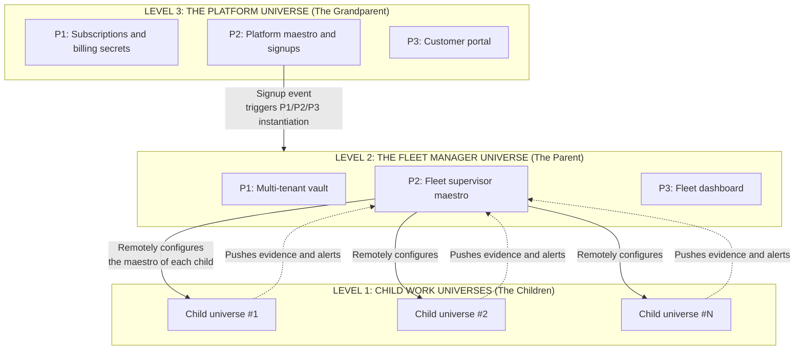

# SHAPER-OS — Fractal Architecture in Action
## From Ex Nihilo Repository to Multi-Tenant Platform

> **Founding Number One Requirement**: The entire system must be instantiable **ex nihilo** from a single Git repository and its deterministic structure (zero hidden state, zero opaque magic).
> **Motto**: *« Keep it simple, follow the rules, and all is wide open to be adaptable always. »*

> **Why this page names no product.** The base repository describes the pattern,
> never one industry's use of it. A worked example anchored in a particular
> application — a shop, a mail system, a document vault — reads to an agent as if
> that application were part of the base, and the base then grows a dependency it
> never declared. The example below is therefore told in the vocabulary of the
> base alone: universes, bricks, tasks. Industry illustrations belong to the
> catalogue, beside the bricks that actually implement them.

---

## 1. THE FRAMING: WHY THE ARCHITECTURE IS FRACTAL

The architecture of SHAPER-OS is not fractal out of theoretical coquetry: it is fractal because it is **the way to remain hyper-simple while absorbing complexity and scale**.

> **What we claim, and what we do not claim.**
> **Three levels are operationally proven**: the child work universe, the fleet manager universe, and the platform universe. This is what is demonstrated, and this is what is sold.
> Structurally, nothing in the pattern forbids going beyond: the system *withstands* whatever number of levels we give it, because each level only knows its parent and its children. But **as long as a convincing example does not exist at 4 or 5 levels, we do not claim it**. Additional depth is not demonstrated by a diagram: it is demonstrated by a real case where it delivers something that 3 levels did not provide.
> This is the same discipline as for restore durations: we announce what we have proven.

The universal pattern repeats at every zoom level:
$$\text{Unalterable Foundation (P1)} \longrightarrow \text{Orchestration \& Agent (P2)} \longrightarrow \text{Business Restitution (P3)}$$

Whether the universe runs a single task, one line of business, a fleet of fifty, or a platform that sells them, **we never invent an exotic new layer**. We nest the same pattern.

---

## 2. THE CONCRETE EXAMPLE: THE 3-LEVEL FRACTAL TREE

---

## 3. LEVEL-BY-LEVEL BREAKDOWN

### Level 1: The Child Work Universe (The Production Unit)
* **Perimeter 1 (Foundation)**:
  - `brick-vault` holds the credentials this universe — and only this universe — may use.
  - `brick-logger` keeps the local JSONL evidence of everything that happened.
  - `brick-queue` carries asynchronous work so that nothing is lost between a decision and its execution.
* **Perimeter 2 (Execution Agent and Helm)**:
  - **Helm remains intact in its original role**: the backup technical control tower for the operator — access to containers, a console when one is needed.
  - The local `brick-maestro` paces the universe's declared `task-*` entries.
* **Perimeter 3 (Dedicated Business Interface)**:
  - **No visible terminal, no raw logs for the end user.**
  - A streamlined interface built for one trade, speaking that trade's words, sitting on top of the same generic bricks.

---

### Level 2: The Fleet Manager Universe (The Supervisor)
Imagine an operator running **fifty child universes**:
* **Role**: a full-fledged Shaper OS universe which **does not absorb the fifty into a giant monolith**, but pilots them as a fleet of fifty independent universes.
* **How it operates**:
  1. **Cross-supervision**: the parent agent reads consolidated evidence from the fifty children without saturating their own memory.
  2. **Top-down configuration**: the parent maestro updates the rules and `ctx-*` contexts of the fifty child maestros.
  3. **Bottom-up aggregation**: the operator's dashboard shows the global overview, and only the exceptions.

---

### Level 3: The Platform Universe (Provisioning and Billing)
* **Role**: manage accounts, subscriptions, and automatic provisioning.
* **The autonomous event cycle**:
  1. **Trigger**: a new customer subscribes to a plan.
  2. **Webhook $\rightarrow$ platform maestro**: the event lands in the platform universe's queue.
  3. **Ex nihilo generation**: the platform maestro creates the directory structure of the customer's manager universe, generates its vault keys, starts its containers, and instantiates its first ready-to-use child universe.
  4. **Delivery**: the secure dashboard URL is sent to the customer.

---

## 4. DISTRIBUTION OF RESPONSIBILITIES: WHO DOES WHAT?

To keep the system hyper-simple and unbreakable, each entity has a strict mandate:

| Entity | What it does | What it NEVER does |
| :--- | :--- | :--- |
| **Platform universe** | Billing, provisioning customer universes, quotas, global lifecycle. | Does not touch the business records held by a child. |
| **Fleet manager universe (parent)** | Arbitration across the fleet, consolidated reporting, updating agent contexts. | Does not store the master secrets of another operator. |
| **Child universe** | Execution of its own declared tasks, and nothing else. | Does not attempt to administer the host's global infrastructure. |
| **Helm (`/console`)** | Universal technical administration and monitoring foundation. | Never morphs into a public-facing business application. |
| **P3 business interface** | Pure user experience, tailored to one trade. | Never displays a terminal or dev complexity to the end user. |

---

## 5. BENEFITS OF THIS FRACTAL APPROACH

1. **Total Isolation and Resilience (Zero Domino Effect)**:
   If child universe #12 suffers an attack or crashes, the other forty-nine and the manager universe continue running without the slightest impact.
2. **Ex Nihilo Reproducibility**:
   At any time, a universe — child or parent — can be rebuilt from its `manifest.json` and the backup of its `vol-*` volumes.
   **Restoration is fast and structured**: fast because there is nothing to reinvent — the fractal pattern is identical across all levels and the building blocks are already built; structured because it always follows the exact same deterministic order (encrypted foundation, then orchestration, then restitution), without hidden state or manual steps.
   **No duration is announced, and this is intentional (Rule 10)**: the time required depends on too many parameters to fit into a single number — images already cached or rebuilt from scratch, host provisioning, and above all **the volume of data to restore**, which bears no resemblance between an empty test universe and years of production. We promise the method, never the stopwatch.
3. **Cognitive Clarity for Humans and AI Agents**:
   Each AI agent only ever sees the strict context of the universe it operates on. It is never polluted by ten thousand lines of out-of-scope code.
4. **Structural Hyper-Simplicity**:
   We only have one system to learn and maintain: **Shaper OS**. Once you know how to create a universe, you know how to create every one of them.

---

> **Closing Golden Rule:**
> *« Intelligence is not in a giant magical model that knows how to do everything. Intelligence is in the fractal architecture that organizes specialized agents across strictly isolated perimeters. »*
