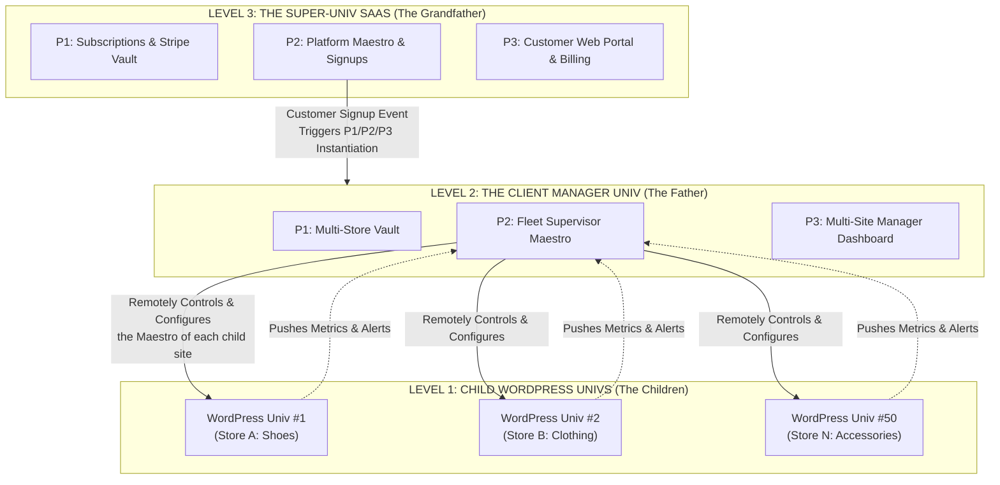

# SHAPER-OS — Fractal Architecture in Action
## From Ex Nihilo Repository to Multi-Tenant SaaS: The WooCommerce / WordPress Example

> **Founding Number One Requirement**: The entire system must be instantiable **ex nihilo** from a single Git repository and its deterministic structure (zero hidden state, zero opaque magic).
> **Motto**: *« Keep it simple, follow the rules, and all is wide open to be adaptable always. »*

---

## 1. THE FRAMING: WHY THE ARCHITECTURE IS FRACTAL

The architecture of SHAPER-OS is not fractal out of theoretical coquetry: it is fractal because it is **the way to remain hyper-simple while absorbing complexity and scale**.

> **What we claim, and what we do not claim.**
> **Three levels are operationally proven**: the child business universe, the Fleet Manager universe, and the Super-Univ SaaS. This is what is demonstrated, and this is what is sold.
> Structurally, nothing in the pattern forbids going beyond: the system *withstands* whatever number of levels we give it, because each level only knows its parent and its children. But **as long as a convincing example does not exist at 4 or 5 levels, we do not claim it**. Additional depth is not demonstrated by a diagram: it is demonstrated by a real case where it delivers something that 3 levels did not provide.
> This is the same discipline as for restore durations: we announce what we have proven.

The universal pattern repeats at every zoom level:
$$\text{Unalterable Foundation (P1)} \longrightarrow \text{Orchestration & Agent (P2)} \longrightarrow \text{Business Restitution (P3)}$$

Whether managing a single task, a WooCommerce store, a fleet of 50 stores, or a global SaaS platform, **we never invent an exotic new layer**. We nest the same pattern.

---

## 2. THE CONCRETE EXAMPLE: THE 3-LEVEL FRACTAL TREE

---

## 3. LEVEL-BY-LEVEL BREAKDOWN

### Level 1: The Child WordPress Universe (The Business Production Unit)
* **Perimeter 1 (Foundation)**: 
  - Encrypted Vault storing WooCommerce API keys (`ck_...`, `cs_...`), WP REST API access, store Stripe.
  - Local JSONL activity logs of the store (orders, stock sync).
  - Queue for asynchronous processing (product sheet generation, CSV imports).
* **Perimeter 2 (Execution Agent & Helm)**:
  - **Helm remains intact in its original role**: It is the backup technical control tower for the system administrator (access to pods, dev console if needed).
  - Local Maestro schedules stock checks and abandoned cart detection.
* **Perimeter 3 (Dedicated Business Interface)**:
  - **No visible terminal, no raw logs for the merchant.**
  - A streamlined interface dedicated to WooCommerce management: microphone button to dictate (*« Update the promo on sneakers »*), marketing-oriented chat, visual catalog, one-click order validation.

---

### Level 2: The Client Manager Universe (The Fleet Supervisor)
Imagine a client (agency or merchant) managing **50 WordPress stores**:
* **Role**: This is a full-fledged Shaper OS universe, which **does not store the 50 stores in a giant monolith**, but pilots them as a fleet of 50 independent child universes.
* **How it operates**:
  1. **Cross-supervision**: The parent agent analyzes consolidated logs from the 50 child WordPress instances without saturating their respective memory.
  2. **Top-down configuration**: The parent Maestro configures and updates the rules and contexts (`AGENT-CONTEXT.md`) of the 50 child Maestros.
  3. **Bottom-up aggregation**: The client's dashboard displays the global overview (*« 3 stockouts on Store A, 12 new orders on Store B »*).

---

### Level 3: The SaaS & Billing Universe (The Global Platform)
* **Role**: Manage client accounts, subscriptions, and automatic provisioning.
* **The autonomous event cycle**:
  1. **Trigger**: A new user subscribes on the website (*« Pro Plan: 10 Managed WordPress sites »*).
  2. **Webhook $\rightarrow$ Super-Maestro SaaS**: The event lands in the Super-Univ Queue.
  3. **Ex Nihilo Generation**: The Super-Maestro automatically creates the directory structure for the client's Manager Universe, generates its Vault keys, starts its Podman containers, and instantiates its first ready-to-use child WordPress Universe.
  4. **Delivery**: The secure dashboard URL is sent to the client.

---

## 4. DISTRIBUTION OF RESPONSIBILITIES: WHO DOES WHAT?

To keep the system hyper-simple and unbreakable, each entity has a strict mandate:

| Entity | What it does | What it NEVER does |
| :--- | :--- | :--- |
| **Super-Univ SaaS** | Billing, provisioning client universes, quotas, global lifecycle. | Does not manage WooCommerce products or customer records. |
| **Manager Univ (Father)** | Arbitration across the 50 stores, consolidated reporting, updating agent contexts. | Does not store master passwords of other clients. |
| **WordPress Univ (Child)** | Execution of precise WordPress tasks (stock sync, listings, follow-ups, SEO). | Does not attempt to administer the host's global infrastructure. |
| **Helm (`/console`)** | Universal technical administration and monitoring foundation. | Never morphs into a public-facing WooCommerce store. |
| **P3 Business Interface** | Pure user experience, tailored to the business (merchant, craftsman, decision-maker). | Never displays a terminal or dev complexity to the end user. |

---

## 5. BENEFITS OF THIS FRACTAL APPROACH

1. **Total Isolation and Resilience (Zero Domino Effect)**:
   If WordPress store #12 suffers an attack or crashes, the 49 other stores and the Manager Universe continue running without the slightest impact.
2. **Ex Nihilo Reproducibility**:
   At any time, a universe (child or father) can be rebuilt from its `manifest.json` and its `tar.bz2` backup of the `sav/` volumes.
   **Restoration is fast and structured**: fast because there is nothing to reinvent — the fractal pattern is identical across all levels and the building blocks are already built; structured because it always follows the exact same deterministic order (encrypted foundation, then orchestration, then restitution), without hidden state or manual steps.
   **No duration is announced, and this is intentional (Rule 10)**: the time required depends on too many parameters to fit into a single number — images already cached or rebuilt from scratch, host provisioning, and above all **the volume of data to restore**, which bears no resemblance between an empty test universe and years of production. We promise the method, never the stopwatch.
3. **Cognitive Clarity for Humans and AI Agents**:
   Each AI agent (Claude Code, Cursor, Antigravity, OpenCode) only ever sees the strict context of the universe on which it operates. It is never polluted by 10,000 lines of out-of-scope code.
4. **Structural Hyper-Simplicity**:
   We only have one system to learn and maintain: **Shaper OS**. Once you know how to create a universe, you know how to create a plugin, a store, a fleet manager, or a complete SaaS.

---

> **Closing Golden Rule:**
> *« Intelligence is not in a giant magical model that knows how to do everything. Intelligence is in the fractal architecture that organizes specialized agents across strictly isolated perimeters. »*
