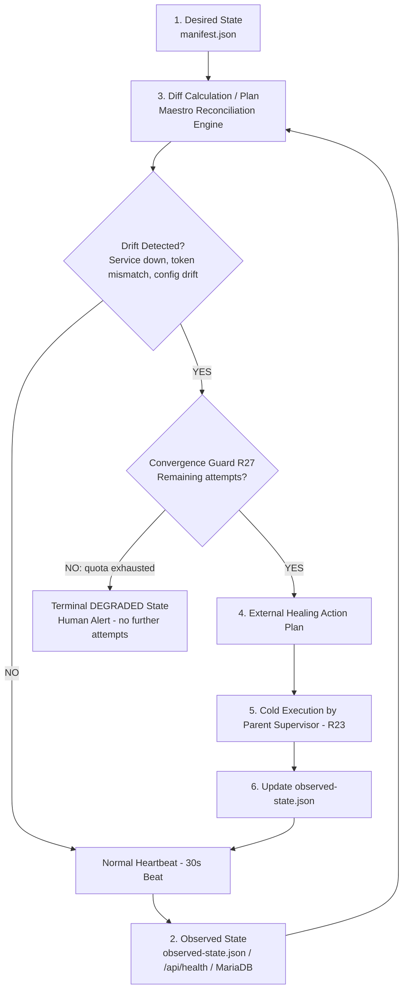
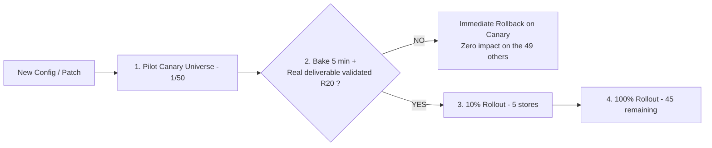
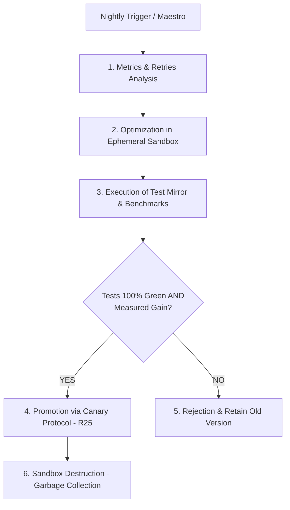
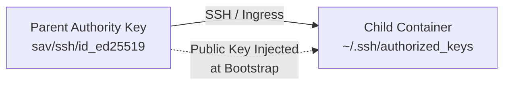

# SHAPER-OS — Declarative Fractal Orchestration, Continuous Reconciliation & Survival Laws
## The Reconciliation Engine, External Healing, Root Guardian, Canary Rollout, and Self-Improvement

> **Founding Motto**: *« Declarative without reconciliation is nothing more than a text file. SHAPER-OS permanently compares the desired state (`manifest.json`) and the observed state, and applies corrections from the outside without ever sawing off the branch on which the agent is sitting. »*

---

## 1. THE CONTINUOUS RECONCILIATION ENGINE: THE LIVING “SOVEREIGN TERRAFORM”

Terraform draws its power from the `Desired` $\leftrightarrow$ `State` $\leftrightarrow$ `Plan` $\leftrightarrow$ `Apply` loop.
In SHAPER-OS, this principle is made **living and permanent** through the Maestro scheduler:



### The 4 Components of the Engine:
1. **Desired State (`manifest.json`)**: What MUST run (bricks, ports, volumes, rules, models).
2. **Observed State (`sav/state/observed-state.json`)**: What actually runs (PIDs, active Podman containers, `/api/health` HTTP codes, MariaDB integrity).
3. **Diff Engine (Maestro)**: At each beat (30s), Maestro compares desired and observed.
4. **External Apply (Rule 23)**: If a drift appears, the parent supervisor triggers the cold conformance restoration plan.

---

## 1bis. THE CONVERGENCE GUARD (Rule 27) — WHY A LOOP MUST KNOW HOW TO GIVE UP

A reconciliation loop that cannot give up **becomes the outage itself**. If the manifest is invalid, if a port is already taken, if a token is rejected by the provider, the parent would attempt repair every 30 seconds indefinitely — and across a fleet of 50 children, this produces **50 simultaneous restart storms**.

| Guardrail | Behavior |
| :--- | :--- |
| **Exponential backoff** | 30s → 1m → 2m → 4m on the same drift signature. Never at a fixed cadence. |
| **Bounded attempts** | `maxHealingAttempts` (default: 5) on the same signature, then stop. |
| **Terminal `DEGRADED` state** | Resting state, no retry. Never auto-clears: only human action or the Root Guardian restores it to `RECONCILING`. |
| **Fleet circuit-breaker** | If > 20% of a fleet enters `DEGRADED` within the same window, all reconciliation and rollouts are suspended on that fleet and escalated. |

> **Principle**: a systemic failure must never be amplified N times by the mechanism intended to repair it.

---

## 2. THE EXTERNAL HEALING LAW & THE ROOT GUARDIAN

### The Fatal Problem of Self-Modification:
When asking an agent to repair itself on its vital components (its bridge server, its Node runtime, its boot scripts, its active tokens):
* It is the equivalent of backing up a file while a process is actively modifying it: **corrupted and untrusted state**.
* If the agent introduces a syntax error into its own communication bridge, **it instantly cuts off its own voice, dies mid-flight, and the system remains stalled with no recovery capability**.

### Rule 23 — Superior-Level Healing Law (External Healing Law)
> **Fundamental Statement:**
> *« An agent NEVER modifies its own active infrastructure files, its runtime, or its vital bricks.*
> *Any structural intervention, failure remediation, or brick update on a Level $K$ Agent is MANDATORILY operated by the Level $K+1$ Supervisor Agent.*
> *The supervisor possesses the complete context of its subordinate, diagnoses the error from the outside, and can reconfigure, restart, or replace the failing universe cold without risk of self-destruction. »*

### Rule 24 — Root Guardian Law
> **Fundamental Statement:**
> *« For the Root of the fractal tree (the highest level, which has no parent in the tree), source code monitoring and modification are performed by an **Out-of-Band Guardian Agent (Sentinel Sidecar)** or by a **Human equipped with their editor (Cursor, Antigravity, Claude Code)**.*
> *This external agent possesses an isolated channel to run global tests, audit root health, and patch it in case of anomalies without depending on its own runtime. »*

---

## 3. THE SELF-HEALING SYSTEM: CONCRETE SELF-HEALING EXAMPLES

Thanks to this strict hierarchy, the system becomes **intrinsically self-healing**. Here are 3 real scenarios — they constitute the implementation specification for Rule 23:

### Example 1: Automatic Repair of a Token / 401 Error / Bridge Freeze
* **Incident**: child universe #14 experiences a freeze of its OpenCode bridge or an expiration of its API token.
* **Self-Healing**:
  1. The parent Manager's reconciliation diff detects the gap between desired and observed (`HTTP 502/401` or 60s timeout on heartbeat).
  2. The Manager accesses the child's Vault from the outside, regenerates a healthy token, and synchronizes it into `univ14/sav/opencode-bridge/token`.
  3. The Manager restarts the `univ14-bridge-opencode` container cold.
  4. The child restarts quickly, with zero data loss and zero human intervention. No duration is guaranteed here either: what is guaranteed is that recovery is automatic and encrypted data in the `sav/` volume is intact.
  5. **Guard R27**: if the 401 persists after 5 attempts with backoff (e.g., key revoked on the provider side), `univ14` transitions to `DEGRADED` and the human is alerted — the parent stops hammering.

### Example 2: Fixing a Format Break or Parser Failure (Production Bug)
* **Incident**: an upstream update modifies the JSON structure the child consumes, causing a parsing error in its worker.
* **Self-Healing**:
  1. The parent Manager intercepts the error in the child's Queue (`status = "FAILED"`).
  2. The Manager instantiates a temporary sandbox universe (`univ14-patch-dev`).
  3. The superior agent adapts the parsing regex in the sandbox and **immediately generates a new regression unit test** (Rule 29).
  4. The test suite runs 100% green, and the produced deliverable passes its typed contract (Rule 20).
  5. The Manager promotes the fixed script **via the canary protocol (Rule 25)** — never directly across all 50 children —, destroys the ephemeral sandbox, and restarts the pending job.

### Example 3: Root Outage Repaired by Guardian / Human
* **Incident**: The SaaS billing root suffers cache corruption or a regression during high traffic.
* **Self-Healing**:
  1. The Out-of-Band Guardian Agent (or Human via Antigravity / Cursor) detects the alert on the fallback channel.
  2. It runs the global foundation validation suite (`npm run test:all`).
  3. It applies the fix to the root, restarts Super-Maestro, and the entire tree returns to equilibrium.
  4. The fix gives birth to its regression test before being considered complete (Rule 29).

---

## 4. RULE 25 — CANARY ROLLOUT & TOP-DOWN ROLLBACK (Anti-Propagation)

When a Manager Universe manages a fleet of 50 child stores, a bad configuration blindly pushed would break 50 stores at once.



* **Step 1 (Canary 1/N)**: Exclusive application to 1 store designated as pilot.
* **Step 2 (Bake Time + Typed Gate)**: Monitoring logs and `/api/health` for 5 minutes, **and** production of at least one real deliverable of the universe's nominal type, which must pass its typed verification contract (Rule 20).
* **Step 3 (Tiered Rollout)**: Rollout to 10%, then across the remainder of the fleet.
* **Step 4 (Automatic Rollback)**: In case of error on the canary, immediate cancellation and alert to the supervisor. The 49 other stores are never touched.

> **The pitfall to avoid**: a `200 OK` on `/api/health` is a liveness signal, not a validity signal. A canary whose port responds while its business logic produces corrupt documents is a false negative that subsequently infects the entire fleet. This is why the canary gate **is** the typed gate of Rule 20.

---

## 5. SCHEDULED SELF-IMPROVEMENT SESSIONS (Continuous Self-Improvement)



### The Self-Improvement Protocol:
1. **Passive audit**: The superior agent analyzes daily logs (prompt retry rates, brick response times).
2. **Improvement hypothesis**: It adjusts the `ctx-universe.md` prompt or optimizes a SQL/RAG query in a cloned universe.
3. **Mandatory test validation**: If and only if the suite of unit tests and benchmarks is 100% green with a measurable gain, the improvement is promoted.
4. **Zero regression risk**: If a single test fails, the modification is discarded without ever touching production.

---

## 6. PATCH PROTOCOL: DIRECT PROD VS SACROSANCT DEV/TEST BRANCHING

| Type of Change | Method | Protocol & Safety |
| :--- | :--- | :--- |
| **Trivial Fix / Typo** | **Direct "Hotfix" in PROD** | Verify absence of critical session $\rightarrow$ direct surgical patch $\rightarrow$ hot reload. Never on a vital organ of the in-flight agent (Rule 23). |
| **Structural Modification / Complex Bug** | **Parallel DEV/TEST Branching** | Temporary clone $\rightarrow$ patch $\rightarrow$ **creation of a mandatory new regression test (Rule 29)** $\rightarrow$ 100% green validation $\rightarrow$ canary promotion (Rule 25) $\rightarrow$ garbage collection of clone. |

---

## 7. COMPLETENESS GUARDRAILS OF THE SYMPHONY

```
┌───────────────────────────────────────────────────────────────────────────────────┐
│                       THE 4 COMPLETENESS GUARDRAILS                               │
├───────────────────────────────────────────────────────────────────────────────────┤
│ 1. UNIVERSE GARBAGE COLLECTOR (Absolute hygiene)                                  │
│    After validation and promotion of a patch, systematic destruction of clone.    │
├───────────────────────────────────────────────────────────────────────────────────┤
│ 2. SURVIVAL HEARTBEAT WATCHDOG (Passive observation)                              │
│    Periodic /api/health probe: external cold repair if freeze > 60s.              │
├───────────────────────────────────────────────────────────────────────────────────┤
│ 3. SACRED SEPARATION: DATA (sav/) VS DISPOSABLE CODE                              │
│    Code and containers are disposable; encrypted data is permanent.               │
├───────────────────────────────────────────────────────────────────────────────────┤
│ 4. CONVERGENCE GUARD (Rule 27)                                                    │
│    Backoff, bounded attempts, terminal DEGRADED state, fleet circuit-breaker.     │
└───────────────────────────────────────────────────────────────────────────────────┘
```

---

## 7bis. RULE 36 — FRACTAL SSH AUTHORITY & EPHEMERAL SANDBOX ACCESS

To orchestrate child environments, develop improvements, and run clean-sheet validations without ever mutating production in-flight:



1. **Authority Key Pair Generation**:
   * Each Parent Universe generates a dedicated **Ed25519 SSH authority key pair** stored encrypted in its Vault / `sav/ssh/id_ed25519`.
2. **Automated `authorized_keys` Provisioning**:
   * Whenever a Parent requests the creation of a blank child container (`<child>-dev` for active coding, or `<child>-test` for clean-sheet zero-state testing), the provisioning bootstrap automatically appends the Parent's public key (`id_ed25519.pub`) into `/root/.ssh/authorized_keys`.
3. **Strict Cryptographic Asymmetry**:
   * The **private key never leaves the Parent**.
   * The child container holds only the public key.
4. **Clean-Sheet Rebuild & Teardown**:
   * The Parent accesses the blank child via SSH, deploys the work area, builds the container image, and runs the entire test suite.
   * Upon successful canary promotion (Rule 25), the Parent deletes the ephemeral containers and revokes the session.

---

## 8. THE CASE THE CANARY DOES NOT COVER: DATA MIGRATIONS (Rule 30)

The canary protects against bad configuration, because configuration can be replayed in reverse. **A database migration carries data**: rolling back the code does not bring back a dropped column. Progressive rollout remains necessary; it is no longer sufficient.

The sequence is non-negotiable:

1. **Full snapshot first** — MariaDB dump of the universe *and* `sav/` volumes, taken immediately prior to the change. Not the nightly backup "which should be enough".
2. **Verified restore** — the snapshot is loaded into an ephemeral sandbox and proven operational. An unverified backup is not a backup (Rule 0G).
3. **Only then**, apply the migration, canary leading the way (Rule 25).
4. **Rollback means restoring the snapshot** — never "running the down script".

**Preferred refinement (expand / contract)**: whenever possible, make changes non-destructive in phases — add the column, write to both, migrate readers, and only drop the old column in a later release once the entire fleet is confirmed migrated. A destructive step and a reversible step never travel in the same deployment.

**At fleet scale**: a schema change across N databases per universe (Rule 26) means N migrations, each with its own snapshot. A shared migration transaction across the fleet is forbidden — it would recreate the single point of failure that Rule 26 was established to eliminate.

---

## 9. CONCLUSION & VISION: CONSTRUCTIVE INTEGRITY

This architecture establishes an **antifragile** system:
* **It does not fear errors**: every anomaly gives rise to a new unit test (Rule 29). The quality baseline of all future universes rises with every incident.
* **It does not harm itself**: each level is healed by its superior level (Rule 23), the root by the out-of-band guardian (Rule 24).
* **It does not break en masse**: the canary protects the fleet (Rule 25), the circuit-breaker protects the canary (Rule 27).
* **It does not run away**: the reconciliation loop knows how to give up and call a human rather than hammering (Rule 27).
* **It has no phantom state**: continuous reconciliation always drives reality toward the desired state.

> *« Built on positive and constructive integrity concepts, the Shaper OS fractal tree holds firm across the three levels we have proven — because it also knows when to stop and ask for help. »*

---
