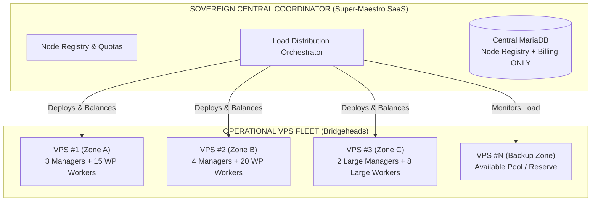

# SHAPER-OS — From Pretty Theory to Real Operations
## Capacity Planning, Statistical Multiplexing, and Multi-VPS Resilience of the Fractal SaaS

> **Operations Motto**: *« You do not size a highway so that every car travels at maximum speed on the exact same centimeter. You size based on statistical multiplexing, and you isolate containers so that a traffic surge on one store never scratches the others. »*

---

## 1. THE FINDING: PHYSICAL REALITY VS THE ABSTRACT PYRAMID

In pure theory, one imagines an endless pyramid of agents and containers — and the fractal pattern supports it on paper.  
In the physical reality of servers (VPS, dedicated servers, LXC, RAM, CPU, disk I/O):
* A server has finite capacity (e.g., 8 cores, 32 GB RAM, NVMe SSD).
* A child universe has asynchronous and variable usage: it does not consume 100% CPU continuously.
* **Client contract vs actual usage**: Contractually, we guarantee to the client that they can manage up to 50 stores. Statistically, 80% of clients manage 2 to 5 day-to-day.

---

## 2. THE STATISTICAL MULTIPLEXING MODEL (The Network Pipe Principle)

Exactly like a telecom operator provisions a 10 Gbit/s link for thousands of users because they do not all download at maximum capacity in the same second:

### Balancing Rules:
1. **No Central Super-Monolith**: The central coordinator does not run all the child universes. It is solely the arbiter and registry.
2. **Bridgeheads (Worker VPS)**: Each VPS runs a balanced set of manager containers and child worker containers.
3. **Dynamic Distribution**: If one child universe carries a traffic spike, it is isolated or migrated to a dedicated VPS without impacting its neighbours.

---

## 3. BLAST RADIUS ISOLATION (Managing Traffic Surges)

What spikes in real life?
* A TV appearance or a major Black Friday.
* A Google index crawler or aggressive scraper hammering the catalog.
* A denial-of-service attack (DDoS) or a webhook loop.

> ### The zero blast radius rule
>
> Even if child universe #12 takes a request storm of 1000 req/s:
>
> 1. That container absorbs it, or saturates, **inside its own cgroup and memory
>    perimeter** — and nowhere else.
> 2. The other forty-nine children, and every other client on the same VPS,
>    continue at their nominal speed with no disruption.
> 3. The parent manager receives the saturation alert and may enable static
>    caching to relieve the database.

---

## 4. PRAGMATIC PERSISTENCE: MARIADB EVERYWHERE

To avoid scattering across 10 different storage engines (SQLite, Redis, in-memory Maps):

1. **MariaDB is the single engine — but one database per universe (Rule 26)**:

| Data | Where it lives | Why |
| :--- | :--- | :--- |
| `shaper_queue_jobs` (async tasks) | **Universe database** | Persistence across reboot without exposing one client's jobs to another. |
| `shaper_vault_secrets` / AES-256 encrypted files | **Universe database** | A secret never leaves the perimeter of its owner. |
| `observed-state` (observed state, Rule 27) | **Universe database**, read from outside by parent | Parent diagnoses without the child writing to the parent. |
| `shaper_nodes_topology` (VPS inventory) | **Central database** | Sole legitimately global data, along with billing. |

   > **Forbidden**: a single database shared across the 50 stores. It would be a common point of failure, and the "zero domino effect" promise of section 3 would become false at the data tier.
2. **Restart tolerance**:
   - If a VPS reboots, MariaDB reloads the exact state of jobs. `PENDING` or `IN_PROGRESS` tasks are resumed without transactional loss.

---

## 5. FROM PRINCIPLE TO PLAN: THE NUMBERS THAT MUST BE MEASURED

Statistical multiplexing is a sound principle, but **a capacity plan without a measured ratio is not a plan**: it is intuition. Until the table below is filled with actual measurements, no contractual density commitment ("up to 50 stores") can be made.

### 5.1 The measurement protocol (to run once per universe type)

1. Start **one** nominal universe alone on a benchmark VPS.
2. Measure at **idle** (zero requests, agent on standby) for 30 minutes: memory RSS, average CPU, disk I/O.
3. Measure at **nominal peak** (realistic business workload: catalog import, document generation, agent dialogue): same metrics, p95 value.
4. Repeat with 2, 5, then 10 collocated universes to measure the **real collocation overhead** (disk cache sharing, I/O contention).

### 5.2 The table to fill (values to measure, never estimate)

| Metric | Child universe | Manager universe | Platform universe |
| :--- | :---: | :---: | :---: |
| Idle RAM | to measure | to measure | to measure |
| Peak p95 RAM | to measure | to measure | to measure |
| Average idle CPU | to measure | to measure | to measure |
| Peak p95 CPU | to measure | to measure | to measure |
| Initial `sav/` disk footprint | to measure | to measure | to measure |
| Monthly disk growth | to measure | to measure | to measure |

### 5.3 Decisions derived from measurements

| Parameter | Derivation Rule |
| :--- | :--- |
| **Density per VPS** | `Available_RAM / Peak_p95_RAM` — never on idle RAM: sizing for idle is guaranteeing collapse at the first simultaneous peak. |
| **Multiplexing ratio** | Number of universes collocated beyond strict density. Prudent start at **1.5×**, adjusted after 30 days of real observation. This is never a universal constant: it depends on the business domain. |
| **Cgroups limits per container** | `--memory` = peak p95 × 1.3; `--pids-limit` and `--cpus` calibrated similarly. **Without these limits, the zero blast radius promise of section 3 is false**: Podman limits nothing by default, and a single runaway universe consumes all host RAM. |
| **Migration threshold** | A universe that sustainably exceeds its p95 peak is migrated to a dedicated VPS before disturbing its neighbors, never after. |
| **Fleet reserve** | Capacity of at least one full free VPS, to absorb the emergency migration of the largest hosted universe. |

> **Commercial commitment vs measurement**: the contract advertises a capacity ("up to 50 stores"); operations delivers it through measured multiplexing. The two numbers are different and must remain so — but the operational number must exist before the contract one is signed.

---

## 6. COST SUMMARY & REAL PROFITABILITY

| Traditional Cloud SaaS Model | Sovereign Fractal Shaper OS Model |
| :--- | :--- |
| Billed per request / per token / per user seat at third parties (exponential costs). | Hosted on a few managed shared VPSs (fixed, predictable cost). |
| Black box: vendor can ban account or cut API access. | Total sovereignty: you own your Podman images, your scripts, and your MariaDB database. |
| Fragile monolith or over-complex microservices (heavy Kubernetes). | Fractal simplicity: each store is a standard, lightweight Podman container. |

---

> *« The genius of fractal architecture is not creating an abstract theory, it is making an infrastructure of 1000 stores manageable with the elegance and lightness of 3 configuration files. »*
