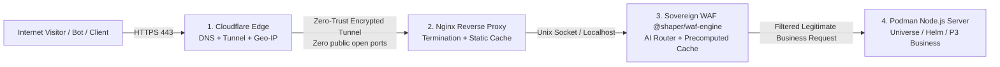

# SHAPER-OS — The Sovereign End-to-End Web Chain
## AI Routing WAF, Multi-Layer Filtering, and Sovereign Dynamic Caching Strategy

> **Security & Performance Motto**: *« Cloudflare closes the borders at the Edge, Nginx distributes static files, our WAF routes and serves precomputed content, and Node.js computes only what is strictly live. Zero overhead, zero unnecessary AWS, 100% control. »*

---

## 1. THE WEB DELIVERY CHAIN: FROM VISITOR TO NODE.JS SERVER

To absorb attacks, filter noise, and route traffic without crashing servers, a request traverses **4 isolated, ultra-fast airlocks**:



---

## 2. BREAKDOWN OF THE CHAIN'S 4 LAYERS

### Layer 1: Cloudflare Edge (DNS, Tunnels & First-Line Geo-IP)
* **Why free Cloudflare (and its acknowledged limits)**:
  - **Zero Trust Tunnels (`cloudflared`)**: No open ports on the box or VPS. The host has no public IP directly exposed to vulnerability scans.
  - **Massive Geographic Filtering (Geo-IP)**: We use free rules to block upfront countries irrelevant to the business (China, Russia, etc.) that pollute bandwidth with blind scans.
  - **What we do NOT ask from Cloudflare**: We do not pay for overpriced Enterprise WAF subscriptions, because application intelligence resides in our own local WAF.

### Layer 2: Local Nginx (The Static Sprinter)
* **Role**: Serve immutable assets at lightning speed (0.1 ms).
* **What it handles directly without ever waking Node.js**:
  - Static files (images, `.css`, `.js`, favicons, fonts).
  - Native Gzip / Brotli compression.
  - SSL termination and security HTTP headers (HSTS, CSP, X-Frame-Options).

### Layer 3: Sovereign Routing WAF (`@shaper/waf-engine` driven by Parent Agent)
* **Why our WAF is unique**:
  - It is **trained and configured by the Parent AI Agent** that designed the application: it intimately knows the exact whitelist of legitimate routes and verbs (`GET /`, `POST /api/beat`).
  - **Intelligent Routing Role**: It identifies traffic type and routes to the correct Podman container (Child Universe, Manager Dashboard, or Helm).
  - **Precomputed Dynamic Cache**: For product sheets, showcase pages, or summaries that do not change every second, the WAF immediately returns precomputed HTML without executing the Node.js runtime.
  - **Deterministic Protections (< 0.2 ms)**: Anti-SQLi, Anti-XSS, Anti-Path Traversal (`../`), and forbidden method blocking (wild `POST` on a `GET` route).

### Layer 4: Node.js Server (Pure Computation Engine)
* **Role**: Exclusively process real, unpredictable business logic (cart additions, Stripe payments, AI agent dialogue, DMS document generation).
* **Benefit**: Relieved from parasitic traffic and static assets, Node.js runs cold with minimal RAM and CPU consumption.

---

## 3. MULTI-TIER CACHE HIERARCHY (Performance Without Heavy Cloud)

To withstand violent traffic spikes without resorting to complex elastic cloud architectures (AWS Auto-scaling / Kubernetes):

```
┌────────────────────────────────────────────────────────────────────────────────────────┐
│                        THE SOVEREIGN CACHE PYRAMID                                     │
├────────────────────────────────────────────────────────────────────────────────────────┤
│ LEVEL 1: PURE STATIC (Nginx)                                                           │
│ • Images, JS bundles, CSS, SVG icons.                                                  │
│ • Served from Nginx memory/disk in 0.1 ms (0% application CPU).                        │
├────────────────────────────────────────────────────────────────────────────────────────┤
│ LEVEL 2: PRECOMPUTED / SSR (WAF Engine)                                                │
│ • Homepages, product catalogs, public presentation sheets.                             │
│ • Pre-generated at build or hot-invalidated on update (0.3 ms).                         │
├────────────────────────────────────────────────────────────────────────────────────────┤
│ LEVEL 3: LIVE TRANSACTIONAL COMPUTATION (Node.js / MariaDB)                            │
│ • Sales funnels, payments, authentication, agentic flows, queue executions.            │
│ • Computed in real time with MariaDB persistence.                                      │
└────────────────────────────────────────────────────────────────────────────────────────┘
```

---

## 4. RESILIENCE AGAINST ATTACKS AND AGGRESSIVE SCRAPERS

When a competitor bot or vulnerability scanner attacks the system:
1. **Step 1 (Edge)**: If the IP originates from a blocked geographic region, Cloudflare drops it at the perimeter.
2. **Step 2 (WAF)**: If a request attempts a path injection (`/wp-admin/../../../etc/passwd`), the WAF strikes it down in **0.1 ms** with a `403 Forbidden` and logs the incident in `security.jsonl`.
3. **Step 3 (Rate-Limiter)**: If an IP fires 200 requests in 10 seconds, the WAF's sliding window temporarily bans it (`429 Too Many Requests`).
4. **Zero Business Impact**: Legitimate users continue browsing and purchasing with latency under 20 ms.

---

## 5. RULE 28 — NO UNPROVEN GUARDIAN: THE MANDATORY DUAL CORPUS

The point of vigilance for this entire chain is Layer 3. A whitelist **synthesized by the parent agent is a hypothesis, not a defense**: until it has been confronted with real attacks, it protects nothing and provides a false sense of security — which is worse than no WAF at all.

The whitelist is therefore an artifact like any other, and falls under Rule 20 (Typed Quality Gate).

### The Dual Corpus, Versioned in the Repository

| Corpus | Minimal Content | Passing Criterion |
| :--- | :--- | :--- |
| **Attack Corpus** | SQLi, XSS, path traversal (`../../etc/passwd`), forbidden verb on `GET`-only route, rate-limit saturation | **100% blocked**. A single pass-through = ruleset rejected. |
| **Legitimate Corpus** | Real business workflows: catalog browsing, add to cart, payment, DMS upload, `/api/beat` call | **100% allowed through**. A single block = client outage, ruleset rejected. |

* **Zero silent drift**: any regeneration of the whitelist by the agent replays **both** corpora, then deploys to the fleet under canary protocol (Rule 25).
* **Any novel block in production** enriches the corpus with a new case and gives rise to its test (Rule 29).

### Perimeter Discipline: What the Sovereign Layer Must and Must Not Do

| Role | Verdict |
| :--- | :--- |
| **Routing** universe → Podman container | ✅ Uncontested and irreplaceable role. Nothing existing knows your universe tree. |
| **Serving precomputed cache** | ✅ Legitimate, but verify first that Nginx `proxy_cache` is not sufficient: do not reimplement a layer that Layer 2 already handles. |
| **Generic attack signature filtering** | ⚠️ **Delegate** to a community-maintained engine (OWASP CRS via Coraza or ModSecurity). A homegrown signature is not maintained against tomorrow's attacks. |
| **Presenting itself as equivalent to a proven WAF** | ❌ Forbidden by doctrine until the dual corpus is green. |

> **Cache Invalidation**: Level 2 of the pyramid is only complete if we know **who** invalidates and **when**. Operational rule: every business write that modifies a published entity (product listing, showcase page) emits a targeted invalidation event on the cache keys derived from that entity. No purely time-based cache expiration on transactional data.

---

## 6. DOCTRINAL SYNTHESIS: WHY THIS CHAIN IS SUPERIOR

| Classic "Big Cloud" Approach | SHAPER-OS "Controlled Chain" Approach |
| :--- | :--- |
| Open the floodgates, let everything through to the application, and pay AWS auto-scaling to mop it up. | Filter through 4 hermetic airlocks: 95% of noise requests die before reaching Node.js. |
| Unpredictable bill at the end of the month (surprise bot traffic spikes). | Fixed hosting cost on sovereign VPSs with fully controlled budgets. |
| Generic WAF rules that occasionally block legitimate requests. | Custom deterministic WAF tailored exactly to the universe hierarchy. |

---

> *« True technical sovereignty begins when every incoming byte is inspected, routed, and served by your own guardians. »*
