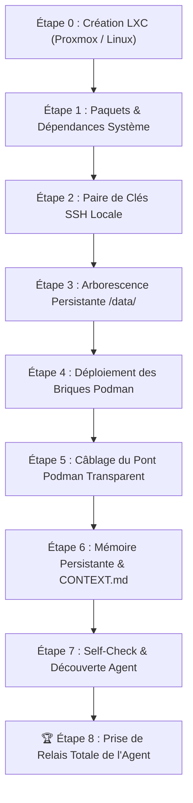

# 📋 Liste Officielle des Étapes : Déploiement LXC Vierge & Relais Agent

> **Perimeter law**: Deployed stack = **P1 socle + P2 agentic** (KovZu Helm). P3 client tools are out of scope here.  
> See [`docs/PERIMETERS.md`](./docs/PERIMETERS.md).

> **Le slug appartient à l'opérateur.** Cette procédure est générique : partout où
> vous lisez `<univ_slug>`, substituez le nom de votre univers. Aucun univers
> concret n'est livré avec ce dépôt — voir [`universes/README.md`](./universes/README.md).

Ce document détaille la séquence exacte et chronologique permettant de monter un univers Shaper OS / KovZu complet sur un conteneur **LXC vierge** (Debian 13, conformément à la règle 11 ; Debian 12 et Ubuntu 24.04 restent utilisables), jusqu'à la **prise de relais autonome par l'agent IA**.

---

## 🎯 Définition du Succès (Critère d'Accomplissement Total)
> **Le système est réputé réussi quand, sur un conteneur LXC vierge, une séquence automatisée déploie l'écosystème et que l'agent IA (`<univ_slug>-bridge-opencode`) prend le commandement, découvre son environnement, manipule les briques Podman et répond à l'opérateur.**
>
> **Trois horloges de restauration (ne jamais dire « &lt; 120 s » sans ça) :**
> 1. **Images déjà dans notre registry / cache Podman** — déploiement **rapide**.
> 2. **Images reconstruites ou tirées de zéro** — **plus long** (build/pull réseau).
> 3. **Plus un delta données** — proportionnel au volume (`sav/`, dumps, GED, fichiers). Un TEST vide ≠ une prod avec des années de fichiers.
>
> Le provisionnement LXC / `apt` est en plus. Détail : [`RULES.md`](./RULES.md) Rule 10.

---



---

## 🛠️ Déroulé des 8 Étapes

### Étape 0 — Configuration du Conteneur LXC (Hôte Proxmox)
Pour permettre à Podman de tourner sans restriction dans le conteneur LXC :
1. Conteneur LXC non-privilégié (ou privilégié selon politique).
2. Options activées dans la configuration Proxmox (`/etc/pve/lxc/<ID>.conf`) :
   ```text
   features: nesting=1,keyctl=1
   ```
3. Démarrage du LXC : `pct start <ID>` puis `pct enter <ID>`.

---

> **Deux familles d'hôtes, un contrat (Rule 11).** Les étapes `pct`/Proxmox de
> ce document ne s'appliquent PAS telles quelles à un hôte Debian/LXD : sur
> LXD, c'est `lxc launch` + profil `podman-univ` + `security.nesting=true`
> (section « Verified from scratch » plus bas, et Rule 11). Un agent identifie
> la famille de l'hôte AVANT de suivre une commande de conteneur — constat
> beta V1.13 : les scripts ne routent qu'une famille, la loi route les deux.

### Étape 1 — Provisioning OS & Outils d'Ingénierie
Exécuté sur le système Debian 13 vierge :
```bash
apt-get update && apt-get install -y   podman   git   curl   wget   jq   ripgrep   openssh-server   openssh-client   python3   python3-pip   rsync   unzip   ca-certificates   nodejs   npm
```

---

### Étape 2 — Génération de la Clé SSH Locale Sécurisée
Permet à l'agent conteneurisé d'accéder au démon Podman hôte sans mot de passe :
```bash
if [ ! -f /root/.ssh/id_ed25519 ]; then
  ssh-keygen -t ed25519 -N '' -f /root/.ssh/id_ed25519
  cat /root/.ssh/id_ed25519.pub >> /root/.ssh/authorized_keys
  chmod 700 /root/.ssh
  chmod 600 /root/.ssh/authorized_keys
fi
systemctl enable --now ssh
```

---

<a id="no-host-data-tree"></a>
### Étape 3 — L'état persistant vit dans l'univers, pas dans `/data/`

**Rien à créer à la main ici.** Cette étape demandait autrefois de créer une
arborescence `/data/` sur l'hôte. C'était une erreur de lecture, et elle a coûté
une hésitation à un testeur : **`/data/…` sont les chemins vus *depuis l'intérieur*
des conteneurs**, jamais des répertoires de l'hôte.

Le montage réel est celui-ci :

| Sur l'hôte (ce qui existe vraiment) | Vu dans le conteneur |
| :--- | :--- |
| `$UNIV/sav/<brique>/` | `/data/<brique>` ou `/sav/<brique>` |
| `$UNIV/log/` | `/data/logger` |
| `$UNIV/sav/vault/` | `/data/vault` — per-universe since V1.13.1 (beta F9) |

L'état persistant d'un univers vit donc **sous le dossier de cet univers**, ce
qui est ce qui rend un univers déplaçable, sauvegardable et destructible d'un
seul geste. Le script de déploiement crée ces répertoires lui-même, avant de les
monter — un test le vérifie désormais pour chaque point de montage.

Il n'y a par conséquent **aucun `chmod 777` à passer** : la ligne qui figurait
ici ouvrait en écriture universelle des répertoires que personne n'utilisait.

> **The one-click script obeys this step too.** Until the 2 September audit
> `scripts/shaper-lxc-bootstrap.sh` still ran `mkdir -p /data/{…}` and
> `chmod -R 777 /data/ged /data/workspaces /data/timelines` on the host while
> this page said the opposite, and it seeded a journal under
> `/data/workspaces/<author>/_kovzu/` that nothing in this repository reads.
> The script now creates nothing on the host: the deploy script of the universe
> creates what it mounts, under the universe, before it mounts it
> ([`universes/README.md` §5](./universes/README.md#materialise-before-mount)).
> A guard reads the script for any host `/data` creation, any `chmod 777`, and
> any unquoted slug (`pkg-universe/test/lxc-bootstrap-script.test.js`).

---

### Étape 4 — Déploiement de la pile complète (9 conteneurs)

> **Ce n'est pas « la base ».** Le socle exécutable est de **cinq** briques —
> vault, logger, bridge, queue, maestro — et c'est ce que déclare
> `manifest.tier-a.json`. Les neuf conteneurs ci-dessous sont la pile complète
> de ce guide : le socle, plus le cockpit, la GED, le vectoriel et le tunnel.
> Un testeur a hésité entre les deux comptes ; les trois lectures possibles de
> « la base » sont réconciliées dans
> [`../docs/architecture/BRICKS.md`](../docs/architecture/BRICKS.md).
Lancement coordonné du cluster avec `universes/<univ_slug>/deploy/podman-up.sh` :
* 🔐 **`<univ_slug>-vault`** (:8610) — Coffre-fort chiffré AES-256-GCM
* 📜 **`<univ_slug>-logger`** (:8620) — Collecteur d'audit JSONL et bus SSE
* 📬 **`<univ_slug>-queue`** (:8640) — File d'attente de jobs asynchrones
* 🎼 **`<univ_slug>-maestro`** (:8630) — Orchestrateur et supervision d'état
* 📂 **`<univ_slug>-ged`** (:8660) — Hub documentaire souverain et OCR
* 🧠 **`<univ_slug>-qdrant`** (:6333) — Base vectorielle sémantique
* 🎛️ **`<univ_slug>-helm`** (:8650) — Cockpit de pilotage universel KovZu
* 🌐 **`<univ_slug>-tunnel`** — Passerelle d'accès distante sécurisée
* 🤖 **`<univ_slug>-bridge-opencode`** (:4440) — Runtime de l'Agent IA

---

### Étape 5 — Câblage du Pont Podman Transparent dans l'Agent

> **Ce qui descend est une clé publique. Jamais une clé privée.**
>
> Cette étape copiait auparavant `/root/.ssh/id_ed25519` — la clé **privée** du
> LXC — dans le conteneur de l'agent. Comme la publique correspondante figure
> déjà dans l'`authorized_keys` du LXC (étape 2), cela revenait à **remettre à
> l'agent la clé qui ouvre son propre hôte**. Un conteneur compromis n'aurait
> pas eu à s'évader : il détenait l'accès.
>
> La règle 36 le dit sans condition — *« la clé privée ne quitte jamais le
> Parent »* — et la question de savoir qui est le Parent ici ne change rien :
> une clé privée ne se déplace pas, à aucun niveau.
>
> Le sens de circulation correct est l'inverse : **celui qui doit initier la
> connexion fabrique sa propre paire et n'envoie que sa clé publique** à celui
> qu'il veut joindre. Révoquer un accès redevient alors le retrait d'une ligne,
> au lieu d'une rotation de clé sur tout ce qui lui faisait confiance.

Le conteneur agent doit joindre le LXC pour piloter Podman. Il génère donc sa
propre paire, et seule sa clé **publique** remonte :

```bash
# 1. L'agent fabrique sa propre identité — la privée naît et reste chez lui
podman exec <univ_slug>-bridge-opencode mkdir -p /root/.ssh
podman exec <univ_slug>-bridge-opencode chmod 700 /root/.ssh
podman exec <univ_slug>-bridge-opencode \
  ssh-keygen -t ed25519 -N '' -q -f /root/.ssh/id_ed25519

# 2. Seule la publique remonte vers l'hôte LXC, et elle est identifiable
AGENT_PUB="$(podman exec <univ_slug>-bridge-opencode cat /root/.ssh/id_ed25519.pub)"
grep -qF "$AGENT_PUB" /root/.ssh/authorized_keys 2>/dev/null || \
  echo "$AGENT_PUB # agent:<univ_slug>-bridge-opencode ajouté $(date -I)" \
    >> /root/.ssh/authorized_keys
chmod 600 /root/.ssh/authorized_keys

# Révoquer cet agent, plus tard, c'est retirer cette seule ligne :
#   sed -i '/agent:<univ_slug>-bridge-opencode/d' /root/.ssh/authorized_keys
```

```bash
# Déploiement du wrapper /usr/local/bin/podman
cat << 'EOF_WRAPPER' > /tmp/podman-wrapper.sh
#!/bin/bash
if [ $# -eq 0 ]; then
  exec ssh -o StrictHostKeyChecking=no -o UserKnownHostsFile=/dev/null -o LogLevel=ERROR -o BatchMode=yes root@localhost podman
fi
CMD=""
for arg in "$@"; do
  CMD="$CMD $(printf '%q' "$arg")"
done
exec ssh -o StrictHostKeyChecking=no -o UserKnownHostsFile=/dev/null -o LogLevel=ERROR -o BatchMode=yes root@localhost podman $CMD
EOF_WRAPPER
chmod +x /tmp/podman-wrapper.sh
podman cp /tmp/podman-wrapper.sh <univ_slug>-bridge-opencode:/usr/local/bin/podman
podman cp /tmp/podman-wrapper.sh <univ_slug>-bridge-opencode:/usr/local/bin/docker
rm -f /tmp/podman-wrapper.sh
```

---

### Étape 6 — The logbook belongs to the universe, not to the host

**Nothing to do on the host here.** Until the 2 September audit this step
created `/data/workspaces/<first name>/_kovzu/JOURNAL.md` on the host — a
journal seeded with a port list and an operator's first name, in the very host
tree Étape 3 says nothing creates, and that nothing in this repository reads.
An operator's name in a tracked file is exactly what the Boot Contract forbids
(10b), and a host path the containers do not mount is state that survives no
rebuild.

If a universe keeps a logbook, that is the universe's decision: it is declared
in that universe's `INTENT.md`, it lives in a volume that universe owns, and
the deploy script that mounts the volume creates it first
([`universes/README.md` §5](./universes/README.md#materialise-before-mount)).
This guide names no path for it and no author.

---

### Étape 7 — Self-Check & Découverte Autonome de l'Agent
L'agent exécute automatiquement son cycle de vérification :
1. Test de son accès Podman : `podman ps -a`
2. Test des APIs MCP : `curl http://127.0.0.1:8610/api/health`, `curl http://127.0.0.1:8660/api/health`
3. Persistent memory: the logbook the universe's `INTENT.md` declares, read from the universe's own volume — nothing on the host (Étape 6).

---

### 🏆 Étape 8 — Prise de Relais Totale & Confirmation Opérationnelle
L'agent est opérationnel sur le port 8650 (Cockpit Helm) et par voix/chat. Il est capable :
* De manipuler le Vault (ex: configurer les identifiants emails sans fuite).
* D'analyser les documents dans la GED.
* De lancer des bacs à sable éphémères (`podman run --rm`).
* De consigner chacune de ses étapes dans son journal.

---

## ⚡ Script de Bootstrap 1-Click (`scripts/shaper-lxc-bootstrap.sh`)

Steps 1, 2, 4, 5 and 7 are condensed in the executable script
`software/scripts/shaper-lxc-bootstrap.sh`. Step 3 creates nothing, and step 6
is no longer a host gesture: the script seeds no journal, because a logbook is
the universe's own (see Étape 6 above). The script needs two things the
command names: the universe slug, and a universe already derived from
`software/universes/_template/` under `software/universes/<univ_slug>/`.
On a fresh LXC container:

```bash
git clone https://github.com/xavdp-pro/SHAPER-OS-V1.13.git /root/SHAPER-OS-V1.13
cd /root/SHAPER-OS-V1.13
UNIV_SLUG=<univ_slug> bash software/scripts/shaper-lxc-bootstrap.sh
```

> Until the 2 September audit this block read `cd /root/SHAPER-OS` then
> `bash scripts/shaper-lxc-bootstrap.sh`: there is no `scripts/` at the
> repository root (it is `software/scripts/`), and the script halts without
> `UNIV_SLUG`, which no line here named. The script now resolves `software/`
> from its own location, so it runs from any directory; the universe it starts
> is `software/universes/$UNIV_SLUG`, and a slug that names no universe is a
> halt that says so, not a warning that scrolls by.

**Durée d'exécution constatée dans ce contexte précis** : images déjà présentes en cache local, univers vide sans données à restaurer, provisionnement LXC et `apt` **non inclus**.
Cette valeur est une mesure d'observation, **pas un engagement** : elle ne vaut que pour ce contexte exact. Voir Rule 10 (trois horloges) avant de la citer où que ce soit.  
**Résultat** : Univers opérationnel, agent prêt au service.

---

## Verified from scratch — 23 August 2026, gbs-test

A blank Debian LXC, the public repository, nothing else. What it took, and what
it found.

### The container itself

```bash
lxc launch <debian-image> univ-<slug>
lxc config set univ-<slug> security.nesting=true    # required
lxc restart univ-<slug>
```

**`security.nesting=true` is not optional.** Podman inside an LXD container
otherwise fails on the first image it tries to run:

```
crun: remount `/var/lib/containers/storage/overlay/…/merged`: Permission denied
```

The message says nothing about nesting, which is why it belongs here.

### Inside it

```bash
apt-get install -y podman git curl jq nodejs npm openssh-server rsync
git clone --depth 1 https://github.com/xavdp-pro/SHAPER-OS-V1.13.git
cd SHAPER-OS-V1.13/software
TAG="v1.7.1-$(git -C .. rev-parse --short HEAD)"
for b in vault logger queue maestro bridge-opencode; do
  podman build -q -f bricks/brick-$b/Containerfile -t "localhost/shaper-$b:$TAG" .
done
cp -r universes/_template universes/univ-<slug>-test   # then specialize INTENT + manifest + deploy/env
cd universes/univ-<slug>-test && ENV_FILE=deploy/env ./deploy/podman-up.sh
```

> *(Dated record — 23 August 2026. The `localhost/shaper-$b:$TAG` names above
> predate the unified image ladder of V1.13.1: today the build publishes
> `<registry>/shaper/brick-*:<tag>` and the deploy resolves the same — see
> `scripts/deploy-image-resolve.sh`.)*

Result: **five containers healthy**, a job injected into the queue reaching
`COMPLETED`, and `/api/vitals` answering with evidence.

### The hidden dependencies clean-sheet runs found

None of them was visible on a workstation, and each broke a fresh install.

1. **`sav/queue` was never created** while the queue container mounts it.
   Invisible on a universe already running, fatal on a new one.
2. **The vault bootstrap called host `npm`.** A blank LXC has podman and git,
   not node. It now runs inside the vault image, which already carries the
   runtime.
3. **`bridge-opencode` copied a gitignored binary** that no longer existed on
   any machine. The image had been unreproducible everywhere, including where it
   was being built. The CLI is now fetched during the build, version-pinned, and
   the build runs `--version` so a bad fetch fails the build.
4. **A mandatory GED test read a gitignored PDF corpus.** It passed only on the
   workstation that had generated the corpus and failed in a public clone. The
   unit test now generates its minimal vector-PDF fixture in memory; ignored
   measurement corpora remain optional.
5. **OpenCode session metadata did not set the headless working directory.** A
   framed job reached the model, then waited forever on an
   `external_directory` permission even though the bind mount was writable and
   `bash=allow`. OpenCode 1.18.18 declares `directory` as a query parameter on
   session create, lookup, prompt, and abort; the bridge must carry the same
   encoded perimeter on all four calls. It must then observe `/global/event`
   (unwrapping `payload`), because `/event` is directory-scoped and would hide
   terminal events from sessions running in other perimeters.
6. **A zero-secret Vault bootstrap wrote no file.** The command announced
   success, but `VaultStore` persisted only when `setSecret` was called; the next
   boot therefore initialized again. Bootstrap now materializes an empty
   storage object, so “initialized and empty” is durable and distinguishable
   from “never initialized”.
7. **The Vault storage file inherited the process umask (`0644`).** Encryption
   protects values, but it does not authorize local readers. Creation, every
   persistence, and loading an older store now enforce owner-only mode `0600`;
   the clean-sheet proof must verify the mode and a second deploy without
   bootstrap.

### Model speed is advisory until measured locally

The free model list rotates, and hosted capacity changes faster than this
document. Internet tokens/second data may order candidates, but deployment must
run a bounded ping from the target LXC. On 25 August 2026, Nemotron 3.5
Lightning led a public speed leaderboard yet timed out twice on `gbs-test`;
MiMo V2.5 answered locally and was selected. Record both outcomes and the
timestamp; never turn that observation into a permanent global default.

> The lesson worth keeping: a workstation accumulates the answers to questions
> the repository never asked. Only a blank machine asks them all.

### Exact proof is part of the contract

A terminal agent status is necessary but insufficient. The controller must
inspect the artifact independently. For byte-exact claims, compare against
explicitly generated expected bytes with `cmp`; shell command substitution
removes trailing newlines, so `test "$(cat file)" = value` cannot prove newline
semantics. The V1.7 clean-sheet run deliberately retained one rejected
`COMPLETED` job that exposed this proof error before a corrected job passed.
