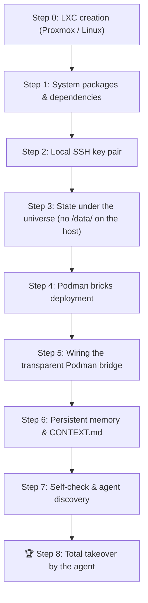

# 📋 Official Step List: Blank LXC Deployment & Agent Takeover

> **Perimeter law**: Deployed stack = **P1 socle + P2 agentic** (KovZu Helm). P3 client tools are out of scope here.  
> See [`docs/PERIMETERS.md`](./docs/PERIMETERS.md).

> **The slug belongs to the operator.** This procedure is generic: wherever you
> read `<univ_slug>`, substitute the name of your universe. No concrete
> universe ships with this repository — see [`universes/README.md`](./universes/README.md).

This document details the exact, chronological sequence that brings up a complete Shaper OS / KovZu universe on a **blank LXC** container (Debian 13, as Rule 11 states; Debian 12 and Ubuntu 24.04 remain usable), up to the **autonomous takeover by the AI agent**.

---

## 🎯 Definition of Success (Criterion of Total Accomplishment)
> **The system is deemed successful when, on a blank LXC container, an automated sequence deploys the ecosystem and the AI agent (`<univ_slug>-bridge-opencode`) takes command, discovers its environment, manipulates the Podman bricks and answers the operator.**
>
> **Three restoration clocks (never say "&lt; 120 s" without them):**
> 1. **Images already in our registry / Podman cache** — **fast** deployment.
> 2. **Images rebuilt or pulled from scratch** — **longer** (network build/pull).
> 3. **Plus a data delta** — proportional to the volume (`sav/`, dumps, GED, files). An empty TEST ≠ a production with years of files.
>
> LXC provisioning / `apt` comes on top. Detail: [`RULES.md`](./RULES.md) Rule 10.

---



---

## 🛠️ The 8 Steps, in Order

### Step 0 — LXC Container Configuration (Proxmox Host)
So that Podman can run without restriction inside the LXC container:
1. Unprivileged LXC container (or privileged, depending on policy).
2. Options enabled in the Proxmox configuration (`/etc/pve/lxc/<ID>.conf`):
   ```text
   features: nesting=1,keyctl=1
   ```
3. Start the LXC: `pct start <ID>` then `pct enter <ID>`.

---

> **Two host families, one contract (Rule 11).** The `pct`/Proxmox steps of
> this document do NOT apply as written to a Debian/LXD host: on LXD it is
> `lxc launch` + the `podman-univ` profile + `security.nesting=true`
> (section "Verified from scratch" below, and Rule 11). An agent identifies
> the host's family BEFORE following a container command — V1.13 beta
> finding: the scripts route one family, the law routes both.

### Step 1 — OS Provisioning & Engineering Tools
Run on the blank Debian 13 system:
```bash
apt-get update && apt-get install -y   podman   nftables   git   curl   wget   jq   ripgrep   openssh-server   openssh-client   python3   python3-pip   rsync   unzip   ca-certificates   nodejs   npm
```

---

### Step 2 — Generating the Secured Local SSH Key
Lets the containerised agent reach the host Podman daemon without a password:
```bash
if [ ! -f /root/.ssh/id_ed25519 ]; then
  ssh-keygen -t ed25519 -N '' -f /root/.ssh/id_ed25519
  cat /root/.ssh/id_ed25519.pub >> /root/.ssh/authorized_keys
  chmod 700 /root/.ssh
  chmod 600 /root/.ssh/authorized_keys
fi
systemctl enable --now ssh
```

---

<a id="no-host-data-tree"></a>
### Step 3 — Persistent state lives in the universe, not in `/data/`

**Nothing to create by hand here.** This step used to ask for a `/data/` tree
to be created on the host. That was a reading error, and it cost a tester a
hesitation: **`/data/…` are the paths seen *from inside* the containers**,
never directories of the host.

The real mount is this one:

| On the host (what really exists) | Seen in the container |
| :--- | :--- |
| `$UNIV/sav/<brick>/` | `/data/<brick>` or `/sav/<brick>` |
| `$UNIV/log/` | `/data/logger` |
| `$UNIV/sav/vault/` | `/data/vault` — per-universe since V1.13.1 (beta F9) |

A universe's persistent state therefore lives **under that universe's
folder**, which is what makes a universe movable, backupable and destroyable
in a single gesture. The deploy script creates these directories itself,
before mounting them — a test now checks it for every mount point.

There is consequently **no `chmod 777` to run**: the line that stood here
opened world-writable directories that nobody used.

> **The one-click script obeys this step too.** Until the 2 September audit
> `scripts/shaper-lxc-bootstrap.sh` still ran `mkdir -p /data/{…}` and
> `chmod -R 777 /data/ged /data/workspaces /data/timelines` on the host while
> this page said the opposite, and it seeded a journal under
> `/data/workspaces/<author>/_kovzu/` that nothing in this repository reads.
> The script now creates nothing on the host: the deploy script of the universe
> creates what it mounts, under the universe, before it mounts it
> ([`universes/README.md` §5](./universes/README.md#materialise-before-mount)).
> A guard reads the script for any host `/data` creation, any `chmod 777`, and
> any unquoted slug (`pkg-universe/test/lxc-bootstrap-script.test.js`).

---

### Step 4 — Deploying the Full Stack (9 containers)

> **This is not "the base".** The runnable socle is **five** bricks —
> vault, logger, bridge, queue, maestro — and that is what
> `manifest.tier-a.json` declares. The nine containers below are this guide's
> full stack: the socle, plus the cockpit, the GED, the vector store and the
> tunnel. A tester hesitated between the two counts; the three possible
> readings of "the base" are reconciled in
> [`../docs/architecture/BRICKS.md`](../docs/architecture/BRICKS.md).
Coordinated launch of the cluster with `universes/<univ_slug>/deploy/podman-up.sh`:
* 🔐 **`<univ_slug>-vault`** (:8610) — AES-256-GCM encrypted vault
* 📜 **`<univ_slug>-logger`** (:8620) — JSONL audit collector and SSE bus
* 📬 **`<univ_slug>-queue`** (:8640) — Asynchronous job queue
* 🎼 **`<univ_slug>-maestro`** (:8630) — Orchestrator and state supervision
* 📂 **`<univ_slug>-ged`** (:8660) — Sovereign document hub and OCR
* 🧠 **`<univ_slug>-qdrant`** (:6333) — Semantic vector database
* 🎛️ **`<univ_slug>-helm`** (:8650) — KovZu universal steering cockpit
* 🌐 **`<univ_slug>-tunnel`** — Secured remote access gateway
* 🤖 **`<univ_slug>-bridge-opencode`** (:4440) — AI agent runtime

---

### Step 5 — Wiring the Transparent Podman Bridge into the Agent

> **What goes down is a public key. Never a private key.**
>
> This step used to copy `/root/.ssh/id_ed25519` — the LXC's **private** key —
> into the agent's container. Since the matching public key already sits in
> the LXC's `authorized_keys` (step 2), that amounted to **handing the agent
> the key that opens its own host**. A compromised container would not have
> had to escape: it held the access.
>
> Rule 36 says it without condition — *"the private key never leaves the
> Parent"* — and the question of who the Parent is here changes nothing: a
> private key does not move, at any level.
>
> The correct direction of flow is the reverse: **whoever must initiate the
> connection makes its own pair and sends only its public key** to whoever it
> wants to reach. Revoking an access then becomes the removal of one line,
> instead of a key rotation on everything that trusted it.

The agent container must reach the LXC to drive Podman. It therefore
generates its own pair, and only its **public** key goes up:

```bash
# 1. The agent makes its own identity — the private key is born and stays with it
podman exec <univ_slug>-bridge-opencode mkdir -p /root/.ssh
podman exec <univ_slug>-bridge-opencode chmod 700 /root/.ssh
podman exec <univ_slug>-bridge-opencode \
  ssh-keygen -t ed25519 -N '' -q -f /root/.ssh/id_ed25519

# 2. Only the public key goes up to the LXC host, and it is identifiable
AGENT_PUB="$(podman exec <univ_slug>-bridge-opencode cat /root/.ssh/id_ed25519.pub)"
grep -qF "$AGENT_PUB" /root/.ssh/authorized_keys 2>/dev/null || \
  echo "$AGENT_PUB # agent:<univ_slug>-bridge-opencode added $(date -I)" \
    >> /root/.ssh/authorized_keys
chmod 600 /root/.ssh/authorized_keys

# Revoking this agent, later, is removing this single line:
#   sed -i '/agent:<univ_slug>-bridge-opencode/d' /root/.ssh/authorized_keys
```

```bash
# Deploying the /usr/local/bin/podman wrapper
cat << 'EOF_WRAPPER' > /tmp/podman-wrapper.sh
#!/bin/bash
if [ $# -eq 0 ]; then
  exec ssh -o StrictHostKeyChecking=no -o UserKnownHostsFile=/dev/null -o LogLevel=ERROR -o BatchMode=yes root@localhost podman
fi
CMD=""
for arg in "$@"; do
  CMD="$CMD $(printf '%q' "$arg")"
done
exec ssh -o StrictHostKeyChecking=no -o UserKnownHostsFile=/dev/null -o LogLevel=ERROR -o BatchMode=yes root@localhost podman $CMD
EOF_WRAPPER
chmod +x /tmp/podman-wrapper.sh
podman cp /tmp/podman-wrapper.sh <univ_slug>-bridge-opencode:/usr/local/bin/podman
podman cp /tmp/podman-wrapper.sh <univ_slug>-bridge-opencode:/usr/local/bin/docker
rm -f /tmp/podman-wrapper.sh
```

---

### Step 6 — The logbook belongs to the universe, not to the host

**Nothing to do on the host here.** Until the 2 September audit this step
created `/data/workspaces/<first name>/_kovzu/JOURNAL.md` on the host — a
journal seeded with a port list and an operator's first name, in the very host
tree Step 3 says nothing creates, and that nothing in this repository reads.
An operator's name in a tracked file is exactly what the Boot Contract forbids
(10b), and a host path the containers do not mount is state that survives no
rebuild.

If a universe keeps a logbook, that is the universe's decision: it is declared
in that universe's `INTENT.md`, it lives in a volume that universe owns, and
the deploy script that mounts the volume creates it first
([`universes/README.md` §5](./universes/README.md#materialise-before-mount)).
This guide names no path for it and no author.

---

### Step 7 — Self-Check & Autonomous Discovery by the Agent
The agent automatically runs its verification cycle:
1. Test of its Podman access: `podman ps -a`
2. Test of the MCP APIs: `curl http://127.0.0.1:8610/api/health`, `curl http://127.0.0.1:8660/api/health`
3. Persistent memory: the logbook the universe's `INTENT.md` declares, read from the universe's own volume — nothing on the host (Step 6).

---

### 🏆 Step 8 — Total Takeover & Operational Confirmation
The agent is operational on port 8650 (Helm cockpit) and by voice/chat. It is able:
* To manipulate the Vault (e.g. configure the email credentials without a leak).
* To analyse the documents in the GED.
* To launch ephemeral sandboxes (`podman run --rm`).
* To record each of its steps in its journal.

---

## ⚡ 1-Click Bootstrap Script (`scripts/shaper-lxc-bootstrap.sh`)

Steps 1, 2, 4, 5 and 7 are condensed in the executable script
`software/scripts/shaper-lxc-bootstrap.sh`. Step 3 creates nothing, and step 6
is no longer a host gesture: the script seeds no journal, because a logbook is
the universe's own (see Step 6 above). The script needs two things the
command names: the universe slug, and a universe already derived from
`software/universes/_template/` under `software/universes/<univ_slug>/`.
On a fresh LXC container:

```bash
git clone https://github.com/xavdp-pro/SHAPER-OS-V1.13.git /root/SHAPER-OS-V1.13
cd /root/SHAPER-OS-V1.13
UNIV_SLUG=<univ_slug> bash software/scripts/shaper-lxc-bootstrap.sh
```

> Until the 2 September audit this block read `cd /root/SHAPER-OS` then
> `bash scripts/shaper-lxc-bootstrap.sh`: there is no `scripts/` at the
> repository root (it is `software/scripts/`), and the script halts without
> `UNIV_SLUG`, which no line here named. The script now resolves `software/`
> from its own location, so it runs from any directory; the universe it starts
> is `software/universes/$UNIV_SLUG`, and a slug that names no universe is a
> halt that says so, not a warning that scrolls by.

**Execution time observed in this precise context**: images already present in the local cache, empty universe with no data to restore, LXC provisioning and `apt` **not included**.
This value is an observed measurement, **not a commitment**: it holds only for this exact context. See Rule 10 (three clocks) before quoting it anywhere.  
**Result**: Universe operational, agent ready for service.

---

## Verified from scratch — 23 August 2026, gbs-test

A blank Debian LXC, the public repository, nothing else. What it took, and what
it found.

### The container itself

```bash
lxc launch <debian-image> univ-<slug>
lxc config set univ-<slug> security.nesting=true    # required
lxc restart univ-<slug>
```

**`security.nesting=true` is not optional.** Podman inside an LXD container
otherwise fails on the first image it tries to run:

```
crun: remount `/var/lib/containers/storage/overlay/…/merged`: Permission denied
```

The message says nothing about nesting, which is why it belongs here.

### Inside it

```bash
apt-get install -y podman nftables git curl jq nodejs npm openssh-server rsync
git clone --depth 1 https://github.com/xavdp-pro/SHAPER-OS-V1.13.git
cd SHAPER-OS-V1.13/software
TAG="v1.7.1-$(git -C .. rev-parse --short HEAD)"
for b in vault logger queue maestro bridge-opencode; do
  podman build -q -f bricks/brick-$b/Containerfile -t "localhost/shaper-$b:$TAG" .
done
cp -r universes/_template universes/univ-<slug>-test   # then specialize INTENT + manifest + deploy/env
cd universes/univ-<slug>-test && ENV_FILE=deploy/env ./deploy/podman-up.sh
```

> *(Dated record — 23 August 2026. The `localhost/shaper-$b:$TAG` names above
> predate the unified image ladder of V1.13.1: today the build publishes
> `<registry>/shaper/brick-*:<tag>` and the deploy resolves the same — see
> `scripts/deploy-image-resolve.sh`.)*

Result: **five containers healthy**, a job injected into the queue reaching
`COMPLETED`, and `/api/vitals` answering with evidence.

### The hidden dependencies clean-sheet runs found

None of them was visible on a workstation, and each broke a fresh install.

1. **`sav/queue` was never created** while the queue container mounts it.
   Invisible on a universe already running, fatal on a new one.
2. **The vault bootstrap called host `npm`.** A blank LXC has podman and git,
   not node. It now runs inside the vault image, which already carries the
   runtime.
3. **`bridge-opencode` copied a gitignored binary** that no longer existed on
   any machine. The image had been unreproducible everywhere, including where it
   was being built. The CLI is now fetched during the build, version-pinned, and
   the build runs `--version` so a bad fetch fails the build.
4. **A mandatory GED test read a gitignored PDF corpus.** It passed only on the
   workstation that had generated the corpus and failed in a public clone. The
   unit test now generates its minimal vector-PDF fixture in memory; ignored
   measurement corpora remain optional.
5. **OpenCode session metadata did not set the headless working directory.** A
   framed job reached the model, then waited forever on an
   `external_directory` permission even though the bind mount was writable and
   `bash=allow`. OpenCode 1.18.18 declares `directory` as a query parameter on
   session create, lookup, prompt, and abort; the bridge must carry the same
   encoded perimeter on all four calls. It must then observe `/global/event`
   (unwrapping `payload`), because `/event` is directory-scoped and would hide
   terminal events from sessions running in other perimeters.
6. **A zero-secret Vault bootstrap wrote no file.** The command announced
   success, but `VaultStore` persisted only when `setSecret` was called; the next
   boot therefore initialized again. Bootstrap now materializes an empty
   storage object, so “initialized and empty” is durable and distinguishable
   from “never initialized”.
7. **The Vault storage file inherited the process umask (`0644`).** Encryption
   protects values, but it does not authorize local readers. Creation, every
   persistence, and loading an older store now enforce owner-only mode `0600`;
   the clean-sheet proof must verify the mode and a second deploy without
   bootstrap.

### Model speed is advisory until measured locally

The free model list rotates, and hosted capacity changes faster than this
document. Internet tokens/second data may order candidates, but deployment must
run a bounded ping from the target LXC. On 25 August 2026, Nemotron 3.5
Lightning led a public speed leaderboard yet timed out twice on `gbs-test`;
MiMo V2.5 answered locally and was selected. Record both outcomes and the
timestamp; never turn that observation into a permanent global default.

> The lesson worth keeping: a workstation accumulates the answers to questions
> the repository never asked. Only a blank machine asks them all.

### Exact proof is part of the contract

A terminal agent status is necessary but insufficient. The controller must
inspect the artifact independently. For byte-exact claims, compare against
explicitly generated expected bytes with `cmp`; shell command substitution
removes trailing newlines, so `test "$(cat file)" = value` cannot prove newline
semantics. The V1.7 clean-sheet run deliberately retained one rejected
`COMPLETED` job that exposed this proof error before a corrected job passed.
