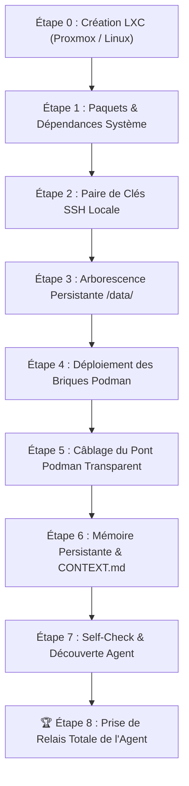

# 📋 Liste Officielle des Étapes : Déploiement LXC Vierge & Relais Agent

> **Perimeter law**: Deployed stack = **P1 socle + P2 agentic** (KovZu Helm). P3 client tools are out of scope here.  
> See [`docs/PERIMETERS.md`](./docs/PERIMETERS.md).

Ce document détaille la séquence exacte et chronologique permettant de monter un univers Shaper OS / KovZu complet sur un conteneur **LXC vierge** (Debian 12 / Ubuntu 24.04), jusqu'à la **prise de relais autonome par l'agent IA**.

---

## 🎯 Définition du Succès (Critère d'Accomplissement Total)
> **Le système est réputé réussi quand, sur un conteneur LXC vierge, une séquence automatisée déploie l'écosystème et que l'agent IA (`univ9-bridge-opencode`) prend le commandement, découvre son environnement, manipule les briques Podman et répond à l'opérateur.**
>
> **Trois horloges de restauration (ne jamais dire « &lt; 120 s » sans ça) :**
> 1. **Images déjà dans notre registry / cache Podman** — déploiement **rapide**.
> 2. **Images reconstruites ou tirées de zéro** — **plus long** (build/pull réseau).
> 3. **Plus un delta données** — proportionnel au volume (`sav/`, dumps, GED, fichiers). Un TEST vide ≠ une prod avec des années de fichiers.
>
> Le provisionnement LXC / `apt` est en plus. Détail : [`RULES.md`](./RULES.md) Rule 10.

---



---

## 🛠️ Déroulé des 8 Étapes

### Étape 0 — Configuration du Conteneur LXC (Hôte Proxmox)
Pour permettre à Podman de tourner sans restriction dans le conteneur LXC :
1. Conteneur LXC non-privilégié (ou privilégié selon politique).
2. Options activées dans la configuration Proxmox (`/etc/pve/lxc/<ID>.conf`) :
   ```text
   features: nesting=1,keyctl=1
   ```
3. Démarrage du LXC : `pct start <ID>` puis `pct enter <ID>`.

---

### Étape 1 — Provisioning OS & Outils d'Ingénierie
Exécuté sur le système Debian 12 vierge :
```bash
apt-get update && apt-get install -y   podman   git   curl   wget   jq   ripgrep   openssh-server   openssh-client   python3   python3-pip   rsync   unzip   ca-certificates
```

---

### Étape 2 — Génération de la Clé SSH Locale Sécurisée
Permet à l'agent conteneurisé d'accéder au démon Podman hôte sans mot de passe :
```bash
if [ ! -f /root/.ssh/id_ed25519 ]; then
  ssh-keygen -t ed25519 -N '' -f /root/.ssh/id_ed25519
  cat /root/.ssh/id_ed25519.pub >> /root/.ssh/authorized_keys
  chmod 700 /root/.ssh
  chmod 600 /root/.ssh/authorized_keys
fi
systemctl enable --now ssh
```

---

### Étape 3 — Création de la Racine Persistante `/data/`
Structure découplée garantissant la persistance totale des données :
```bash
mkdir -p /data/{vault,logger,queue,ged,workspaces,opencode-bridge,timelines,qdrant}
chmod -R 777 /data/ged /data/workspaces /data/timelines
```

---

### Étape 4 — Déploiement des 9 Briques Podman Shaper OS
Lancement coordonné du cluster avec `universes/univ9/deploy/podman-up.sh` :
* 🔐 **`univ9-vault`** (:8610) — Coffre-fort chiffré AES-256-GCM
* 📜 **`univ9-logger`** (:8620) — Collecteur d'audit JSONL et bus SSE
* 📬 **`univ9-queue`** (:8640) — File d'attente de jobs asynchrones
* 🎼 **`univ9-maestro`** (:8530) — Orchestrateur et supervision d'état
* 📂 **`univ9-ged`** (:8660) — Hub documentaire souverain et OCR
* 🧠 **`univ9-qdrant`** (:6333) — Base vectorielle sémantique
* 🎛️ **`univ9-helm`** (:8650) — Cockpit de pilotage universel KovZu
* 🌐 **`univ9-tunnel`** — Passerelle d'accès distante sécurisée
* 🤖 **`univ9-bridge-opencode`** (:4440) — Runtime de l'Agent IA

---

### Étape 5 — Câblage du Pont Podman Transparent dans l'Agent
Injection des identifiants et des wrappers dans le conteneur de l'agent :
```bash
# Injection de la clé SSH dans l'agent
podman exec univ9-bridge-opencode mkdir -p /root/.ssh
podman cp /root/.ssh/id_ed25519 univ9-bridge-opencode:/root/.ssh/id_ed25519
podman cp /root/.ssh/id_ed25519.pub univ9-bridge-opencode:/root/.ssh/id_ed25519.pub
podman exec univ9-bridge-opencode chmod 700 /root/.ssh
podman exec univ9-bridge-opencode chmod 600 /root/.ssh/id_ed25519

# Déploiement du wrapper /usr/local/bin/podman
cat << 'EOF_WRAPPER' > /tmp/podman-wrapper.sh
#!/bin/bash
if [ $# -eq 0 ]; then
  exec ssh -o StrictHostKeyChecking=no -o UserKnownHostsFile=/dev/null -o LogLevel=ERROR -o BatchMode=yes root@localhost podman
fi
CMD=""
for arg in "$@"; do
  CMD="$CMD $(printf '%q' "$arg")"
done
exec ssh -o StrictHostKeyChecking=no -o UserKnownHostsFile=/dev/null -o LogLevel=ERROR -o BatchMode=yes root@localhost podman $CMD
EOF_WRAPPER
chmod +x /tmp/podman-wrapper.sh
podman cp /tmp/podman-wrapper.sh univ9-bridge-opencode:/usr/local/bin/podman
podman cp /tmp/podman-wrapper.sh univ9-bridge-opencode:/usr/local/bin/docker
rm -f /tmp/podman-wrapper.sh
```

---

### Étape 6 — Initialisation de la Mémoire de Bord (`_kovzu/`)
Création du journal persistant qui survit à tous les reboots :
```bash
for WS in /data/workspaces/Administrateur /data/workspaces/Xavier; do
  mkdir -p "$WS/_kovzu"
  cat << 'EOF_J' > "$WS/_kovzu/JOURNAL.md"
# Journal des Opérations — Shaper OS / KovZu

## Initialisation — Déploiement Clean-Sheet
- **Socle Opérationnel** : Podman 5.4, Python 3.11, Pip, Git, JQ, Ripgrep, Node 20.
- **Cluster Shaper OS Actif** : Vault (:8610), Logger (:8620), Queue (:8640), Maestro (:8530), GED (:8660), Qdrant (:6333), Helm (:8650).
- **Prise de Relais** : Agent souverain initialisé et prêt pour les commandes utilisateur.
EOF_J
done
```

---

### Étape 7 — Self-Check & Découverte Autonome de l'Agent
L'agent exécute automatiquement son cycle de vérification :
1. Test de son accès Podman : `podman ps -a`
2. Test des APIs MCP : `curl http://127.0.0.1:8610/api/health`, `curl http://127.0.0.1:8660/api/health`
3. Vérification de la mémoire persistante : lecture de `_kovzu/JOURNAL.md`.

---

### 🏆 Étape 8 — Prise de Relais Totale & Confirmation Opérationnelle
L'agent est opérationnel sur le port 8650 (Cockpit Helm) et par voix/chat. Il est capable :
* De manipuler le Vault (ex: configurer les identifiants emails sans fuite).
* D'analyser les documents dans la GED.
* De lancer des bacs à sable éphémères (`podman run --rm`).
* De consigner chacune de ses étapes dans son journal.

---

## ⚡ Script de Bootstrap 1-Click (`scripts/shaper-lxc-bootstrap.sh`)

L'intégralité des étapes 1 à 7 est condensée dans le script exécutable `scripts/shaper-lxc-bootstrap.sh`.  
Sur un conteneur LXC neuf, il suffit de taper :

```bash
git clone https://github.com/xavdp-pro/univ-shaper-os.git /root/SHAPER-OS
cd /root/SHAPER-OS
bash scripts/shaper-lxc-bootstrap.sh
```
**Durée d'exécution constatée dans ce contexte précis** : images déjà présentes en cache local, univers vide sans données à restaurer, provisionnement LXC et `apt` **non inclus**.
Cette valeur est une mesure d'observation, **pas un engagement** : elle ne vaut que pour ce contexte exact. Voir Rule 10 (trois horloges) avant de la citer où que ce soit.  
**Résultat** : Univers opérationnel, agent prêt au service.

---

## Verified from scratch — 23 August 2026, gbs-test

A blank Debian LXC, the public repository, nothing else. What it took, and what
it found.

### The container itself

```bash
lxc launch <debian-image> univ-<slug>
lxc config set univ-<slug> security.nesting=true    # required
lxc restart univ-<slug>
```

**`security.nesting=true` is not optional.** Podman inside an LXD container
otherwise fails on the first image it tries to run:

```
crun: remount `/var/lib/containers/storage/overlay/…/merged`: Permission denied
```

The message says nothing about nesting, which is why it belongs here.

### Inside it

```bash
apt-get install -y podman git curl jq nodejs npm
git clone --depth 1 https://github.com/xavdp-pro/SHAPER-OS-V1.8.git
cd SHAPER-OS-V1.8/software
TAG="v1.7.1-$(git -C .. rev-parse --short HEAD)"
for b in vault logger queue maestro bridge-opencode; do
  podman build -q -f bricks/brick-$b/Containerfile -t "localhost/shaper-$b:$TAG" .
done
cp -r universes/_template universes/univ-<slug>-test   # then specialize INTENT + manifest + deploy/env
cd universes/univ-<slug>-test && ENV_FILE=deploy/env ./deploy/podman-up.sh
```

Result: **five containers healthy**, a job injected into the queue reaching
`COMPLETED`, and `/api/vitals` answering with evidence.

### The hidden dependencies clean-sheet runs found

None of them was visible on a workstation, and each broke a fresh install.

1. **`sav/queue` was never created** while the queue container mounts it.
   Invisible on a universe already running, fatal on a new one.
2. **The vault bootstrap called host `npm`.** A blank LXC has podman and git,
   not node. It now runs inside the vault image, which already carries the
   runtime.
3. **`bridge-opencode` copied a gitignored binary** that no longer existed on
   any machine. The image had been unreproducible everywhere, including where it
   was being built. The CLI is now fetched during the build, version-pinned, and
   the build runs `--version` so a bad fetch fails the build.
4. **A mandatory GED test read a gitignored PDF corpus.** It passed only on the
   workstation that had generated the corpus and failed in a public clone. The
   unit test now generates its minimal vector-PDF fixture in memory; ignored
   measurement corpora remain optional.
5. **OpenCode session metadata did not set the headless working directory.** A
   framed job reached the model, then waited forever on an
   `external_directory` permission even though the bind mount was writable and
   `bash=allow`. OpenCode 1.18.18 declares `directory` as a query parameter on
   session create, lookup, prompt, and abort; the bridge must carry the same
   encoded perimeter on all four calls. It must then observe `/global/event`
   (unwrapping `payload`), because `/event` is directory-scoped and would hide
   terminal events from sessions running in other perimeters.
6. **A zero-secret Vault bootstrap wrote no file.** The command announced
   success, but `VaultStore` persisted only when `setSecret` was called; the next
   boot therefore initialized again. Bootstrap now materializes an empty
   storage object, so “initialized and empty” is durable and distinguishable
   from “never initialized”.
7. **The Vault storage file inherited the process umask (`0644`).** Encryption
   protects values, but it does not authorize local readers. Creation, every
   persistence, and loading an older store now enforce owner-only mode `0600`;
   the clean-sheet proof must verify the mode and a second deploy without
   bootstrap.

### Model speed is advisory until measured locally

The free model list rotates, and hosted capacity changes faster than this
document. Internet tokens/second data may order candidates, but deployment must
run a bounded ping from the target LXC. On 25 August 2026, Nemotron 3.5
Lightning led a public speed leaderboard yet timed out twice on `gbs-test`;
MiMo V2.5 answered locally and was selected. Record both outcomes and the
timestamp; never turn that observation into a permanent global default.

> The lesson worth keeping: a workstation accumulates the answers to questions
> the repository never asked. Only a blank machine asks them all.

### Exact proof is part of the contract

A terminal agent status is necessary but insufficient. The controller must
inspect the artifact independently. For byte-exact claims, compare against
explicitly generated expected bytes with `cmp`; shell command substitution
removes trailing newlines, so `test "$(cat file)" = value` cannot prove newline
semantics. The V1.7 clean-sheet run deliberately retained one rejected
`COMPLETED` job that exposed this proof error before a corrected job passed.
