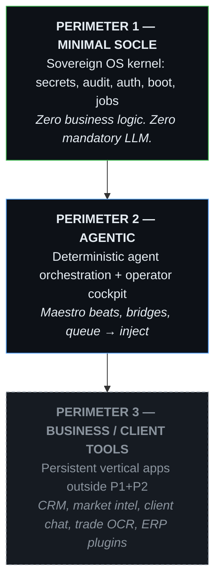

# SHAPER OS — Three Perimeters (Canonical Taxonomy)

> **Intent Classification**: GENERIC INTENT (Universal / Parameterized Blueprint)  
> **Status**: Foundational law — supersedes the obsolete README “Layer 1–4” layout.

Every component, package, brick, or app MUST be classified into exactly one perimeter before design or deploy.

---

## Overview



**Golden rules**

1. **P1 never knows P3** — socle bricks have zero knowledge of verticals (Rule 1: brick isolation).
2. **P2 is the organism, not the product** — Helm/KovZu, GED/RAG memory, Maestro tasks enrich the assistant; they do not replace client-facing ERPs (Rule 0F).
3. **P3 is built via the Shaper Way** — sandbox → `shaper-tool-scaffold.mjs` (run in the universe class repository, never in the base) → `packages/pkg-<slug>` + `bricks/brick-<slug>`, its own port, and state in a volume the universe owns (`vol-<universe>-<slug>`, mounted at `/data/<slug>` inside the container — never a host path); never merged into KovZu’s belly.
4. **Perimeter means LAYER, never OWNER** *(V1.13, Rule 37)* — a brick that
   exists for a single client can still be P1: a fork's hardened SSO brick is
   socle-layer even though one owner demanded it. Who a brick belongs to is
   said by `source`/`forkedFrom` and the repo it lives in; the perimeter says
   only where it sits in the stack. Every declared brick carries its
   `perimeter` in the manifest — the canonical table below is what
   `shaper verify` checks known bricks against.
5. **Behaviour files ride the brick that executes them** — a `ctx-*` or
   `task-*` file carrying P3 business behaviour (a mailbox's triage rules)
   inside a P1/P2 universe does not need a perimeter field of its own: its
   perimeter is P3 by definition, and the universe hosting it stays what its
   bricks say. One sentence, no new manifest slot.

---

## Perimeter 1 — Minimal Socle

**Objective**: Boot a sovereign universe (encrypt, audit, authenticate, queue generic jobs). PRA restore time is **three clocks** — see Rule 10 in [`../RULES.md`](../RULES.md): cached images = fast; rebuild from zero = longer; plus data-volume delta. Do not quote “&lt; 120s” alone.

| Package / brick | Role | Status in repo |
| :--- | :--- | :--- |
| `@shaper/pkg-vault` / `brick-vault` | AES-256-GCM secrets | ✅ |
| `@shaper/pkg-logger` / `brick-logger` | JSONL append-only audit | ✅ |
| `@shaper/pkg-auth` | Stateless Bearer, in-process | ✅ |
| `@shaper/pkg-db` / `brick-mariadb` | Turbinobash DB config resolver | ✅ |
| `@shaper/pkg-queue` / `brick-queue` | Async jobs, opaque payload — JSONL evidence survives a crash, execution does not (see its INTENT) | ✅ |
| `@shaper/waf` | Edge WAF (deterministic) | ❌ planned |
| `log-sentinel` | System telemetry | ❌ planned |

**Boot order** (from `topology.json`): `vault` ∥ `logger` → `queue` → (P2 nodes attach).

> **Note**: `topology.json` → `minimalSocle` mixes P1 and P2 package names. Strict P1 = vault, logger, auth, db, queue only. See [`TOPOLOGY-INTENT.md`](./TOPOLOGY-INTENT.md).

**Forbidden in P1**: IMAP triage rules, CRM schemas, scrapers, client UI, LLM prompts with business rules.

---

## Perimeter 2 — Agentic

**Objective**: Wake agents on deterministic events; inject LLM only when the beat handler decides; full observability.

| Package / brick | Role | Status in repo |
| :--- | :--- | :--- |
| `@shaper/pkg-maestro` / `brick-maestro` | Cadence scheduler | ✅ |
| `@shaper/pkg-agent-runtime` | Task dispatch inside `brick-maestro` (1 image, N tasks) | ✅ |
| `@shaper/pkg-mail-agent` | IMAP check (vault creds only) | ✅ |
| `@shaper/pkg-bridge-agy` / `brick-bridge-agy` | Antigravity CLI bridge (Rule 8) | ✅ |
| `@shaper/pkg-bridge-opencode` / `brick-bridge-opencode` | OpenCode CLI bridge (free tier) | ✅ |
| `opencode-bridge` | Vendored OpenCode HTTP/SSE server | ✅ |
| `brick-helm` (KovZu) | Operator cockpit: `/console`, admin socle/maestro | ✅ |
| `@shaper/pkg-ged-engine` / `brick-ged` | Operator document hub (`/data/ged`) | ✅ (organism) |
| `@shaper/pkg-rag` + `brick-qdrant` | Semantic memory for the organism | ✅ partial |
| `codex-v1` (planned) | Versioned agent context registry | ❌ plan only |
| Claude bridge at socle | `@shaper/bridge-claude` | ❌ Helm routes only |

**Triggers**: Maestro cron, IMAP arrival, voluntary queue job (`agent.inject`), operator inject via Helm.

**Helm `/console` chat is P2** — it pilots CLI agents, not client-facing team chat.

**Removed from active UI**: `/talk` and `/voice` routes redirect to `/console`. Voice STT/TTS inside `/console` remains P2.

**Test universes** (`UNIV7`, `UNIV8`, `UNIV9`) prove **P1 + P2** — they are not P3 verticals.

---

## Perimeter 3 — Business / Client Tools

**Objective**: Deliver persistent tools for human business activity — separate lifecycle, branding, port, and data from KovZu.

Built only via:

```bash
bash scripts/shaper-sandbox.sh          # ephemeral prototype
# from the root of the universe CLASS repository — the scaffold halts inside the base
node scripts/shaper-tool-scaffold.mjs create --slug <slug> --name "<Name>" --desc "<what it does>" [--port <port>]
```

The scaffold writes the layers the naming contract knows and nothing else:
`packages/pkg-<slug>/` (the source package, with a test that binds a real
socket) and `bricks/brick-<slug>/` (`INTENT.md`, `brick.json`, a
`Containerfile` that copies the package from the pinned source image, and a
`cfg-<slug>.container` unit in the base bricks' shape — `Image=@IMG@` from
the lock, `Volume=vol-%i-<slug>`). It creates nothing on the host and does
not touch the base's `topology.json`.

| Planned package / universe | Purpose | Perimeter |
| :--- | :--- | :--- |
| `market-intelligence` | Stealth scraper, market benchmark | **P3** |
| `enterprise-chat` | Scoped SSE/WebSocket chat for **client portals** (not KovZu) | **P3** |
| `ocr-engine` | PDF OCR + entity extraction for quotes/invoices | **P3** |
| `wikiuniv-v1` | Showcase + RBAC portal | **P3** |
| `univ-sinistre`, `univ-artisan`, `univ-immo` | Vertical ERP universes | **P3** |
| POC CRM (VISION phase 5) | Mails, invoices, charts for a client | **P3** |
| `Helm Desk` | Desktop display app (mobile → desk WS) | **P3** |

### What is `enterprise-chat`?

Reusable **real-time chat brick** (SSE/WebSocket) scoped per tenant / universe / dossier — embedded in P3 apps (CRM extranet, BTP client portal, etc.).

It is **not** Helm `/console` (P2). KovZu chat streams to CLI bridges; `enterprise-chat` would stream human-to-human or human-to-service messages inside a business product.

### What is `market-intelligence`?

Autonomous **business intelligence** tool: competitive scraping, price benchmarks, market signals — typical **third-wave / P3** deliverable, never part of minimal socle or agent orchestration core.

### Gray-zone libs (classify at scaffold time)

| Lib | Default perimeter | Notes |
| :--- | :--- | :--- |
| `mail-parser-engine` | P2 if generic MIME/RFC822 lib; P3 if triage rules | Split parser (P2) from business triage (P3) |
| `variables-engine` | P2 if agent template interpolation; P3 if quote/invoice merge fields | Same code, different deploy boundary |
| `ai-client-engine` | P2 if shared LLM JSON helper for bridges; P3 if vertical-specific structured output | Prefer bridge contract first |

---

## Mapping: obsolete README “Layers” → perimeters

| Old README name | Current name | Perimeter |
| :--- | :--- | :--- |
| `vault-engine` | `@shaper/pkg-vault` | P1 |
| `event-logger` | `@shaper/pkg-logger` | P1 |
| `job-queue` | `@shaper/pkg-queue` | P1 (generic) |
| `waf-engine` | `@shaper/waf` | P1 (planned) |
| `maestro-engine` | `@shaper/pkg-maestro` | P2 |
| `univ-mail-agent` | `@shaper/pkg-mail-agent` | P2 |
| `univ-bridge-agy` | `@shaper/pkg-bridge-agy` | P2 |
| `bridge-engine` | absorbed by bridge packages + Helm plugins | P2 |
| `app-shell` | replaced by `brick-helm` for operator UI | P2 |
| `enterprise-chat` | not implemented | **P3** |
| `market-intelligence` | not implemented | **P3** |
| `ocr-engine`, `wikiuniv-v1` | not implemented | **P3** |
| `apps/univ-*` verticals | no generator — a vertical is a universe class repository, born by [`UNIVERSE-REPO-BIRTH.md`](../../docs/agent/UNIVERSE-REPO-BIRTH.md) (a procedure); the factory script that wrote `apps/` left on 2 September 2026 | **P3** |

---

## Agent decision checklist

Before any task, ask:

1. **Does this strengthen secrets, audit, boot, or generic jobs?** → **P1**
2. **Does this schedule, inject, observe, or enrich the operator/agent organism?** → **P2**
3. **Does this deliver a persistent business tool for an end user or client?** → **P3** (scaffold outside KovZu)

When in doubt: **P1 < P2 < P3** — never pull P3 logic into P1 or KovZu’s belly.

---

## Related documents

| File | Role |
| :--- | :--- |
| [`RULES.md`](../RULES.md) | Engineering invariants (Rule 0A: P1/P2/P3) |
| [`topology.json`](../topology.json) | P1+P2 dependency graph |
| [`docs/DOC-INDEX.md`](./DOC-INDEX.md) | Documentation index & read order |
| [`docs/FUNCTIONAL-INVENTORY.md`](./FUNCTIONAL-INVENTORY.md) | Parallel objectives / features by component |
| [`MANIFESTO.md`](../MANIFESTO.md) | KovZu belly vs Shaper Way |
| [`docs/UNIVERSE-ARCHITECTURE.md`](./UNIVERSE-ARCHITECTURE.md) | Universe manifest fractal model |
