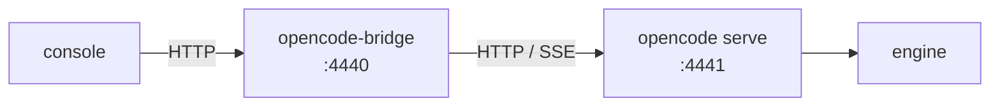

# opencode-bridge

HTTP + SSE bridge in front of the [OpenCode](https://opencode.ai) CLI, on the
**same contract** as `cursor-agent-bridge`, `antigravity-bridge` and
`claude-bridge`.

It lets an operator console (the catalogue's `brick-helm` cockpit, or any
client of the shared bridge contract) drive OpenCode like any other CLI agent,
with no application-side code specific to it.

## What sets it apart from the other bridges

Cursor and Antigravity launch **one process per run** and read its stdout.
OpenCode ships a real headless server: the bridge launches `opencode serve`
**once**, subscribes to its event stream and translates it into the shared
contract.

That is what gives **token-by-token streaming** (`message.part.delta`), where
`opencode run --format json` returns the text in a single block at the end.



## API

| Route | Purpose |
|-------|---------|
| `GET  /api/health` | Public probe (no token) |
| `GET  /api/status` | State + `ready` (the serve answers) + the model in use |
| `GET  /api/conversations` | Registered conversations |
| `POST /api/inject` | `{ conversation, message, model?, attachments? }` |
| `GET  /api/events` | SSE, filterable with `?conversation=` |
| `POST /api/conversations/stop` | `{ conversation }` or `{ all: true }` |
| `POST /api/conversations/reset` | Forgets the session — the next run starts from zero |
| `POST /api/conversations/delete` | Removes the conversation from the registry |
| `POST /api/upload` | Base64 attachment into the workspace |
| `GET  /api/fs/list?path=` | Directory listing (workspace picker) |

Auth: `Authorization: Bearer <token>`, created on first start in
`~/.config/opencode-bridge/token` (chmod 600).

## Events emitted

The contract shared by every bridge:

| Type | When |
|------|------|
| `connected` | The SSE stream opens |
| `inject` | A run was accepted (carries `run_id`) |
| `thinking` | Reasoning deltas; `subtype: completed` at the end |
| `tool` | A tool started — `call_id`, `tool`, `input`, `command`, `cwd` |
| `tool_complete` | A tool finished — `call_id`, `result` |
| `response` | Answer deltas — `delta` + cumulative `text` |
| `response_complete` | Final text |
| `run_complete` | End of run |
| `run_aborted` | Interrupted through `/stop` |
| `ping` | Keepalive (25 s) |

Every event of a run carries its `run_id` and an increasing `seq`.

## Mapping from OpenCode events

| OpenCode | Bridge |
|----------|--------|
| `message.part.delta` (part `reasoning`) | `thinking` |
| `message.part.delta` (part `text`, assistant message) | `response` |
| `message.part.updated` (part `tool`) | `tool` / `tool_complete` |
| `session.idle` | `response_complete` + `run_complete` |

A part's type is not repeated in its deltas: the bridge remembers
`partID → type` from `message.part.updated` to route each delta.

## Install

```bash
cp .env.example .env && chmod 600 .env   # port / model / workspace
./start-bridge.sh
```

The `opencode` CLI is not versioned here: install it in `bin/opencode` (or
point `OPENCODE_BIN` elsewhere).

## Models

`opencode models` lists what is available. Models suffixed `-free` cost
nothing and need no credentials.

The bridge names **no default model**. The model comes from `OPENCODE_MODEL`,
measured at deployment from the target host — enumerate, probe on the shape of
the work, keep what passed (Rule 7, runbook Step 4.2b). Empty means "not
chosen": a run says so instead of guessing, and `podman-up.sh` halts before
starting the brick. A model named in this file would be a default, and the
last one named here had been withdrawn from its catalogue while still
shipped.

## Checking

```bash
curl -s localhost:4440/api/health
T=$(cat ~/.config/opencode-bridge/token)
curl -s -H "Authorization: Bearer $T" localhost:4440/api/status
```

`ready: true` means the internal `opencode serve` answers.

## Tests

```bash
npm test          # unit — event translation, no network and no model
npm run test:cli  # end to end — needs the bridge running
```

The unit tests cover `translate.mjs`, deliberately free of I/O: it receives an
OpenCode event and returns the canonical events to broadcast, so real
sequences can be replayed without launching a CLI or spending quota. The event
shapes come from real captures against the OpenCode CLI version recorded in
`test/translate.test.js`.

`scripts/test-cli.sh` checks the real installation: authentication, a full
run with a tool call, effective text streaming, session continuity across two
turns, stop, reset and the validation guards.
